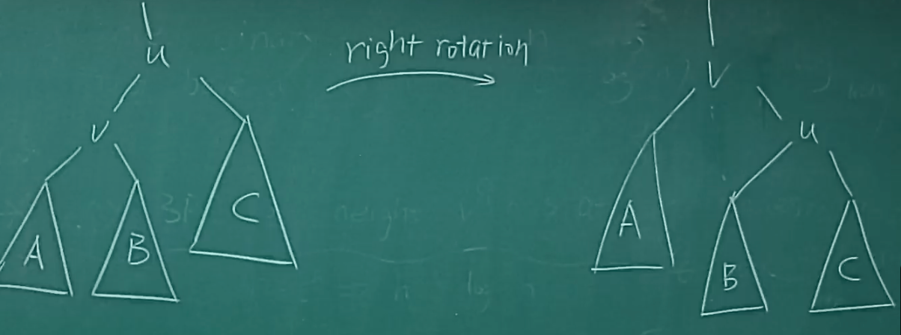

### AVL Tree

#### 1. balance factor(BF)

Order property：左边小，右边大；

Structure property：｜BF｜<= 1；

与堆相反， 应该先满足Order property；

#### 2. 定义

balanced binary search tree(BBST) = AVL tree

#### 3. 为什么要AVL Tree

> 定理：有n个结点的平衡二叉树，是一个斐波那契数列，最后求得高度不高于O(logn)。
>
> 定理证明：先证明引理
>
> 

而这个性质很容易维护，所以就有了AVL Tree。

#### 4. Rotation 操作

##### 4.1 right rotation

1. 只需要改三个指针，所以时间是O（1）；

2. 旋转能够维持BST性质；
3. 旋转会改变高度差，即会改变BF；

##### 4.2 left rotation

#### 5. Insertion

##### 5.1 Left case

###### LLcase（LLRotation）

###### LRcase（LRRotation）

##### 5.2 Right case
##### 5.3 总结

只要修正了最下面那个节点，其他因他而起的不平衡节点都会被修正。

插入引起的不平衡最多两次旋转就能修正。

**case的划分就是破坏者和被破坏者的关系，找的是被破坏者以下的三层，下面的不用看。**

不管是这四种的什么情况，**最后都要变成中间一个两边各一个的情况**，剩下的四块按顺序搬运过去。

#### 6. Deletion

- 步骤：
  - 像BST一样delete；
  - 恢复平衡；
- 在结构上必定会删除一个leaf；

- 删除只会让一个点变得不平衡，但是修复不平衡时候，旋转一次可能会把不平衡向上传，一直传到根结点为止。所以最多旋转`O（logn）`次才能修复，所以最终时间还是为`O（logn） + O（logn）* O(1) = O（logn）`。

#### 7. 总结

综上所述，AVL树的高度是logn级别的，并且维持树平衡的代价也是logn级别的。

### Splay Trees
#### 1. 核心思想
- 不要求每一步都做得很好，但是平均下来时间复杂性要小于等于`O(logn)`。
- 要找一个对象（其实是任何一个动作，包括插入），那就顺便把这个对象翻到树根（这样下次查找到他的概率就会大一点）。
#### 2. 不好的情况

#### 3. 优化

变换过程中不一定两边高度差不超过1；

#### 4. 删除

### Amortized Analysis（均摊代价分析）
#### 定义
- Amortized Bound：任意多次操作的时间复杂性上界；
- Average-case Bound：无限多次操作的时间复杂性上界；
#### 解决方法
##### Aggregate analysis（累计分析）
> 以push，pop，multipop为例，n次操作，最多只有n个元素，所以mutipop最多也是O(n-1)，所以总时间复杂性就是O(n)，所以每个的时间就是O(1)。

##### Accounting method（记账方法）
> 总的时间等于push的两倍
>
> 摊还时间 = 实际时间 + credit
>
> 总和方法对所有的操作一视同仁，而记账算法不同，每个操作的credit不尽相同。

##### Potential method（势能法）

> 

##### 分析伸展树

- 每个结点的势能计算。

- 
