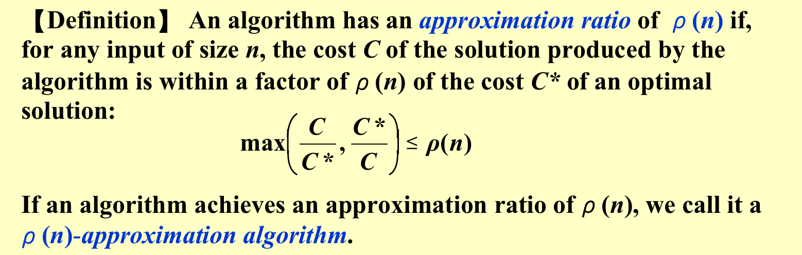
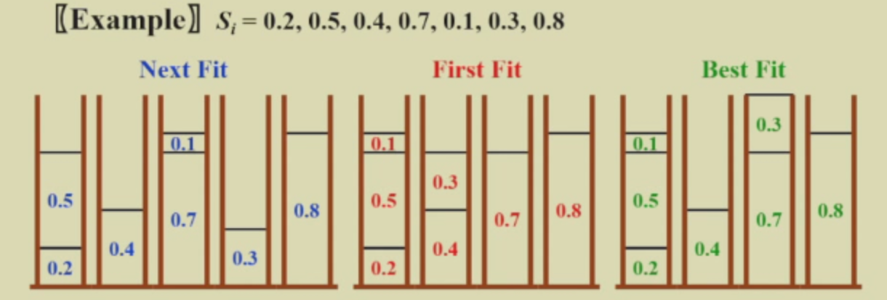
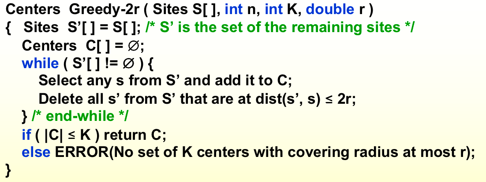
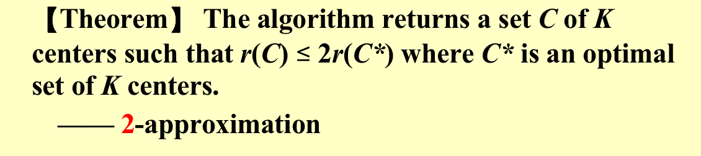

## 概述

**对于NPC问题**：

- 如果N的大小比较小，就算是$O(2^N)$的时间复杂度我们也可以接受

- 用多项式时间内的算法解决一部分重要的特殊的情况

- 或者放弃找最优解，而是找近似最优解的解。

**Approximation Ratio（近似比）**

**定义**：假设原问题解的值域是正数，最优解是$C^*$，近似算法得到的解是$C$，将两个相除（让比值大于1），如果这个比值能够被一个值bound住，那么我们就说算法有一个近似比$\rho$。

---

给出一个限制条件$\epsilon$，也就是需要给出的算法的近似比为$1+ \epsilon$，也就是说**一个近似方案有两个参数**，一个是问题的规模另一个是近似比限制条件$\epsilon$，在计算时间复杂度的时候我们需要进行权衡。

比如$O(n^{2/ \epsilon })$，随着$\epsilon$的减少，时间复杂度呈指数级上升；对于这类对于特定的$\epsilon$，时间复杂度在多项式时间的算法我们称为**PTAS(polynomial-time approximation scheme)**

而$O((1/\epsilon)^2n^3)$，这类算法和n和$\epsilon$都呈现多项式的关系，对于这类算法可以对近似比的要求更加严格。对于这类关于$\epsilon$和n都呈多项式时间复杂度的算法我们称为**FPTAS(fully polynomial-time approximation scheme)**

### 算法的三个方面

我们这一节课学的都是B+C的算法

## Bin Packing

给定N个items，每个item的size是$S_1, S_2, ..., S_N$，$0 < S_i \le 1$。找出最少数量的bin来容纳所有的item，这是一个npc问题。

### On-line Algorithms

#### Next Fit

当我们读到一个item，看能否放进当前的bin，如果不能就开一个新的bin。这个算法只需要扫描一遍，时间复杂度为$O(N)$。

!!! tip "theorem"
    
    Let M be the optimal number of bins required to pack a list I of items.  Then next fit never uses more than 2M – 1 bins.  There exist sequences such that next fit uses 2M  – 1 bins.

    **proof**

    

#### First Fit

当我们读到一个item，看能否放进之前的所有bin，如果不能就开一个新的bin。这个算法每次都要扫描之前的所有bin，所以时间复杂度为$O(NlogN)$。

!!! tip "theorem"
    
    Let M be the optimal number of bins required to pack a list I of items.  Then first fit never uses more than 17M / 10 bins.  There exist sequences such that first fit uses 17(M – 1) / 10 bins.

#### Best Fit

当我们读到一个item，看能否放进之前的所有bin，找出剩余空间最小的bin放进去，如果不能就开一个新的bin。这个算法和之前的Fisrt Fit是一样的1.7。

#### 例子

但是这些算法都是on-line，就是当前做了decision之后，就不能改变了。

!!! tip "theorem"

    对于on-line的算法，There are inputs that force any on-line bin-packing algorithm to use at least 5/3 the optimal number of bins.

### Off-line Algorithms

扫描所有的item之后才得出答案。先把item的大小进行排序，先放大的item，再放小的item。

## Knapsack Problem

### Fractional version

背包的容积给定为M，有N个物品，物品有代价 $w_i$和利益$p_i$，允许把物品按比例切分放入，求利益最大的装法。

!!! quote "from Carton手写笔记"

    

### 0-1 version（NP-hard）

物品不能按照比例放入，要么放入要么不放入。

如果使用最大性价比的贪婪算法，比如$(w_1,w_2,w_3,w_4) = (1, 0.05, 0.05, 0.05)$，$(p_1, p_2,p_3,p_4) = (10, 1, 1, 1)$，最大性价比选的话会选择后面三个，不是最优解。

如果直接按照价值排序，不考虑性价比，价值高的物品能放进去就放进去，放不进去在考虑下一个，这样也可构造反例，不是最优解。

**我们可以综合上述两种算法，取两种算法的最优解**。

可以算出这种算法的近似比为2。

!!! note "证明近似比为2"

    $P_{max}$：能放进来的物品中价值最大的那个；
    $P_{opt}$：0-1情况下的最大收益；
    $P_{frac}$：可切割版本下的最大收益；
    易得$P_{max} \le P_{opt} \le P_{frac}$

    $P_{greedy}$：0-1问题中用收益率贪婪算法得到的最大收益
    $P_{max} \le P_{greedy}$，很好理解，因为算法是性价比贪婪和价值贪婪的两个取最大。

    $P_{opt} \le P_{frac} \le P_{max} +P_{greedy}$，这个也很容易理解，greedy算法最后可能会有剩余，在这个时候把价值最大的物品塞进去，那么肯定比最优解的价值还高。

    $\Longrightarrow P_{opt}/P_{greedy} \le 1 + P_{max}/P_{greedy} \le 2$

---

**动态规划算法解决问题**

设$W_{i,p}$是考虑完第i个物品之后利益为p时的最轻质量。

如果$p_i > p$，说明$W_{i,p}$并没有把第i个物品放进来，所以$W_{i,p} = W_{i-1,p}$；否则选择放入或者不放入总重量比较小的那个。

因为有i和p两个维度，而$i = 1, ...,n$，$p = 1,...,nP_{max}$，想乘即可，但是这个时间复杂度是伪多项式时间复杂度，因为$P_{max}$可以是n的指数级。比如十个物体，价值十个亿，动态规划的复杂度一下子就上去了。

**动态规划代码到时候记忆一下！**

当$p_{max}$很大时，我们可以同时除以一个数（round方法）来使每个p都减少，这样可以节约时间，但是会有精度的损失。

!!! quote "from Carton手写笔记"

    

## K-center Problem

**问题描述**：平面上给定一堆集合，要求找出不超过K个圆心的位置，使得园覆盖所有点，而且radius（所有宿舍中离食堂最远的那个宿舍离食堂的距离尽可能短）最小。

---

**思路**：

找K个中心比较难，我们先找一个中心，但是这样就没有意义

假设我们把食堂放到宿舍上，这样，假设原来的食堂放置最优解的长度为r，那么把食堂放在宿舍上还能覆盖到原来所有宿舍，长度最多为2r。

也就是说现在我们让食堂在宿舍上，这样他的最优解不会比原来的最优解的两倍差。

现在我们随机选一个点作为圆心，假设已经知道最优解是r，那么把和这个点相距2r以内的点全部删除，因为这些点肯定已经被覆盖了。再从剩下的点里面随机选一个点，如此重复，直到所有点点都被删除。如果这些被选中的中心点的数量$\le K$，那么结束。否则不存在解，也就是半径r是错的。

!!! tip "Theorem"

    如果这个算法选择的中心超过K个，那么原来的问题的最优解半径也肯定比r大。
    

    proof：

    假设我们近似算法选择了K+1个点作为中心，而原问题最优解只有K个中心，这时候肯定有2个中心被原问题的K个点包住，且距离$\le r$，根据三角形法则，这两个点的距离$\le 2r$，但是根据之前的算法描述这是不可能的，矛盾。

那么我们怎么确定r呢？我们可以直接使用二分法，一个一个r去试验，如果能找到就把r缩小，如果不能找到就把r放大。

因此我们得到了一个近似比为2的近似算法。

---

**优化上述算法**：

上述算法要二分来找r太繁琐，我们在找下一个中心的时候，不是随机选择$\ge 2r$的点，而是选择**距离当前所有选中的中心最远的点**（如果这个点都已经$\le 2r$，那说明你早就已经覆盖了所有点），把它加入中心的集合中，一共选择K次，直接输出就是答案。

!!! tip "Theorem"

    这个算法算出的最优解不差于原问题最优解的两倍。

    proof：

    假设最优解是r，那么一旦我们当前的算法返回$>2r$的解，那么至少有一个宿舍距离我们选出来的食堂是$>2r$的，并且被我们这个算法算出来的所有的距离都是$>2r$的。

    现在我们用之前的随机算法再解一遍这个问题，外面二分出r带入这个算法，会发现至少有K+1个点他们之间的距离大于2r，那么和最优解为r冲突。

---

此类问题最好的近似比就是2，如果更小除非P=NP。

## The End

!!! quote "参考资料"

    1. ADSNotes_Algorithms.pdf(from Carton手写笔记)
    2. ADS11ppt
    3. 小角龙(18)复习笔记.pdf
    4. JerryG(20)复习笔记.pdf
    5. 智云课堂：2023yds
