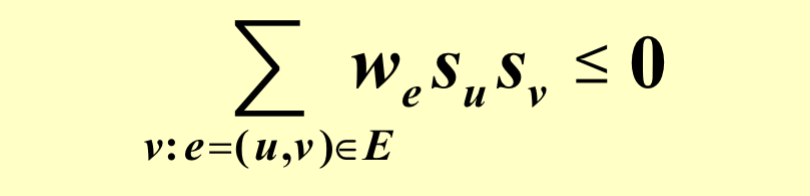
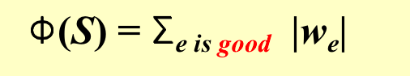
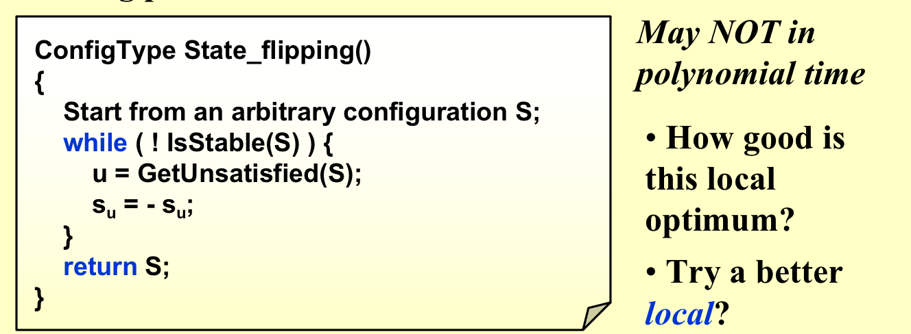
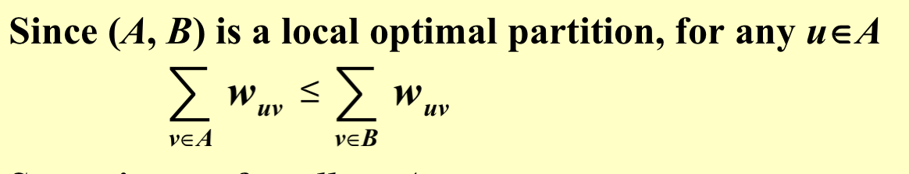
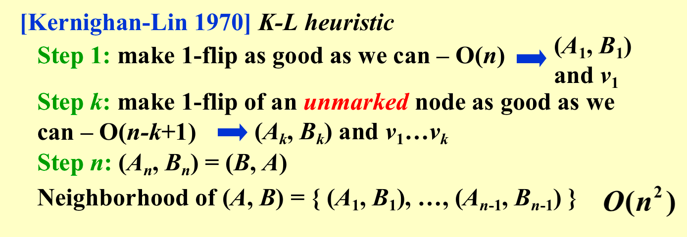

## 1. 概述

做一个初始的猜测，然后在猜测的点周边，用更优解来替代猜测的点，不断迭代逼近最优解。所以局部搜索的想法就是从不准确的解作为开始，不断搜索该点周围更加接近最优的解来替代，如此重复来逼近最优解。逼近最优解不一定会在有限步骤内停止。

Local Search的结构


!!! quote "from Carton手写笔记"

    

算法：

- 可行解作为一个起点；
- 在S的邻居中按照某一种规则去找到其中的一个更加接近最优解的邻居。
- 如果最好的邻居都比自己差，那么算法结束；否则，把当前点移动到邻居身上。

## 2. 顶点覆盖问题

**问题概述**：在无向图中找最小的点集，对于每一条边，至少有一个点在点集中。

**构造算法**：首先需要找到一个可行解，直接取所有的点为起始解。cost(S)定义为S中点的个数。S'是S的邻居，S'从S中去掉一个点得到。

**案例**：

---

**Metropolis算法**

相比于原来的梯度算法，红色是改动的部分。我们随机选出来一个点，如果比当前的解要好，那么正常进行替换；如果更差的话，仍旧**会有一定的概率替换成新的点**。相比于原来的解，cost越大替换概率越低。

T如果特别大，那么替换概率为1，如果T特别小，那么就是原来的算法，替换概率几乎为0。随着算法的推进，替换概率越小越好，也就是T越小越好。

思考算法的结束时间，一种可行的想法是当概率小到某个阈值之下就结束。


**Simulated Annealing 模拟退火算法**

随着算法的迭代，越来越接近最优解，所以T越来越小（模拟温度降低），上升替换概率也越来越小。

## 3. Hopfield Neural Networks

**相关定义**

给定有权图，如果边的权重小于零，那么两个端点有相同的状态，如果权重大于零，那么两个端点有不同的状态。权重的绝对值越大，那么这条边越重要。定义好边和坏边(好边就是满足上述条件的边) $w_es_us_v < 0$。

对于一个顶点，如果其好边权重大于坏边权重则称之为满足结点。

如果所有结点都是满足的，那么这个图就是稳定的。

---

**State-flipping Algorithm**

如果根本就没有一个可行解，那么这个算法就会死循环

```c
ConfigType State_flipping()
{
    //从一个随机的解开始
    Start from an arbitrary configuration S;
    while ( ! IsStable(S) ) {
        u = GetUnsatisfied(S); //每次随机找一个不满足的结点
        $s_u$ = - $s_u$; //把这个结点进行变色
    }
    return S;
}
```

下面证明：这个算法最多迭代**所有边权绝对值的和**次数，必定能够找到可行解。

我们把当前好边权重的绝对值的和记作函数，来衡量距离可行解的距离。我们希望这个值不断地增大。

当我们改变一个结点的状态

而我们每次改变的点的状态是不满足的，所以每次迭代都是严格递增的，最多增加到所有边的边权和，这个时候所有的边都是好边。

**这个算法不一定每次都增加满足的结点，但是一定会增加好边的权重和。**

思考这个算法的时间复杂度，因为权值可以很大，所以这是一个伪多项式时间复杂度算法

## 4. 最大切问题

**问题概述**：给定一个图，找到一种将其点分成两个集合A、B的方法，使得两端分别在A、B集合的边的权重和最大（也就是说A、B内部的边权重和最小）。

**现实例子**：我们现在有n门课，m位同学，每位同学有两门想上的课，现在我们要排课，使得能够同时参加自己最喜欢的两门的同学最多。我们以课作为结点，以人作为边，如果一个人喜欢某两门课，那么进行连线，现在给点染色，一个上午一下午。

---

**构造local search的方案**：

目标：最大化联结边的权重。
初始解：随机分组即可。
邻居：改变一个点的分组。

这其实就是Hopfield Neural Network问题的特殊情况，只是所有的边权为正。

我们还是按照Hopfield Neural Network问题的算法来解决最大切问题，这里的满足不满足变为——**如果从某个节点出发到同集合的另外一个节点的所有边权和小于，从这个节点出发到另外一个集合的节点的所有边权和，那么称这个点为满足**。但是我们需要额外思考几个问题。

---

上述方案找到的局部最优解不会比全局最优解的一半差。

对任意在集合A中的结点，从他出发另一端点也在A的边权和一定小于等于从他出发另一端点在B的边权和（如果大于，那么不是局部最优解）

把A中的所有点加起来，那么就是两个点都在A的边的权重和的两倍（因为算了两次）小于等于端点跨越集合的边的权重和。

左边是最优解，最优解的上限是所有边的权重和。


---

如上算法还是伪多项式时间复杂度（边权和x点的个数）的算法，我们是否能够改进这个算法呢？

我们尽可能寻找能够让我们割边（端点在不同集合的边）权重和增加更多的点来进行翻转


近似比原来是2，现在会变差为$2+\epsilon$。

---

原来我们只是去翻转一个节点，我们现在翻转k个节点来构成邻居。

我们先跟以前一样，翻转一个节点（这个节点翻转能使得割边权重和增加最多），之后在这个翻转的基础上再去翻转下一个节点，翻转k次，从这k次中，取出割边权重和增加最多的成为邻居。



## 5. HW


## 6. The End

!!! quote

    1.ADSNotes_Algorithms.pdf(from Carton手写笔记)
    2.ADS11ppt
    3.小角龙(18)复习笔记.pdf
    4.智云课堂：2023yy
    5.JerryG(20)复习笔记.pdf


!!! success "注释"

    abstract: abstract
    info: definition
    tip: some theorem
    example: example
    note: supplement 
    warning: warning
    danger: danger
    question: help u remember
    success: comment
    quote: quote
    