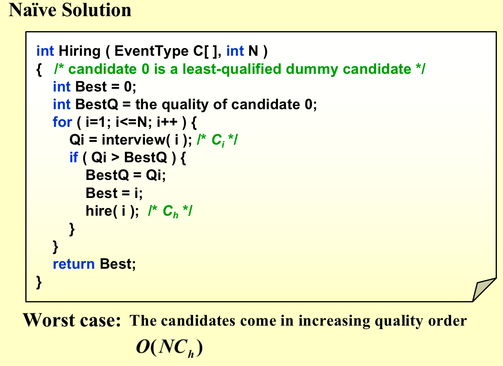
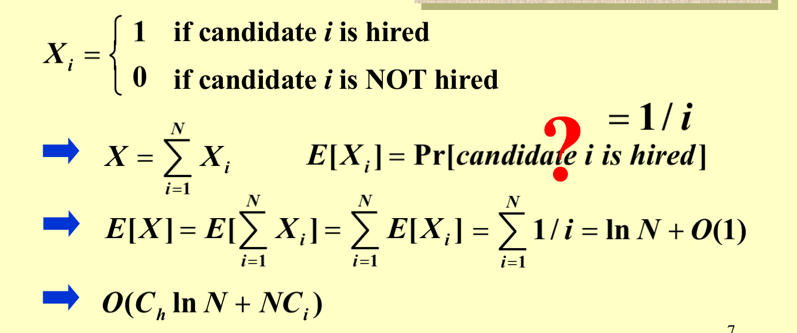
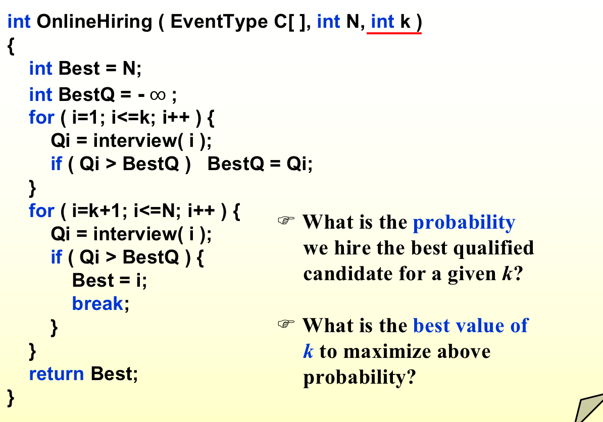
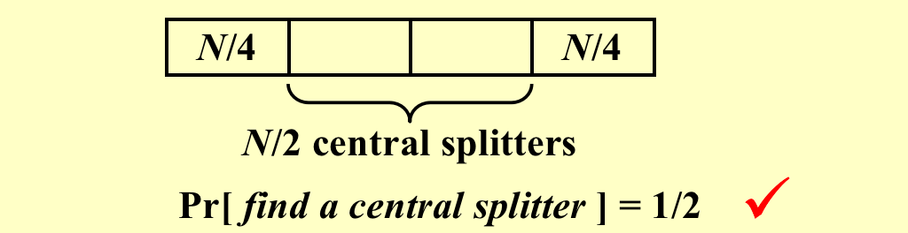
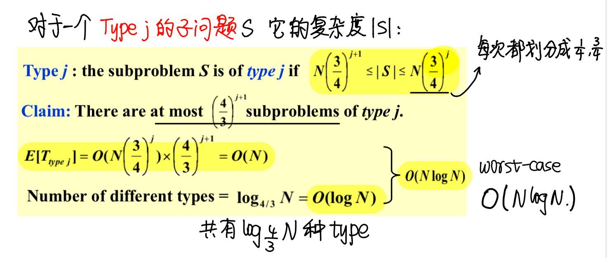

## 1. 概述

什么需要随机：世界表现为随机——这意味着输入需要随机；算法表现为随机——这意味着在最坏的输出情况下算法还是做出随机的选择。

随机的概念：随机在算法一般有两种含义，一种是指输入在指定的集合内是随机生成的，另一种是指算法的行为具有随机性（相同输入，相同步骤时，下一步操作可能不同）。随机算法一般指的是第二种。

总是得出正确答案的高效确定性算法是以下算法的特殊情况——

- 用非常高的概率（不一定必须）来给出正确的答案的高效随机算法；

- 总是正确的，并且在期望中运行高效的随机算法；

基本概念复习：

## 2. The Hiring Problem

### 2.1 问题概述

我们要找到一个人招聘，我们依次面试N个人，每个人面试完必须马上告知是否录用，如果录用，那么需要代价Ch，每次面试的代价是Ci，但是Ci远小于Ch。要制定策略，代价比较小并且找到最好的那个人的概率最大。

### 2.2 方法一

类似找最大值，但凡是目前最大的，就录用。但是这样的话，如果序列是递增的，那么需要$O(NC_h)$的开销。

**改进**：在雇佣之前先进行随机打乱

对输入打乱的方法——**重随机排列(random permutation)**，给每一个输入一个随机的优先级，比如1～N^3之间的随机数。然后根据优先级进行排序即可。这样可以保证输入在各个位置的可能性是相同的，但是缺点是耗时。

平均来看，第i个人被雇佣的概率是1/i(i是前i个人中最大的改了是1/i)，

### 2.3 方法二

只雇佣一个人，先面试前k个都不录取，在后面的N-K个人中选出第一个比前K个最高分要高的，如果没有，那么只能选择最后一个人。

分析：$S_i$表示第i个面试者是所有人中最好的，那么这个概率是$1/N$，而$S_i$被选到，那么必须k+1到i-1的人没有被选到，那么概率是$k/(i-1)$（k+1到i-1都没有1到k中最好的好，**也就是1到i-1的人中，最好的在1到k中**），所以$S_i$是最好的而且被雇佣的概率为$k/N(i-1)$。

代入即可得到选到最好的人的概率

对k求导，得k=N/e的时候取到最大值。

## 3. 快速排序pivot的随机选择

快速排序就是寻找一个pivot，然后根据pivot分成两堆，然后递归解决问题。原来是选三个元素取中间值，但是最坏的复杂度仍然是$O(n^2)$，平均复杂度为$O(nlogn)$。

Central splitter: 现在我们规定将数组分成两段的pivot，每段至少是总长度的1/4。

Modified Quicksort: 我们在每次递归之前，找到的pivot都是central splitter，如果不是那么重新随机选择pivot。

我们找到一个Central splitter的期望循环次数最多为2

这个限制中，子问题的大小不超过父问题的 3/4。

!!! quote "from carton手写笔记"

    一个问题总规模是N，type j子问题的规模最小是如下所示，那么type j子问题的个数最多是前两者相除。而解决所有子问题内部的时间，就是解决每个子问题的时间上界乘以问题个数的上界。

    而我们一共有的子问题的类型个数为如下图所示。
    
    

## 4. The End

!!! quote

    1.ADSNotes_Algorithms.pdf(from Carton手写笔记)
    2.ADS13ppt
    3.小角龙(18)复习笔记.pdf
    4.智云课堂：2023yy
    5.JerryG(20)复习笔记.pdf

!!! success "注释"

    abstract: abstract
    info: definition
    tip: some theorem
    example: example
    note: supplement 
    warning: warning
    danger: danger
    question: help u remember
    success: comment
    quote: quote