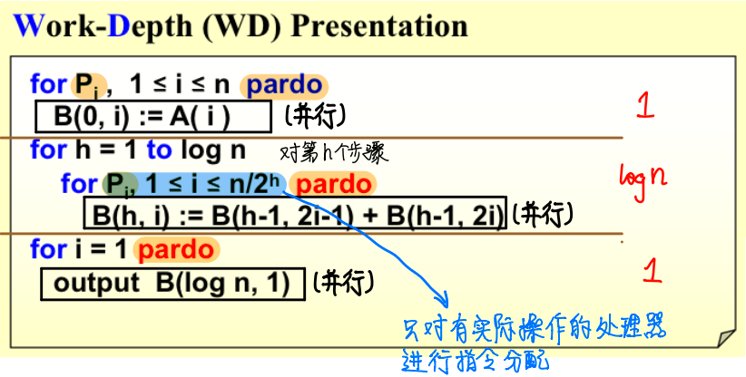
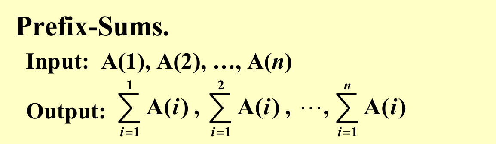
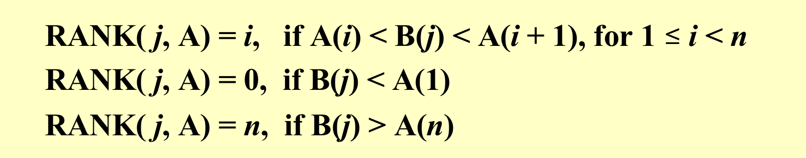
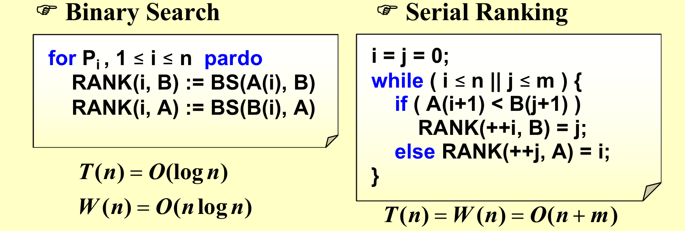
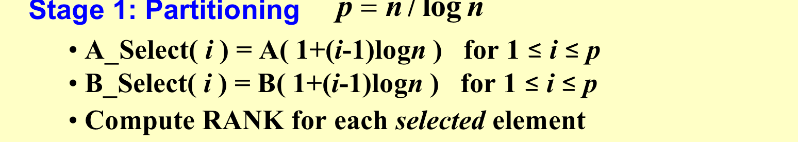
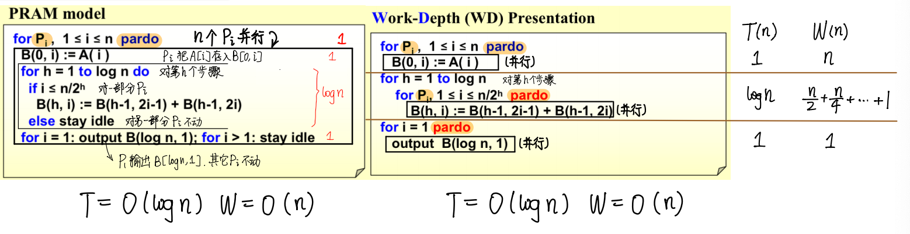
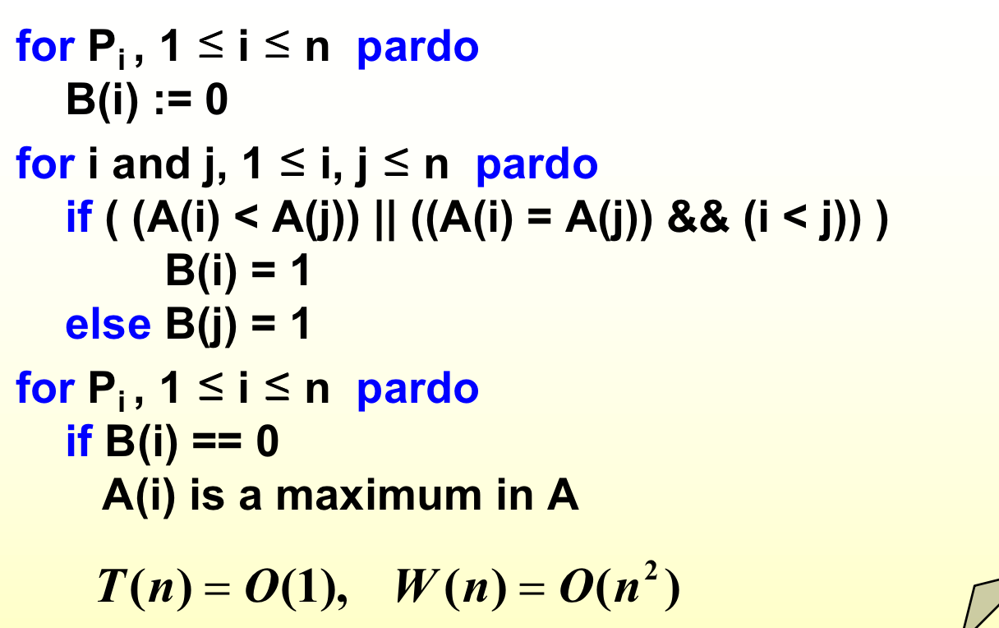

## 1. 概述

并行：

- Machine parallelism：硬件上的并行
- Parallel algorithms：算法并行，这其中有两个模型，Parallel Random Access Machine (PRAM)模型和Work-depth measurement模型

并行算法，目的是利用cpu可以同时执行多条指令（通过流水线、多核、超长指令字等）的特性，合理调度指令的执行方式，使得工作量不增加的情况下减少运行时间。

### 1.1 PRAM 
**Parallel Random Access Machine**

每个单位时间每个处理器都只能执行一个操作，但是每个处理器可以并行地同时地进行操作。

冲突（from carton手写笔记）

---

**例子**

如下所示的B定义为B(迭代次数, 处理器编号)

具体算法：

PRAM缺陷：会造成资源的浪费，因为并不是所有的处理器都需要工作；我们不知道某条指令分配给哪个处理器。

### 1.2 WD

PRAM是获得若干个处理器，那么在任务完成之前，这些处理器就算没有工作也不会释放。

而WD每一步都会去请求一些处理器来工作，这样可以减少资源的浪费。

## 2. 衡量效率

- Work load – total number of operations总工作量: W(n)
- Worst-case running time时间复杂度: T(n)

## 3. Example: Prefix-Sums

问题描述：

仍然构建出原来的二叉树：

定义C为，以当前节点为根节点，最右叶节点之前的和。比如B(3,1)的C就是前8个，比如B(1,3)的C就是前6个的和。

如果在左路径上，那么C值和B值相等；
若一个节点是右儿子，那么C和父节点的值是一样的。
如果不是以上两种情况，那么C就是左边节点的C（左边节点的C值又=其父节点的C值）加上自身的B值。

我们自下而上算B，之后，自上而下算C。

代码：算B值的work load是2n(n+n/2+n/4+…+1)，算C值的work load仍然是2n。其实可以通过观察二叉树的结点个数来看work load，一个node代表一个work load。

## 4. Example: Merging

Merging – merge two non-decreasing arrays A(1), A(2), …, A(n) and B(1), B(2), …, B(m) into another non-decreasing array C(1), C(2), …, C(n+m) 

分割法 Partitioning Paradigm：分割成若干个问题，这些问题互相之间没有依赖关系。

**引入RANK**来表示一个数组中的元素在另一个数组中的位置：

**如果我们已经知道了RANK的值**，那么例如A[i]最后的位置其实就是RANK（B数组中比他小的值的个数）+i（A数组中比他小的个数）。因为上述操作不会往同一个位置写元素，所以他们是独立的，所以可以并行。

---

**那么我们如何求出RANK？**第一种是二分查找法，第二种是串型算法，类似于普通的归并排序算法的合并，也就是两个指针指着两个数组前进。

以上两种算法的**比较**：

- 二分查找法：时间复杂度更低，但是要消耗更多的CPU资源（需要n个处理器），而且总的工作量更大。
- 串型算法：时间复杂度高，但是只需要一个处理器，总工作量小。

**算法改进**

第一步：任务划分

把数组分成每个大小为logn的块。对于每一块的第一个元素，我们利用二分查找计算RANK。

把以上任意两条线之间定义为一个子任务。

这样就能划分出2p个子任务，每个子任务最大为$O(logn)$，因为每个block的大小为$logn$。

以上，通过二分查找来获得RANK需要$T(logn)$，总工作量为$O(plogn)=O(n)$。

第二步：

总结：$T=O(logn), W=O(n)$

## 5. Maximum Finding

- **法一**：可以直接套用刚刚的算法，因为找最大值比加法容易，可以把加号替换成max。

- **法二**：两两比较比较所有的数据，最终一次都没有被打败的就是最大的。如果产生冲突，那么使用CRCW的common处理（但是别人的笔记中写的是arbitrary？我也比较认同arbitraty）机制，只有在写入的值相同的时候才能有效写入。

- **法三**-1：将问题按照$\sqrt n$的规模分成$\sqrt n$个子问题。之后用法二来算出最大的。
- **法三**-2：让每个子问题的规模都是h，然后合并的时候调用法三-1，这样工作量可以减少到$O(n)$。

- 法四
    - 先从$n$个元素中随机筛选出$n^{7/8}$个元素，找出$n^{7/8}$个处理器，去随机找出一个元素，但是这样的话不能保证不重复，但是无伤大雅。$T=O(1), W=O(n^{7/8})$
    - 把上述$n^{7/8}$个元素分成$n^{3/4}$个每组有$n^{1/8}$元素。对于每个$n^{1/8}$的子问题都使用法二来暴力求解，找到最大值。每个子问题$T=O(1), W=O((n^{1/8})^2 = O(n^{1/4})$，所有加起来为$T=O(1), W=O(n^{1/4}) \times n^{3/4}=O(n)$
    - 上一步得到了$n^{3/4}$的最大值，再作切分，分成$n^{1/2}$个每组有$n^{1/4}$元素。对于每个$n^{1/4}$的子问题都使用法二来暴力求解，找到最大值。每个子问题$T=O(1), W=O((n^{1/4})^2 = O(n^{1/2})$，所有加起来为$T=O(1), W=O(n^{1/2}) \times n^{1/2}=O(n)$
    - 上一步得到了$n^{1/2}$的最大值，直接使用法二暴力求解。$T=O(1), W=O((n^{1/2})^2 = O(n)$
    - 上一步得到了$n^{7/8}$个元素中的最大值s。
    - 我们需要$block的数量\times block元素个数^{2} \le n$。
    - 我们让所有的元素和这个选出来的s比较，比s大的元素丢到一个大小为$n^{7/8}$的数组中的随机位置。之后利用刚刚算法再来一遍。
    - 如果碰巧，最大的元素在被随机丢入数组的时候被覆盖了，那么就再来一遍。直到没有元素比这个元素大为止，也就是数组为空。
    - 

## 6. The End

!!! quote

    1. ADSNotes_Algorithms.pdf(from Carton手写笔记)，本次笔记有较多引用，不妥删
    2. ADS14ppt
    3. 小角龙(18)复习笔记.pdf
    4. 智云课堂：2023yy
    5. JerryG(20)复习笔记.pdf
