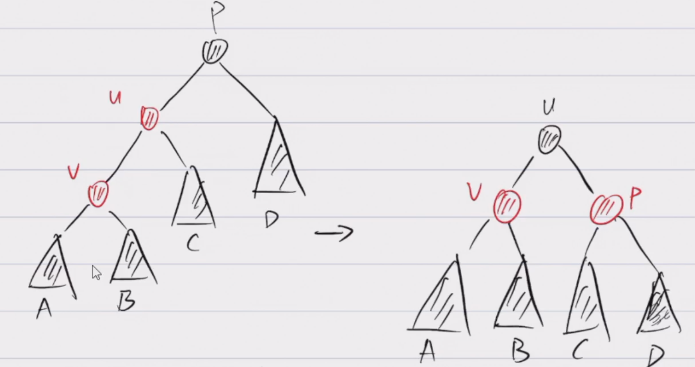
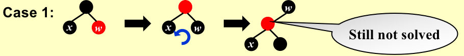
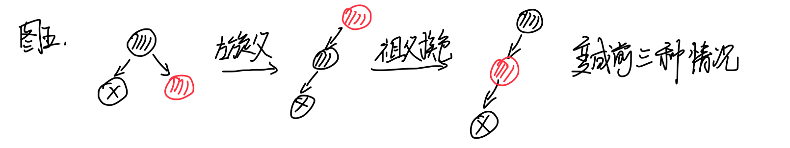

## Red-Black Trees
### 1. Definition
A red-black tree is **a binary search tree** that satisfies the following red-black properties:
- Every node is either red or black.
- The root is black.（头尾都是黑）
- Every leaf (NIL，外部结点) is black.
  - NIL结点是原来的整棵树的结点数加一；
- If a node is red, then both its children are black.（不可能有两个红的相连）
  - 保证红的肯定比黑的少；
- For each node, all simple paths from the node to descendant leaves contain the same number of black nodes.
  - 保证黑点数量一样，保证每一条path的长度比不会超过2，树的高度不会超过两倍的黑高；

!!! tip "平衡二叉树"
    高度保持logN的二叉树；

!!! tip "black-height(bh)"

    是指从当前点（不包括当前点）到叶结点路径中，黑色结点的个数，bh(Tree)=bh(root)；

!!! note "规律"

    A red-black tree with N internal nodes has height at most 2ln(N +1).

    证明：

    

!!! quote "点此跳转"

    [红黑树生成网站](https://www.cs.usfca.edu/~galles/visualization/RedBlack.html)

### 2. Insert

!!! question "速记"

    叔叔是红的，变成一红带两黑；叔叔是黑的，变成一黑带两红；

加入红色结点，如果加在黑点后面，那就结束了，如果加在红色结点后面，那么就有后面几种情况：

判断不同的情况直接看uncle（上一代的subling），如果是红的，就是情况一，如果是黑的就是情况二三；

- case1: 改变一下颜色，把这棵子树的的根结点记为P（现在是红色）；
  - 如果P就是整棵树的根结点，直接标黑；
  - 如果P的父母是黑的，没事；
  - 如果P的父母是红的，那就又冲突了；

- case2: 做一次rotate后变成case3；
- case3: 改变一下颜色，做一次rotate；
- 一次插入最多两次旋转，代价非常小，T = $O( h )$ = $O( lnN )$ ；

### 3. Delete 

!!! note "推论"

    推论：如果有一个节点，只有一个子节点，那么这个结点一定是黑色，而子节点一定是红色；
    

- 跟二叉搜索树一样地进行删除操作，到最后一定会退化成删除单个节点，或只有一个子树的节点；
- 恢复红黑树的性质；
  - 若删除叶子红色节点，直接删除即可；
  - 若删除单子树节点，那么这个节点一定是黑色的（刚刚上面的推论），那么也很简单，直接删除，把后面的接上来并修改颜色即可；
  - 稍微复杂的是删除单个黑节点；
    - 黑兄弟，右红侄/双红侄（无论黑兄弟有没有左孩子，无论父亲什么颜色）：左旋父，祖染父色，父叔黑；
    - 黑兄弟，左红侄（当没有右红侄的时候，无论父亲什么颜色）：右旋兄，交换兄弟与其右子颜色，变成情况一；
    - 黑兄弟，双黑侄（其实是两个NIL节点，无关父亲颜色）：兄弟红，用递归，遇根或红节点，染黑回；
    
    - 红兄弟：左旋父，父、祖换色，变成前三种情况递归处理；

### 4. Compare

| rotation次数表格 | AVL       | 红黑树 |
| ---------------- | --------- | ------ |
| Insertion        | $\le2$    | $\le2$ |
| Deletion         | $O(logN)$ | $\le3$ |

## B+ Trees

### 1. Definition

A B+ tree of order M is a tree with the following structural properties：

- The root is either a leaf or has between 2 and M children.（树的根或者是一片树叶，或者其儿子数在2和M之间）
- All nonleaf nodes (except the root) have between [M/2] and M children.
- All leaves are at the same depth.

!!! tip 

    数据库的基础，先索引（在内存），再寻址（在硬盘）。

    B-树就是非叶节点也存储信息；

### 2. Insert

### 3. Delete

- delete如果到了下限，先看兄弟们有没有能合并的，如果没有，再把父节点下移；

!!! quote "点此跳转"

    [大佬博客](https://www.cnblogs.com/nullzx/p/8729425.html)

!!! quote "参考资料"

    1. ADS02RBTree_Stu.ppt

    2. 中国大学mooc

    3. B站五号智能

    4. 智云课堂：2023myc，2022hqm，2022yds