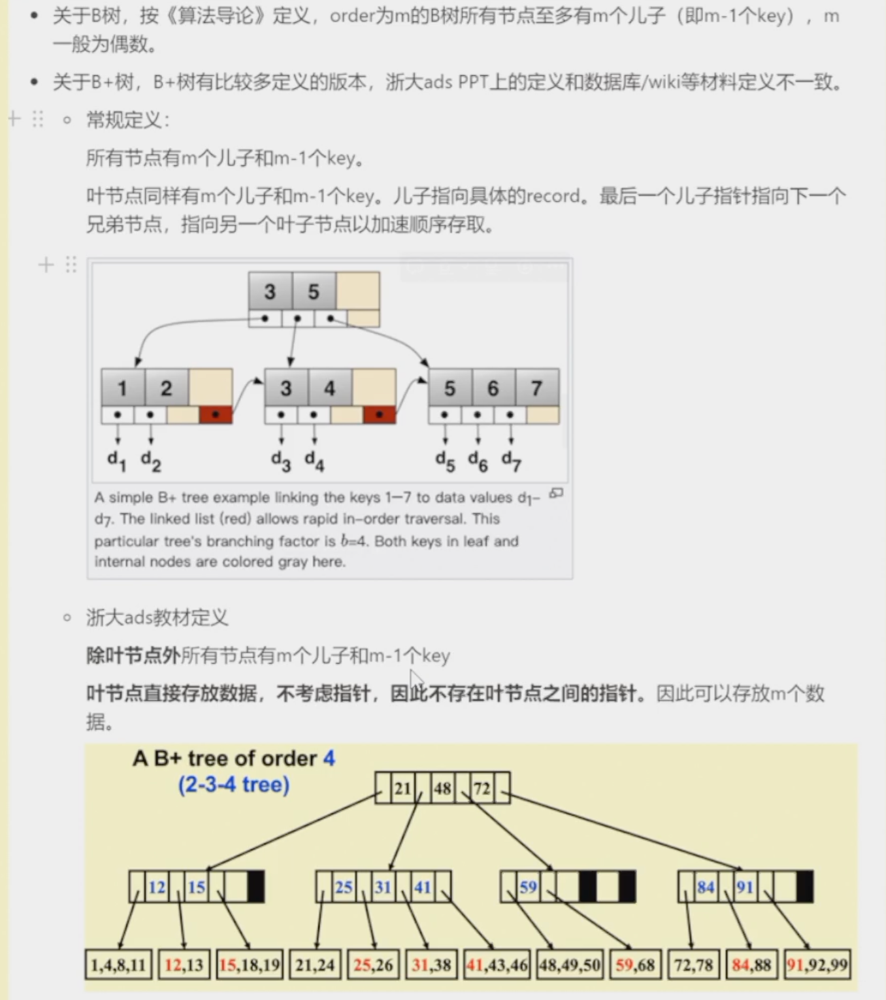

## B+ Trees

## Inverted File Index

### 1. Solution

- Scan each page for the string "Computer Science".
- Term-Document Incidence Matrix.（按照文件来，构建一个邻接矩阵）弊端：邻接矩阵有可能非常稀疏，导致空间和时间的浪费；
- Compact Version - Inverted File Index
  - 为什么要记录“times”？
  - 答：如果我们要找一个文件同时包含多个词语，这样的话我们只需要看出现次数最少的词语，这样比对的次数最少。

### 2. Index Generator

- 英语的单词是靠空格隔开的，但是换成是中文就会变的比较麻烦，我们需要判断这是否是一个“term”，所以我们需要Token Analyzer；
- Vocubulary Scanner和Vocabulary Insertor可以有很多具体实现方式，比如二叉搜索树、哈希等；
- 内存放不下这么多东西，所以要写到硬盘里去，所以要Memory management；
- 

#### 2.1 Token Analyzer

- Word Stemming：将单词处理成原型；
- Stop Words：such as “a” “the” “it”，index他们没有什么用，但是他们还是有posting list的，所以我们可以在搜索或者插入前直接把这些词汇删除，这些叫作stop words；

#### 2.2 Vocubulary Scanner&VInsertor

- Search Trees（such as B-trees, B+ trees）
  - 注意不是红黑树或者AVL树（红黑树稍快AVL树10%-20%），因为他们相对于B树不是那么的高效；
- Hashing
  - 使用哈希，搜索一个正确的单词会更快，但是range search开销会比较大（比如你打错了一个单词或者你搜索一个句子）；

#### 2.3 Memory management

- Block里面存着一部分的posting list，到最后进行整合；
- 为了让merge更快，我们应该keep所有的BlockIndex是有序的；

### 3. 研究者关心的一些问题
#### 3.1 Distributed indexing

- 是对于很大的数据来说的，数据规模大到一个机器存储不下，这时候我们要用很多机器来存储，一个机器就是一个node；
  - Term-partiotioned index：我们用term dictionary来划分存储在哪台机器上；
  - Document- partitioned index：每台机器通过文档来划分，这样的话可能在每台机器上都有可能找到同一个term；

#### 3.2 Dynamic indexing

- 我们一般用一个辅助index来存储新的文件，并生成自己的一个positing list，之后等文件读完了再与main index进行合并；

#### 3.3 Compression

- 为了减少posting list存储空间；
  - 首先去掉stoping word；
  - 然后我们把所有的词连成一长串，然后我们存储一下每个单词的首字母的地址（index）；
  - 这样还不够节约，我们存储相邻两个index之间的差值

#### 3.4 Thresholding（阈值）

- 只对最上面的一些重要文件进行检索，并不检索全部的文件；
  - 不适合带有bool值的搜索要求；
  - 可能会无法找到一些真的相关的文件；
- 对想要查找的term通过频率进行升序排序，然后只检索其中一部分的term（low frequenct的term更重要）；
- 我们可以先把阈值设置在20%，再设置在40%，如果这两者之间有重要内容漏掉了，那就60%，反之说明20%可能已经足够了；

### 4. Measures
#### 衡量搜索引擎
- 建立index的时间有多快；
- 检索的时间有多快；
  - 当然这是一个关于index的函数（index = 100的当然比index = 1000000的要快的多，这样比就不公平了）；
- 语言的表现力
  - 比如苹果，可以是水果也可以是公司，搜索引擎能不能识别描述性词语；
  - 应对复杂的要求比如有很长一句话；

- 用户所关心的：
  - data retrieval：响应时间、检索范围；
  - informaition retriecal：搜索结果的相关程度； 

#### 衡量相关程度

- recall：召回率；
- precision：精确率；

- How to improve relevancy？
  - page rank(网页排名), semantic web(语义网络)…

!!! quote "参考资料"
    1. ADS03ppt
    2. 智云课堂：2022yds
