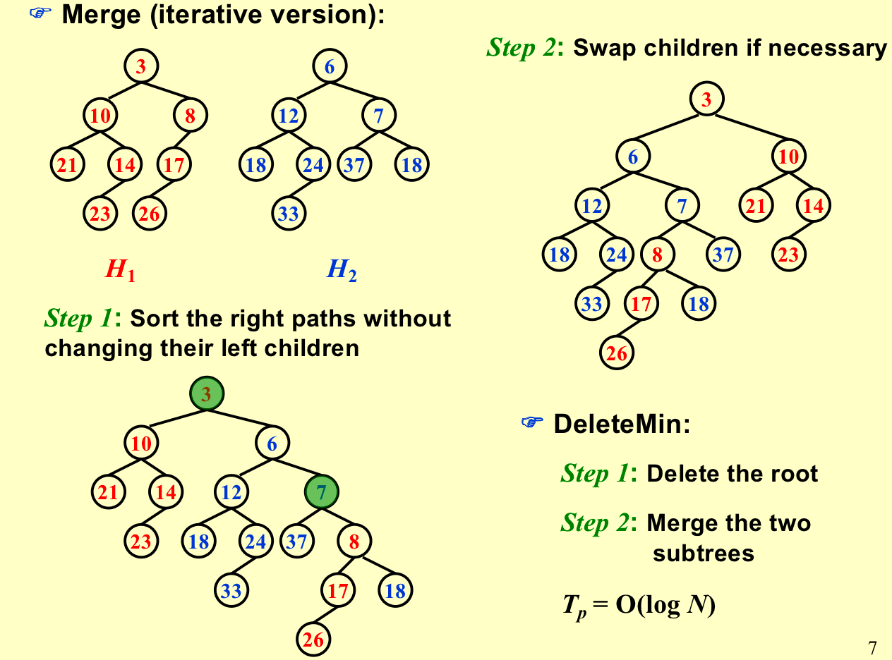
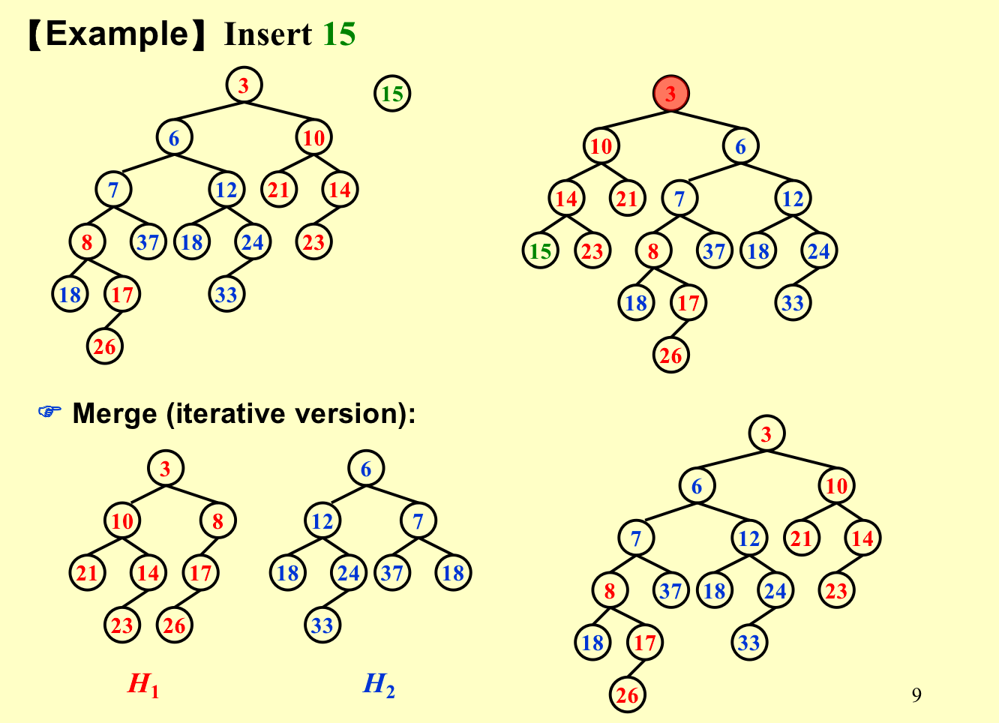
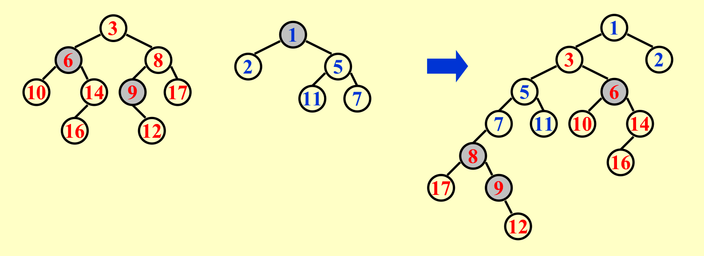

## Leftist Heaps
- 目的：普通堆的合并时间复杂度为$O(N)$，而左倾堆把合并复杂度降为$O(logN)$。
- Order Property – 和堆一样；
- Structure Property – 二叉树，但是是不平衡的；

### Npl

- The **null path length, Npl(X)**, of any node X is the length of the shortest path from X to a node without two children. 
  - NULL的Npl是-1，叶节点的Npl是0；

- Npl(X) = min { Npl(C) + 1 for all C as children of X }

### Definitioan

- The leftist heap property is that for every node X in the heap, the null path length of **the left child is at least as large as that of the right child**.（左倾堆保证任一个节点的左孩子 npl 一定大于等于右孩子的 npl，更偏向于向左延伸）

### Theorem

- 一个右路径上有$r$个节点的左倾堆，至少有$2^r-1$个节点；
- 找一个节点的Npl，只需要一直往右直到Npl为0的点；
- 反过来，如果左倾堆有$N$个节点，那么右路径至多有$log(N+1)$个节点；
- 因为右路径的长度级别是$logN$，所以如果所有工作都在右路径上进行的话，那么就可以保证在$logN$中；

### Merge(Insert)

#### recursive solution

- 假设H1的根更小，那么Merge( H1->Right, H2 )，进行递归；
- Attach( H2, H1->Right )
- Swap(H1->Right, H1->Left ) if necessary；
- 注意，因为swap是在递归调用之后的，所以swap其实是自底向上进行的。
- 

#### Iterative solution

- 沿着右路径进行比大小，哪个小就接上去；
- 然后自底向上（还是在右路径中）进行左右孩子换位；

### DeleteMin

- 删除根节点；
- Merge两个子树；

## Skew Heaps

- 是左倾堆的一个简单版本。 

- Target: Any M consecutive operations take at most $O(M log N)$ time.

- 斜堆的右路径在任何时刻都可以任意长，所有操作的最坏情形运行时间均为$O(N)$。

- Skew Heaps是对Leftist Heaps的改进，Skew Heaps也是一个用于快速合并的数据结构，但无需存储Npl信息，节省了空间。虽然不能保证是左倾树，但是通过无条件交换左右子树，达到平摊意义上的左倾（因为左式堆的合并都是沿最右路径进行的，所以合并之后最右路径长度必然增加，影响操作效率，所以将其与左子树交换）。

### Merge

Always swap the left and right children except that the largest of all the nodes on the right paths does not have its children swapped. 

### Insert

相当于合并，可以看如下两个例子；

!!! question "速记"
    原来两个树在最右边有多少，那么同样的merge之后在左边就会有多少个节点。

### Amortized Analysis for Skew Heaps

!!! quote "点此跳转"
    [不如还是看大佬的吧](https://note.isshikih.top/cour_note/D2CX_AdvancedDataStructure/Lec04/#合理性分析)

#### heavy node

A node p is heavy if the number of descendants of p’s right subtree is at least half of the number of descendants of p, and light otherwise.  Note that the number of descendants of a node includes the node itself.（如果heavy，右儿子节点要大于一半）

**那些heavy/light会变的节点都是原本在右路径上的点。**

#### prove

- potential function: 两个树的heavy node；
- 对于一系列操作，从从两个heap，分别为heap1和heap2，变成了heap3；
- l1表示heap1中右路径light node的个数，h2表示heap2中右路径heavy node的个数；
- 所以就有`Tworst = l1 + h1 + l2 + h2`。
- h指两棵树那些不在右路径上的heavy点的和，他们在merge的前后数量是不变的。
- 

- 
- 用归纳法证明`l1 < log(n1)`和`l2 < log(n2)`，也就是证明如果右路径上有k个light nodes，那么整棵树的节点数要不少于$2^k-1$；
- 

#### Theorem

所有在右路径上的heavy点，最终都会变成light点。这个证明yds老师讲了好久，但是没怎么听懂。

!!! quote "参考资料"
    1. ADS04ppt
    2. 智云课堂：2022yds
    3. 小角龙(18)复习笔记.pdf

