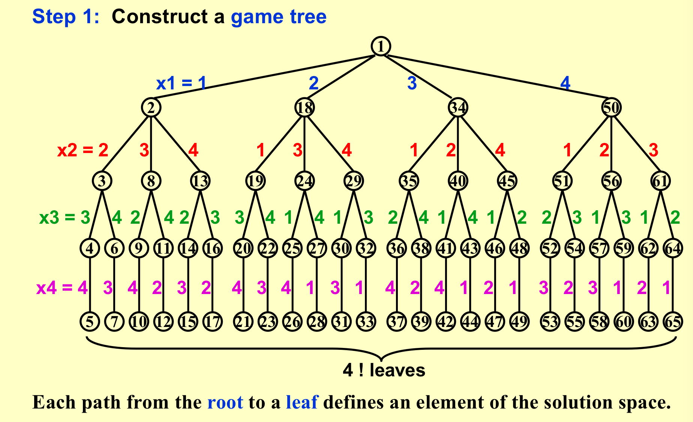
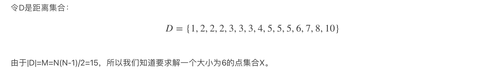
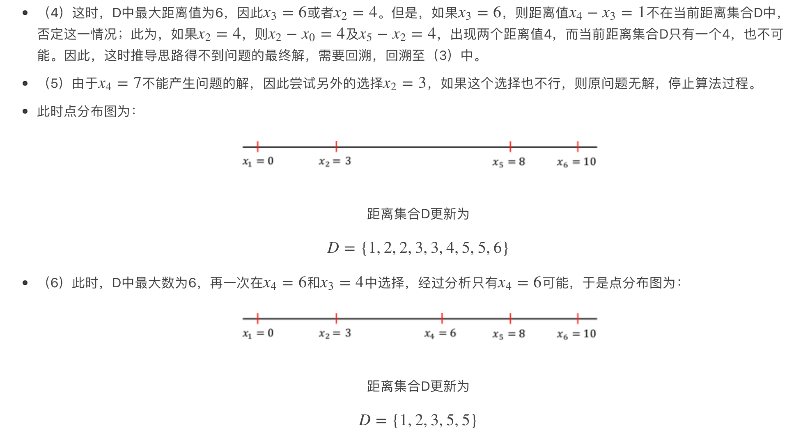
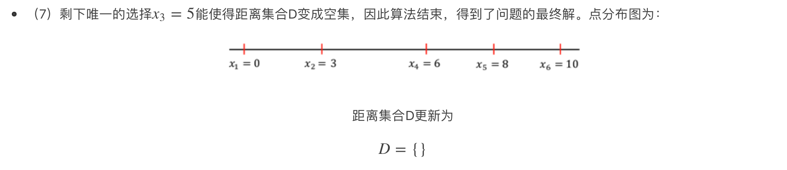
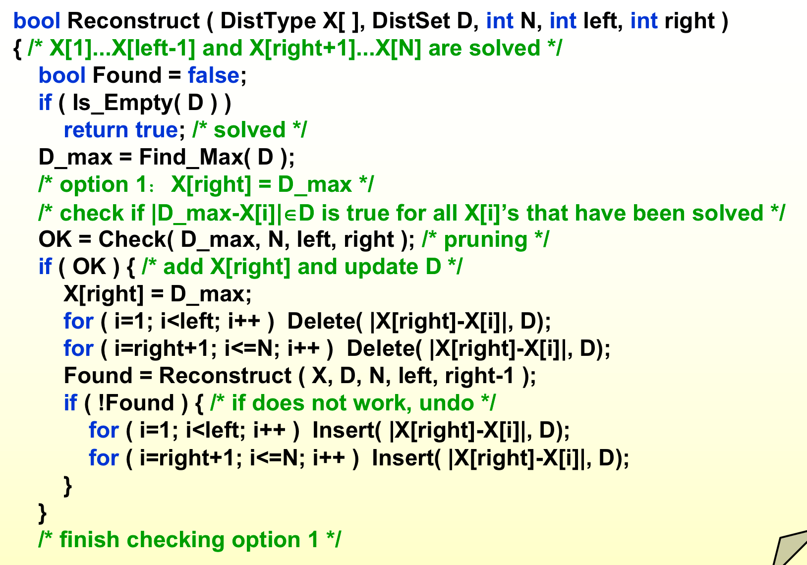
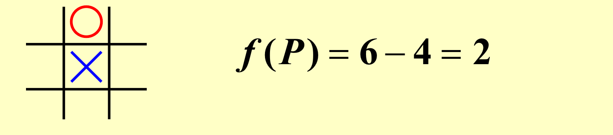
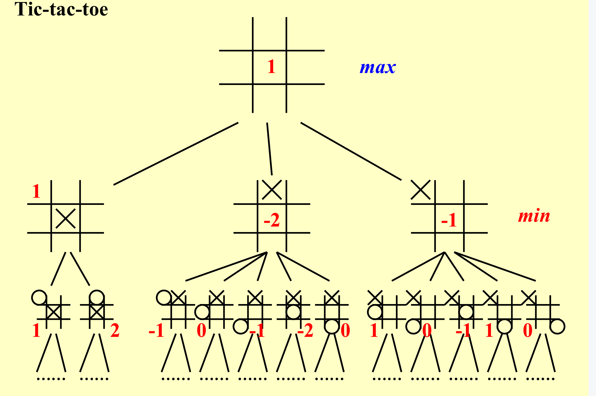

### 1. 引入

- 找到问题答案的一个可靠方法是列出所有候选答案，检查每个答案，宣布确定的答案。
- 回溯使我们能够消除对大量候选人的明确检查，同时仍然保证在算法运行到终止时会找到答案。
- 基本思想是假设我们有一个偏解（x~1~，··，X~i~），然后我们加一个解进去，并检查（x~1~，··，X~i~，X~i+1~）是否满足约束。如果答案是“是”，我们继续添加下一个X，否则删除这个X，
  回溯到先前的部分解（x~1~，··，X~i~）。其实就是深度优先算法。

### 2. 八皇后问题

- 在8×8格的国际象棋上摆放8个皇后，使其不能互相攻击，即任意两个皇后都不能处于同一行、同一列或同一斜线上，问有多少种摆法。

- 以四皇后为例
  - 
  - 

### 3. 道路重建问题

通过给定的点集来回推原来的坐标；

#### 例子

只要每次选最大的点，那么比较的对象永远是两边的端点！

决策树

#### 伪代码

### 4. Backtracking 代码思路

类别数更少的情况放在前面判断！

### 5. AlphaGo

井字棋

采用Minimax Strategy

- 使用状态评估函数来估，`f(P)=W(computer)-W(human)`，W( )表示这一情况下，获胜的可能状态，所以计算机需要让他尽可能的大；
- 如图，圆圈有四种可能性赢，而叉有六种可能性赢；（2023yds）

- 计算机要让f()最大，人要让其最小；

 **αβ剪枝(αβ pruning) -> 重要**
- [最清晰易懂的MinMax算法和Alpha-Beta剪枝详解_Bug_Programmer的博客-CSDN博客](https://blog.csdn.net/weixin_42165981/article/details/103263211)
- 不管黑色的地方取什么都没有意义；
- 不管黑色的地方取什么都没有意义；

- 搜索的点可以变成O(N^0.5)；
