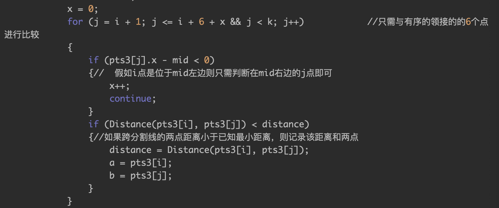
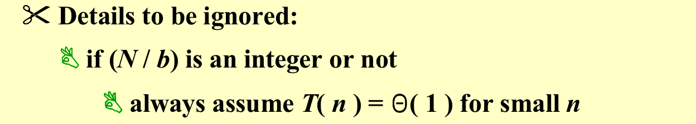
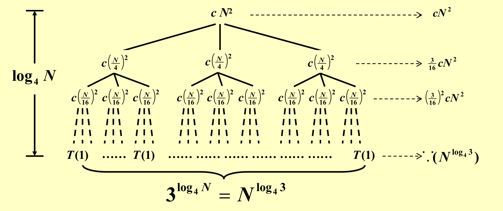
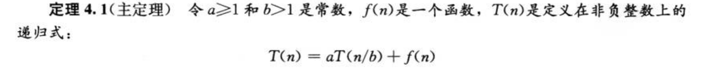
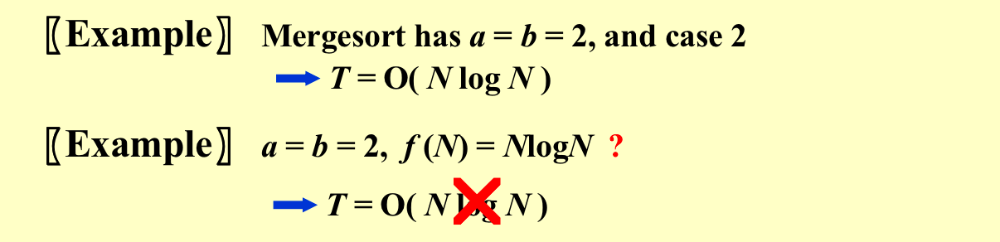
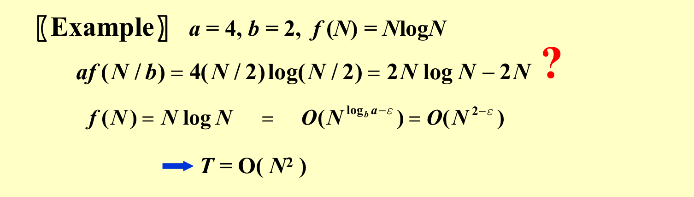
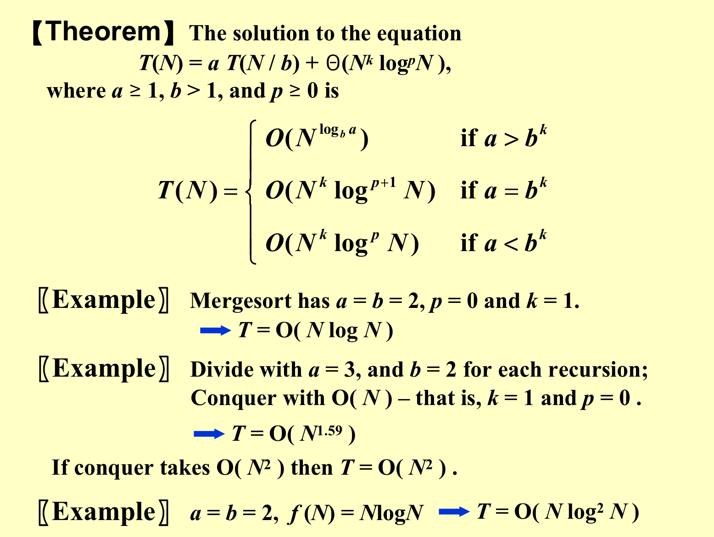

### 1. 概述

`General recurrence:   T(N) = aT(N/b) + f(N)`把问题分成a个子问题，每个子问题的问题规模为原来的1/b，合并的时间复杂度为$f(N)$，如上公式就是这个意思。

一些可以被`divide and conquer`解决的问题：

- The maximu m subsequence sum 连续的子序列的和最大值 – the $O(NlogN)$solution
- Tree traversals （树的遍历）– $O( N )$
- Mergesort and quicksort –  $O(NlogN)$ 

combine对算法的时间复杂度的影响：

!!! quote "注意点(from JerryG)"
    -  分解成的不同子问题之间在各自的解决上必须互无关联，即形式上可以作为原问题的规模更小的 instance。子问题不能需要自身不包含的信息才能解决， 否则无“分治“可言。所以要定义好子问题，保证其独立性。 
    - 要想好如何根据小问题的解合并成大问题的解，这步同样不能复杂度太高。 
    - 对于足够小的子问题，可能直接解决比继续划分效率更高，如快速排序在子数列足够小时用普通排序方法速度更快。 
    - 分治法应用极其广泛，但并不是所有问题都能应用分治思想，尤其是全局内部关联度非常高的问题，比如棋类博弈问题。

### 2. 最近点对问题

#### 问题背景

在应用中，常用诸如点、圆等简单的几何对象代表现实世界中的实体。在涉及这些几何对象的问题中，常需要了解其邻域中其他几何对象（**最接近**）的信息。例如，在空中交通控制问题中，若将飞机作为空间中移动的一个点来看待，则具有最大碰撞危险的2架飞机，就是这个空间中最接近的一对点。这类问题是计算几何学中研究的基本问题之一

#### 具体方法

已知集合S中有n个点，使用分治法的思想就是将S进行拆分，分为2部分求最近点对。算法每次选择一条垂线L，将S拆分左右两部分为SL和SR，( L一般取点集S中所有点的中间点的x坐标来划分，这样可以保证SL和SR中的点数目各为n/2 否则以其他方式划分S，有可能导致SL和SR中点数目一个为1，一个为n-1，不利于算法效率，要尽量保持树的平衡性 )

#### 具体算法

- 如果只有两个点，那么直接输出；
- 根据横坐标，分成两个组，分别调用，求出两边各自最小的距离；
- 求出两边最小的距离a；
- 求出距离中心线a内的所有点，然后根据y坐标进行排序生成点对数组ptr；
- 对ptr中的每一个点进行遍历(包括左右！)
  - 如果是中心线右边的点，直接跳过；
  - 只需与相邻的6个点进行比较；

### 3. 分析

三种分析时间复杂度的方法：代入法（数学归纳法）、递归树方法（猜一个好的结果）、Master method(主定理)法；

#### 3.1 代入法示例

`T( N ) = 2 T( [N / 2] ) + N(向下取整)`

必须得是cN，不能是（c+1)N，所以不行；

#### 3.2 递归树方法

找规律，一直分解到最后一层

**再来一个例子：**

再利用归纳法进行证明

#### 3.3 Master method
**叫作主方法的原因是它分析的是 combine 和 conquer 部分哪个是主导。**

其实就是比较f(N)和 $N^{log_ba}$ 的大小关系，第一种情况是后者大，那么就以后者为主；第二种情况是渐进意义上的相等；第三种情况是，前者比较大，而且满足一些关系，那么就以前者为主。

后者不满足case3的第二个条件

!!! note "证明"

    此定理可以通过递归树进行证明

    

    case1证明：

    

    case2 和 case3 的证明看书。

**另一个形式：**

前面那个可以证明，但这个不能证明  

**最强大的定理：**

!!! question "速记"

    递归递归产生的复杂度是 $N^{log_ba}$, 这个指数 $log_{b}a$ 跟 k 做比较，更大的一方显然可以主导复杂度。如果两者相等，给 f 的 log 的指数加一作为补偿。

!!! quote "参考资料"

    1. ADS06ppt
    2. JerryG(20)复习笔记.pdf
    3. 智云课堂: 2022bjj，2022yds

