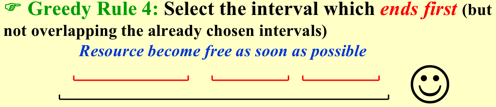

### 1. 基本概念

- 优化问题（optimization problem）：给定一组约束条件和一个优化函数（optimization function）。满足约束条件（constraints）的解称为可行解（feasible solution）。在可行解中求使得优化函数取得最好值的解称为最优解。
- 贪心算法：根据贪婪的标准，在每个阶段做出最好的决定。与回溯法不同，在一个阶段做出的决定在以后的阶段不会改变，所以贪心算法往往复杂度比较低，可以减少大量的搜索，同时每个决定都应该确保可行性。
    - **坚持局部最优直到全局最优**，但不一定能够达到全局最优，贪心算法的结果不一定是真正的最优解（但它给出的解近似于最优解）；
    - 注意，贪心算法**未必能解决所有优化问题**，贪心算法只能在**局部最优和全局最优等价**的时候才能使用；

### 2. Activity Selection Problem 

选择尽可能多的相容活动，或者通俗一点，选择尽可能多的不重合的线段。

$a_i$表示活动，$s_i$表示活动开始时间，$f_i$表示活动结束时间：

#### Solution1: 动态规划

设$S_{ij}$是完全处于“活动$a_i$结束之后～活动$a_j$开始之前”这个区间内的活动合集，假设$c_{ij}$是$S_{ij}$中最多相容活动数。

**最优子结构**：从该区间中随机选一个活动$a_k$，则需要保证k的两边的区间也要使活动数量最多，这就构成了**递推式**$c_{ij} = max\left\{c_{ik} + c_{kj} + 1\right\}$，这样的**时间复杂度**是$T=O(N^2)$

!!! quote "from Carton"

    另外的动态规划的想法：
    

#### Solution2: 贪心算法

利用反例来否定贪心算法的一种策略

- 选择最早开始的；
- 选择最短的；
- 选择和其他线段重合最少的；

---

**选择最早结束**的，或者**选择最晚开始**的是可以的，这样总是留下了最多的资源。首先根据结束时间排序，这里需要$O(NlogN)$，当然这个时间一般不算在内，剩下的比较有没有冲突，所以时间复杂度为$O(N)$。

---

**正确性验证：**

性质：假设有$a_1$, $a_2$ ... $a_n$这么多活动，假设最优解有k个活动，最优解选择了$a_1$, $a_2$ ... $a_k$，贪心算法选择了$a_1'$, $a_2'$ ... $a_k'$，那么总有$a_k'$结束时间比$a_k$早。

可以使用数学归纳法进行证明，假设$a_{k-1}'$比$a_{k-1}$结束时间早，因为最优解中$a_k$是不会和$a_{k-1}$有冲突的，而$a_{k-1}'$结束时间比$a_{k-1}$更早，所以更加不会有冲突，所以$a_{k-1}'$和最优解中的$a_k$是相容的，所以再不济也能选择$a_k$当作$a_k'$，所以贪心算法的最后的结束时间一定比早于等于最优解的结束时间。

现在我们假设最优解有k+1个活动，现在我们证明贪心算法的k个解的结束时间是比最优解的k个解早的，那么肯定能把最优解的第k+1个活动放到贪心算法的解中，所以贪心算法也能选进来，所以贪心算法肯定是和最优解一样多的，这样就证明了这个题目用这种贪心算法的正确性。

---

!!! info

    必须注意的一点是，可行的贪心算法保证得到最优解中的一个，或者说不会有解比它更优，但不能保证问题的任何一个最优解都一定能通过这个贪心算法得到。

    看上去这个策略是对的，但是最优性仍需要数学证明，算法本身不保证最优性。

    在证明贪心算法可行性的时候，思路通常是：假定一个存在的最优解，分析其有没有可能由这个贪心算法得到，如果不可能，则考虑能否将这个最优解转化为可由贪心得到的最优解。

!!! note "贪心算法的基本要素"

    1. 局部最优和全局最优相等
    2. 可以在做出一次贪心选择后转化成一个子问题
    3. 证明用贪心的方法总能存在最优解
    4. 存在最优子机构，在做出了贪心选择之后还可以在子问题中寻找最优解（每一个贪心算法背后总有一个更加复杂低效的动态规划算法）

### 3. Huffman Code - for file compression

如果将字符等长进行编码，虽然便于分隔，但是会造成空间的浪费。所以我们可以按照字符出现的频率进行相应的不等长编码。现在我们的目标是要让如图所示的cost最小。

当然还有一个重要的要素是编码之后能够**解码**，也就是说**任何一个数的编码不能是别的数的编码的prefix**，在图形表示，也就是编码必须放在full tree(这棵树所有的节点要么是叶子要么有两个孩子)的叶节点。

---

（参考JerryG）

所以 huffman 编码解决的是**用贪心算法生成二叉编码树使得平均编码长度（利用字符频率和长度，长度也是树中叶节点深度计算出的期望值）最短**的问题。（补充一点，注意为了让平均长度短（叶节点平均深度低），构建出的树必属 full-tree，即不存在只有一个子节点的节点，因为没有必要，可以把这种节点跟子节点合并）。

**算法描述**：

- 先把C个节点写入一个最小堆中，每个节点的值是对应字符的频率；
- 进行C次循环，每次新建一个节点，左右孩子设为从最小堆中依次推出的两个节点，并且将新节点的值设为子节点的值之和（也就是子节点频率的和）；
- 将这个新节点加入到最小堆中，堆每次大小减少1，重复C次结束；

**贪心思想**：

- 每次 pop 堆中两个元素，相当于较早地取频率最低两个元素，并且把他们加起来合成一个节点，这意味着它们将放在最终编码树的较低层位置，对应的是让低频字符深度大，从而高频字符深度小。

**算法时间**：

- $T = O(ClogC)$

**算法证明：**

要证明：为什么频率最小的一定放在最深的位置？对$n-1$个字符的最优解是否可以扩展到$n$个字符的最优解？

x，y的频率是最小的两个字符节点，证明如下结论

z是x和y的频率的和，证明前者是后者的最优子结构

非常容易证明，这里就不详细写了～

---

!!! quote "参考资料"

    1. ADS09ppt
    2. 小角龙(18)复习笔记.pdf
    3. JerryG(20)复习笔记.pdf
    4. ADSNotes_Algorithms.pdf(from Carton手写笔记)
    5. 智云课堂：2023yds

