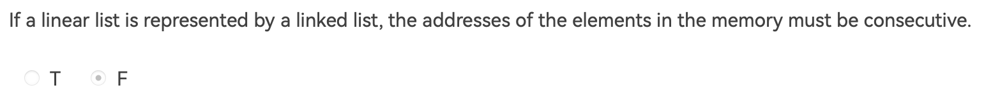

## fds_hw2
>consecutive 连续的

#### 1.


#### 2.


#### 3.
- 6-1 Add Two Polynomials(多项式相加)
```C
Polynomial Add( Polynomial a, Polynomial b )
{
    //temp是中间变量
    int size;
    size = sizeof(struct Node);
    PtrToNode begin;
    begin = (PtrToNode)malloc(size);
    begin->Next = NULL;
    PtrToNode temp;
    temp = begin;
    //初始化
    a = a->Next;
    b = b->Next;
    while(a!=NULL&&b!=NULL)
    {
        if(a->Exponent < b->Exponent){
            temp->Next = b;
            b = b->Next;
            temp = temp->Next;
            temp->Next = NULL;
        }else if(a->Exponent > b->Exponent){
            temp->Next = a;
            a = a->Next;
            temp = temp->Next;
            temp->Next = NULL;
        }else{
            PtrToNode cur;
            cur = (PtrToNode)malloc(size);
            cur->Coefficient = a->Coefficient + b->Coefficient;
            cur->Exponent = a->Exponent;
            cur->Next = NULL;
            if(cur->Coefficient != 0){
                temp->Next = cur;
                temp = temp->Next;
            }
            a = a->Next;
            b = b->Next;
        }
    }
    while(b!=NULL)
    {
        temp->Next = b;
        temp = temp->Next;
        temp->Next = NULL;
        b = b->Next;
    }
    while(a!=NULL)
    {
        temp->Next = a;
        temp = temp->Next;
        temp->Next = NULL;
        a = a->Next;
    }
    return begin;
}
```

#### 4.
- 6-2 Reverse Linked List(importamt!!)
```C
List Reverse( List L )
{
    List temp, Pre, Next;
    temp = L->Next;
    Pre = NULL;
    while( temp )
    {
        Next = temp->Next;
        temp->Next = Pre;
        Pre = temp;
        temp = Next;
    }
    L->Next = Pre;
    return L;
}
```

## fds_hw4
#### 1. 

#### 2.
6-1 Isomorphic
```C
int Isomorphic( Tree T1, Tree T2 )
{
    if(T1 == NULL&&T2 == NULL)
        return 1;
    if(T1 == NULL&&T2 != NULL)
        return 0;
    if(T1 != NULL&&T2 == NULL)
        return 0;
    if(T1->Element != T2->Element)
        return 0;
    int flag1 = Isomorphic(T1->Left, T2->Left);
    int flag2 = Isomorphic(T1->Left, T2->Right);
    int flag3 = Isomorphic(T1->Right, T2->Left);
    int flag4 = Isomorphic(T1->Right, T2->Right);
    return (flag1 && flag4) || (flag2 && flag3);
}

```
#### 3. 
- 7-1 ZigZagging on a Tree
```c
#include<stdio.h>
#include<stdlib.h>

struct tree{
  int data;
  int level;
  struct tree *right;
  struct tree *left;
};

void Create_tree(struct tree **root, int *inorder, int *postorder, int lenth, int *level_loca, int level){
  
  if(lenth <= 0){
    *root = NULL;
      if(*level_loca < level - 1){
          *level_loca = level - 1;
      }
      return;
  }

  int loca_root = 0;
  for(int i = 0; i < lenth; i++){
    if(*(inorder + i) == postorder[lenth - 1]){
      *root = (struct tree*)malloc(sizeof(struct tree));
      (*root)->data = *(inorder + i);
      (*root)->level = level;
      loca_root = i;
      break;
    }
  }

  Create_tree(&(*root)->left, inorder, postorder, loca_root, level_loca, level + 1);
  Create_tree(&(*root)->right, inorder + loca_root + 1, postorder + loca_root, lenth - loca_root - 1, level_loca, level + 1);
}

int main()
{
  int nodes_num;
  scanf("%d",&nodes_num);

  int inorder_seq[nodes_num];
  int postorder_seq[nodes_num];

  for(int i = 0; i < nodes_num; i++){
    scanf("%d",&inorder_seq[i]);
  }

  for(int i = 0; i < nodes_num; i++){
    scanf("%d",&postorder_seq[i]);
  }

  struct tree *root = NULL;
  int total_level;
  Create_tree(&root, inorder_seq, postorder_seq, nodes_num, &total_level, 1);

  int output[total_level][nodes_num];

  for(int i = 0; i < nodes_num; i++){
    for(int j = 0; j < total_level; j++){
      output[j][i] = 0;
    }
  }

  struct tree *queue[nodes_num];
  for(int i = 0; i < nodes_num; i++){
    queue[i] = NULL;
  }
  
  int pre_level = 0, cur_level = 0, level_num = 0;
  int front = 0, rear = 0, empty = 0;
  queue[0] = root;
  while(empty == 0){
    //pop
    cur_level = queue[front]->level - 1;
    if(cur_level != pre_level) level_num = 0;
    output[cur_level][level_num++] = queue[front]->data;
    front++;

    //是否empty
    if(rear < front) empty = 1;

    //push
    if(queue[front - 1]->left){
      empty = 0;
      queue[++rear] = queue[front - 1]->left;
    }
    if(queue[front - 1]->right){
      empty = 0;
      queue[++rear] = queue[front - 1]->right;
    }

    pre_level = cur_level;
  }
  
  //输出
  printf("%d", output[0][0]);
  int j;
  int turn = 1;
  for(int i = 1; i < total_level; i++){
    turn = (i + 1) % 2;
    j = 0;
    if(turn == 1){
      //找到最后一个元素
      while(output[i][j] != 0){
        j++;
      }
      j--;
      //往前输出
      for(; j >= 0; j--){
        printf(" %d", output[i][j]);
      }
    }else{
      while(output[i][j]){
        printf(" %d", output[i][j++]);
      }
    }
  }
    
  printf("\n");

  return 0;
}

```
## fds_hw5
#### 1. 
答案选A；
解答：When locating the middle element during the binary search, you can decide to use either the floor or the ceiling of (Left+Right)/2, but you cannot choose both of them at the same time.If you choose the floor, then it means for EVERY node in the decision tree, its left subtree always has no more nodes than its right subtree. If you choose the ceiling, then the left subtree always has no fewernodes than the right subtree.Only one tree in the choicesis consistent in this sense.


## fds_hw6
#### 1.
- Percolate Up andDown
```c
void PercolateDown( int p, PriorityQueue H ){
    int Child;
    int i = 1;
    int Last_element = H->Elements[1];
    while(i * 2 <= H->Size){
        Child = i * 2;
        if(Child != H->Size && H->Elements[Child+1] < H->Elements[Child])
            Child ++;
        if(Last_element > H->Elements[Child])
            H->Elements[i] = H->Elements[Child]; 
        else break;
        i = Child;
    }
    H->Elements[i] = Last_element; 
    return;
}

void PercolateUp( int p, PriorityQueue H ){
    int Parent;
    int i = p;
    int insert_element = H->Elements[p];
    while(i > 0){
        Parent = i / 2;
        if(H->Elements[Parent] > insert_element)
            H->Elements[i] = H->Elements[Parent]; 
        else break;
        i = Parent;
    }
    H->Elements[i] = insert_element;
    return;
}
```

#### 2.
- 7-1 Complete Binary Search Tree
```c
#include<stdio.h>
#include<math.h>
#include<stdlib.h>

struct BST{
  int num;
  struct BST *right;
  struct BST *left;
};
void creat_BST(struct BST **root, int *input, int N);
void output_cengxu(struct BST *root, int N);

int main(){
  //读取输入
  int N;
  scanf("%d", &N);
  int input[N];
  for(int i = 0; i < N; i++){
    scanf("%d", &input[i]);
  }

  //冒泡排序
  int temp;
  for(int i = 0; i < N - 1; i++){
    for(int j = 0; j < N - i - 1; j++){
      if(input[j] > input[j+1]){
        temp = input[j];
        input[j] = input[j+1];
        input[j+1] = temp;
      }
    }
  }

  struct BST *root = NULL;
  creat_BST(&root, input, N);
  output_cengxu(root, N);
  return 0;
}

void creat_BST(struct BST **root, int *input, int N){
  if(N == 0){
    *root = NULL;
    return;
  }


  int level = 0;//层数
  while(pow(2,level) <= N){
    level++;
  }

  int number_left = 0;
  number_left = pow(2, level) - N - 1;
  if(number_left <= pow(2, level - 2)) number_left = pow(2, level - 2);
  else number_left = pow(2, level - 1) - number_left;
  number_left += pow(2, level - 2) - 1;

  *root = (struct BST*)malloc(sizeof(struct BST));
  (*root)->num = input[number_left];
  creat_BST(&((*root)->left), input, number_left);
  creat_BST(&((*root)->right), input + number_left + 1, N - number_left - 1);

  return;
}

void output_cengxu(struct BST *root, int N) {
  struct BST *queue[N];
  for (int i = 0; i < N; i++) {
    queue[i] = NULL;
  }

  int front = 0, rear = 0, empty = 0;
  queue[0] = root;
  while (empty == 0) {
    // pop
    if (front == 0)
      printf("%d", queue[front]->num);
    else
      printf(" %d", queue[front]->num);
    front++;

    //是否empty
    if (rear < front) empty = 1;

    // push
    if (queue[front - 1]->left) {
      empty = 0;
      queue[++rear] = queue[front - 1]->left;
    }
    if (queue[front - 1]->right) {
      empty = 0;
      queue[++rear] = queue[front - 1]->right;
    }
  }

  printf("\n");
  return;
}
```
## fds_hw7
#### 1.
