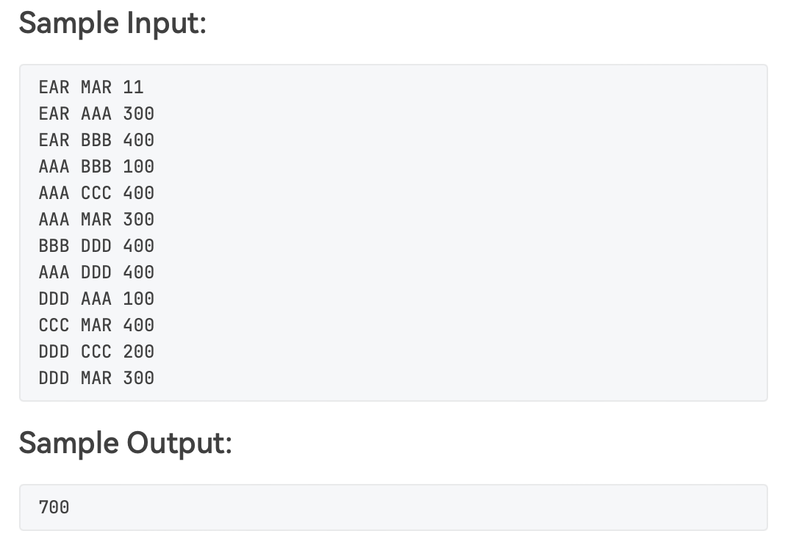

### Universal Travel Sites（最大流问题）

##### 输入输出


##### 代码
```c
#include <iostream>
#include <vector>
#include <algorithm>
#include <queue>

#define num 1000
int capacity[num][num], pre[num];
//capacity用于存放边的容量，若为0则没有边
//pre表示上一个点

using namespace std;

//运用宽度优先遍历查找增广路径，如果没有则返回-1
int bfs(int point_num){
  queue<int> seq;//存放结点
  for(int i = 0; i < point_num; i++) pre[i] = -1;
  pre[0] = -2;//区分起点
  seq.push(0);//将起点压入队列
  while(!seq.empty()){
    int out = seq.front();
    seq.pop();
    if(out == 1) break;//如果pop出了目的地，则退出
    for(int i = 0; i < point_num; i++){//查找所有pop出的点的邻接点，如果没有被访问过，那么push进队列
      if(capacity[out][i] > 0 && pre[i] == -1){
        pre[i] = out;
        seq.push(i);
      }
    }
  }
  //如果是因为队列空了而结束，说明目的地没有被访问过，所以没有增广路径
  if(pre[1] == -1) return -1;
  //如果找到了增广路径，则要遍历这条增广路径，找出最小流量的那条边作为最大流量
  else{
    int i = 1;
    int max_flow = capacity[pre[i]][1];
    while(pre[i] != -2){
      if(max_flow > capacity[pre[i]][i]) max_flow = capacity[pre[i]][i];
      i = pre[i];
    }
    return max_flow;
  }
}

int main(){
  //input1
  vector<string> name;
  string name_in;
  cin >> name_in;
  name.push_back(name_in);
  cin >> name_in;
  name.push_back(name_in);
  int N;
  cin >> N;

  //input2
  vector<string>::iterator it1, it2;
  int i1, i2;
  int max_flow;
  for(int i = 0; i < N; i++){
  //在读取两个地名的同时，将名字压入vector并建立名字和数字的对应关系
    cin >> name_in;
    //这一段都在查找是否有重复，如果有重复，那么不压入
    it1 = find(name.begin(), name.end(), name_in);
    if(it1 == name.end()){
      name.push_back(name_in);
      it1 = name.end() - 1;
    }
    i1 = it1 - name.begin();

    cin >> name_in;
    //这一段都在查找是否有重复，如果有重复，那么不压入
    it2 = find(name.begin(), name.end(), name_in);
    if(it2 == name.end()){
      name.push_back(name_in);
      it2 = name.end() - 1;
    }
    i2 = it2 - name.begin();

    cin >> max_flow;
    capacity[i1][i2] = max_flow;
  }
  //至此输入结束

  int point_num = name.size();//点的个数
  int run;//一次找寻到的流量
  int cumulating = 0;//总流量

  while(1){
    run = bfs(point_num);
    if(run == -1) break;//表示已经没有增广路径
    cumulating += run;
    int i = 1;//1表示目的地，0表示出发地
    while(pre[i] != -2){//反向回溯，改变capacity使算法可以反悔
      capacity[pre[i]][i] -= run;
      capacity[i][pre[i]] += run;
      i = pre[i];
    }
  }
  
  cout << cumulating;

  return 0;
}
```

### Uniqueness of MST（最小生成树的唯一性）

##### 三种情况
<center>
	
	
	
</center>

##### 参考资料
[次小生成树](https://www.cnblogs.com/yyys-/p/11172535.html)
[最小生成树超时](https://blog.csdn.net/qq_43506138/article/details/88595702)

##### 代码
```c
#include <iostream>
#include <vector>
#include <algorithm>
#define N 1000
const int INF = 2147483647;//int中最大的数字

using namespace std;

struct edge{
  int p1;
  int p2;
};

int wei[N][N];//边之间的权值
int MAXE[N][N];//用于表示在最小连通树中，两个点之间的最大边
int used[N][N];//表示这条边是否已经在最小连通树中
int num_v, num_e;//边喝点的数量
vector<struct edge> path; //记录最小生成树的边

//这两个函数用于统计等价类数量
int set_find(int *root, int v){
  if(root[v]< 0) return v;
  else return root[v] = set_find(root, root[v]);
}
void set_union(int *root, int v1, int v2){
  if(v1 == v2) return;
    root[v2] = v1;
}

int prim(){
  vector<int> seq;
  seq.push_back(1);
  int cur_point = 0;
  int next_point = 0;
  int min_edge = 0;
  int whole_weight = 0;
  while(1){
    next_point = -1;
    min_edge = INF;

	//先找到和seq中的点相连的权最小的边
    for(vector<int>::iterator i = seq.begin(); i < seq.end(); i++){
      for(int j = 1; j <= num_v; j++){
        if(wei[*i][j] != 0 && min_edge > wei[*i][j] && seq.end() == find(seq.begin(), seq.end(), j)){
          min_edge = wei[*i][j];
          cur_point = *i;
          next_point = j;
        }
      }
    }
    //表示没找到，则返回-1，表示没有最小生成树
    if(next_point == -1) return -1; 

    //更新seq中任意两点间最大边权
    //新加进去的点是next_point，和cur_point相连
    MAXE[cur_point][next_point] = min_edge;
    MAXE[next_point][cur_point] = min_edge;
    //next_point和seq中的其他所有点的路径，都要通过cur_point，这是关键！！
    //这里有一点递归的思路，因为cur_point的已经知道了，所以只需要把min_edge跟cur_point与其他边的maxe，谁大谁就是next_point与其他边的maxe
    for(vector<int>::iterator i = seq.begin(); i < seq.end(); i++){
      if((*i) != cur_point){
        if(min_edge >= MAXE[cur_point][*i]){
          MAXE[next_point][*i] = min_edge;
          MAXE[*i][next_point] = min_edge;
        }else{
          MAXE[next_point][*i] = MAXE[cur_point][*i];
          MAXE[*i][next_point] = MAXE[cur_point][*i];
        }
      }
    }

    whole_weight += min_edge;//统计最小生成树的质量
    seq.push_back(next_point);//将点压入seq

    struct edge the_edge;
    the_edge.p1 = cur_point;
    the_edge.p2 = next_point;
    used[cur_point][next_point] = 1;
    used[next_point][cur_point] = 1;
    path.push_back(the_edge);//将边压入path

    if((int)seq.size() == num_v) return whole_weight;//这里表示正常返回，已经找到了所有的点
  }
}

int main(){
  cin >> num_v >> num_e;
    
  int set[num_v + 1];
  for(int i = 0; i < num_v + 1; i++){
    set[i] = -1;
  }

  int v1, v2, wei_temp;
  for(int i = 0; i < num_e; i++){
    cin >> v1 >> v2;
    cin >> wei_temp;
    wei[v1][v2] = wei_temp;
    wei[v2][v1] = wei[v1][v2];
    set_union(set, set_find(set, v1), set_find(set, v2));
  }

  int number = 0;
    for(int i = 1; i <= num_v; i++){
      if(set[i] < 0) number++;
    }
    if(number > 1){
      cout << "No MST" << endl;
      cout << number << endl;
      return 0;
    }

		//这是PTA最后一个测试点！！！
    if(num_v == 1){
      cout << "0" << endl;
      cout << "Yes";
      return 0;
    }
    

  int whole_wei = 0;
  whole_wei = prim();

//通过判断次小生成树和最小生成树是否相同来判断唯一性
    for(int i = 1; i <= num_v; i++){
      for(int j = 1; j <= num_v; j++){
        if(i != j && used[i][j] == 0){//如果这条边不在最小生成树中
          if(MAXE[i][j] == wei[i][j]){//i点和j点在最小生成树上有唯一路径，这条路径上的最大权重的边如果和这条不在最小生成树上的边相等，那么说明可以被替换
            cout << whole_wei << endl;
            cout << "No" << endl;
            return 0;
          }
        }
      }
    }

  cout << whole_wei << endl;
  cout << "Yes" << endl;
  return 0;
}
```
