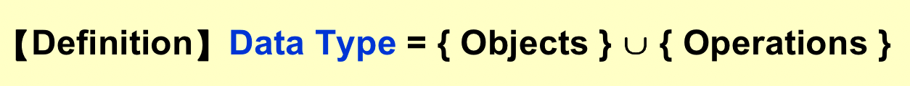
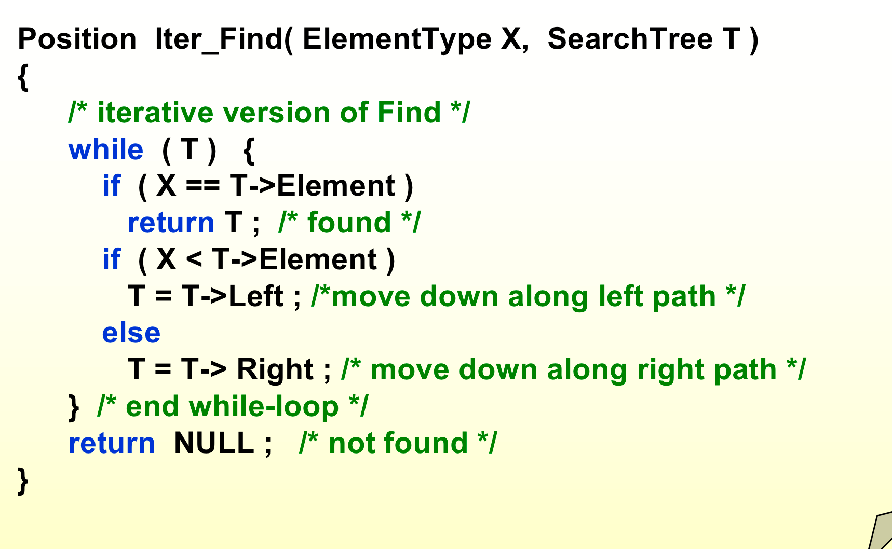
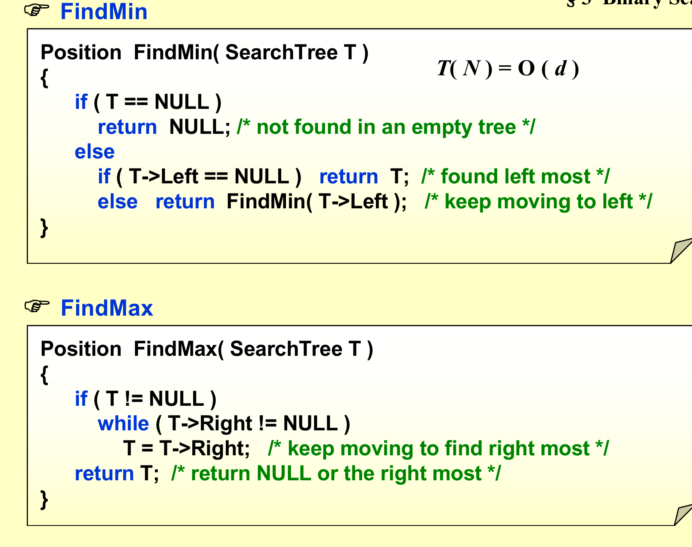
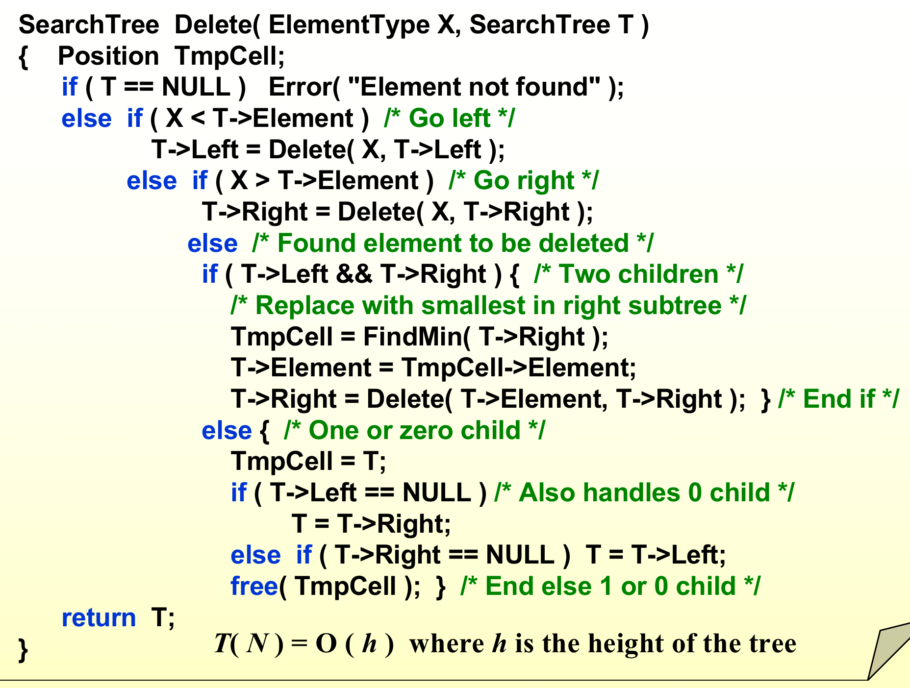

## Lec 1
### 1. algorithm


>程序使用编程语言写的，不一定是有限的（比如操作系统）；

### 2. Analyze


>O可能包含等于的情况，而o是严格小于
>nlogn比n快
>对数平方比对数快

## Lec 2
### 1. 求最大子序列
#### Divide and Conquer

求两边求中间，递归终点如下：
```C
if(left == right)
	if(seq[left] > 0)
		return seq[left];
	else
		return 0;
```


#### On-line ALgorithm


### 2. Lists, Stacks and Queues
#### 2.1 ADT



##### linked lists
1. 需要熟悉各种操作，插入、删除、反转；

- Insertion: 
	>temp->next = node->next;
	node->next = temp;

- Deletion: 
	>pre->next = node->next;
	free(node);

2. 有无头节点；

## Lec 3
### Cursor Implementation of Linked Lists (no pointer)

### The Stack
操作较为简单，不再赘述，谈到多项式的处理，复习[逆波兰表达式](https://blog.csdn.net/weixin_43919932/article/details/103327530)，又谈到函数调用。


### The Queue ADT
队尾插入，队首删除；
front 和 rear 指向头和尾会导致空和满是一样的，无法区分；
> 1. 本质上是信息不够，加变量；
> 2. 少一个元素（这种情况下可以rear指向最后一个元素后的一个位置）；

## Lec 4
### Trees
#### 定义
- degree of a node ::= number of subtrees of the node.  For example, degree(A) = 3, degree(F) = 0.


- degree of a tree ::= max of the node degree. For example, degree of this tree = 3.
- siblings ::= children of the same parent.
- length of path ::= number of edges on the path.
- depth of ni ::= length of the unique path from the root to ni.   Depth(root) = 0.
- height of ni ::= length of the longest path from ni to a leaf.  Height(leaf) = 0, and height(D) = 2.
- height (depth) of a tree ::= height(root) = depth(deepest leaf).

### Binary Trees
【Definition】A binary tree is a tree in which no node can have more than two children.
- 利用队列来实现中序遍历；
- 利用循环来实现中序遍历；
	- 左边走到底，边走边压栈；
	- tree赋值栈顶，pop栈顶元素；
	- 判断是否为空，如果空，则break；
	- 如果不空，输出；
	- 向右走；


#### Threaded Binary Trees
有了线索很方便，如果不是线索，就向右走到底，是线索就按线索来；

加一个头节点来指向中序的起点和终点；


## Lec 5
### 后序遍历第一个点
左边走到底，往右走一步，再左边走到底，直到两边都没有了；

### 完全二叉树
除了最后一行都是满的，最后一行不满的也是在后面；

### 二叉树的性质
For any nonempty binary tree, n0 = n2 + 1 where n0 is the number of leaf nodes and n2 the number of nodes of degree 2.

>证明：每个结点往上看，边的条数：n0 + n1 + n2 - 1；每个节点往下看，边的条数：n1 + 2n2； 
>
>//三叉树四叉树也有类似的结论；

### Binary Search Trees
#### 定义


>查找树的中序遍历一定从小到大；

#### 操作
##### 1. Find




##### 2. FindMin & FindMax



##### 3. Insert


##### 4. Delete
importent！！



>lazy_deletion也可以，用空间换时间。不真的删除，只是做个标记；


## Lec 6
### Heaps
对于堆的操作，先保证其结构，在保证其是堆；
### insertion
先放进最后，然后逐步往上比较；
### DeleteMin
把最后的一个放进根，然后跟insertion一样进行比较；

### BuildHeap
1. 先把所有放进数组中，然后最后一排结点开始，自下而上全部转化成堆；
2. 当成一个一个插入，速度比方法一慢；
### d-Heaps
All nodes have d children；


