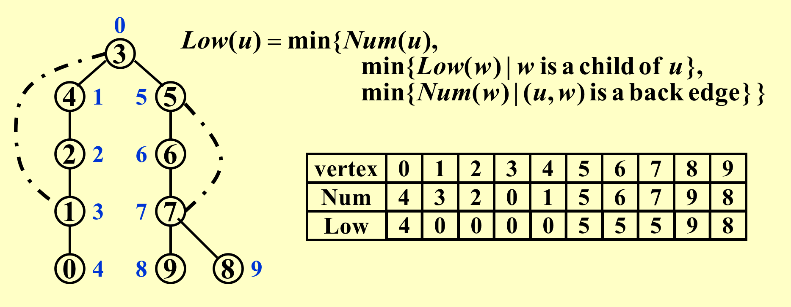

### Depth-First Search(DFS)
#### 1. 用处
  - 双连通子图（任意两个点都有两条路径）
  - 欧拉回路（一笔画，把所有边走一遍）

#### 2. 算法实现
- 深度优先算法实现（访问顺序看for是如何访问的）；
  
- 无向图是连通的，当且仅当从任意结点开始的深度优先搜索访问到每一个结点；
  
    - 如果连通：
    
  
    - 如果不连通（可以用来求连通分支的个数）：
    

#### 3. 双连通子图的一些定义 

- 如果一个连通的无向图中的任一顶点删除之后，剩下的图仍然连通，那么这样的无向连接图就称为**双连通的（biconnected）**。G is a biconnected graph if G is connected and has no articulation points.
- v is an **articulation point** if G’ = DeleteVertex( G, v ) has at least 2 connected components. 即，如果一个图不是双连通的，那么将其删除后图将不再连通的那些顶点叫做**割点（articulation point）**
- A biconnected component is a maximal biconnected subgraph.

#### Finding the biconnected components of a connected undirected G
- 先随便找一个点使用DFS；
- **back edge**连接的一定是祖先后裔的关系；
-  number值按照深度遍历的顺序；
- low值就是消息所能传到的最高级别（实线不算）；

- 1. 如果根结点有两个以上的儿子，一定是关节点（因为根的两边不会有连线）；
- 2. 至少有一个儿子通不了天就是关节点；

- 更新low值相当于后序遍历，因为儿子要先更新；

#### 双连通子图程序
- 第一趟遍历，先和dfs一样对进行num赋值；

- 第二趟第三趟遍历都是后序遍历，计算low并检验是否割点；

- 一次遍历就实现；

#### 4. 欧拉路径与回路
- 1. 判定：
    - 欧拉回路存在当且仅当图是连通的且每个节点的度都是偶数；（An Euler circuit is possible only if the graph is connected and each vertex has an even degree.）
    -  欧拉环路，An Euler tour is possible if there are exactly two vertices having odd degree.  One must start at one of the odd-degree vertices.

- 2. 算法：
    - 任意一点出发深度遍历（这样一定能回到原点，因为有边出去一定有边回来，因为是偶数的度）；
    - 回到原点后，沿着刚刚遍历出来的环走，一定能够发现一个点有边没走完（如果都走完了，那程序就可以结束了）；
    - 然后刚刚那个没走完的点为原点，重复上述操作；
    - 这样遍历出来了两个环，把两个环并成一个大环，这个大环肯定有点的边没走完；

- 提了一嘴哈密顿通路问题；

### 图论总结
- 图分成点和边，那么如何表示边的结构：
    - 用矩阵表示，即邻接矩阵；
    - 用链表表示，一般的用邻接表和逆邻接表，有向图十字链表，无向图多重链表；
- 图的核心基础算法：
    - 深度遍历；
    - 宽度遍历；
    - 然后在遍历过程中不断通过一个点更新另外的点；

### 排序
- 排序分类：
    - 内排序（放在内存里排序）
    - 外排序（把数据放在硬盘里，一部分一部分排序，最后使用归并排序）
- 排序方法：
    - 简单排序
      - 插入排序：假定前面i个已经排好了，插入后一个元素；（最快N，最小N^2^）
      - 冒泡排序：最大的冒泡到最后；
      - 选择排序：从头到尾看一遍，挑一个最大的，和最后一个交换；
      - 简单排序的特点：
        - 比较+交换；
        - 无法突破N^2^，对于N个数，平均的逆序为N^2^，而交换一次只能改变一个逆序；

### 快速排序
#### Shell（分组排序）
- 分成若干组，各自排序好后，再分成若干组，逐渐粗放，到最后只分一组，运用插入排序（插入排序越有序越快）；

#### qsort（快速排序）
- 冒泡排序升级版；

#### 堆排序
- 选择排序升级版，因为选择排序是要找到最大的，所以我们就用堆来找最大的；

#### 基数排序