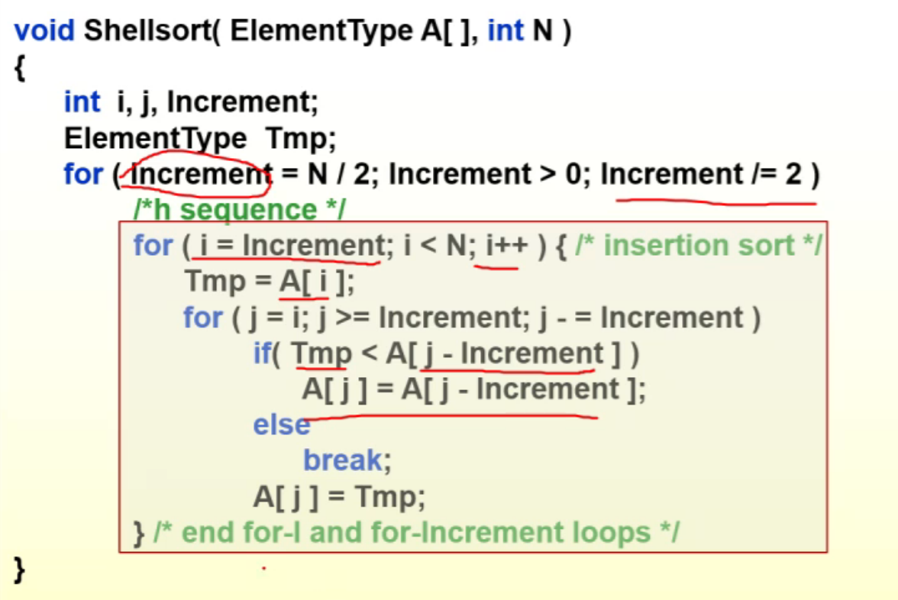
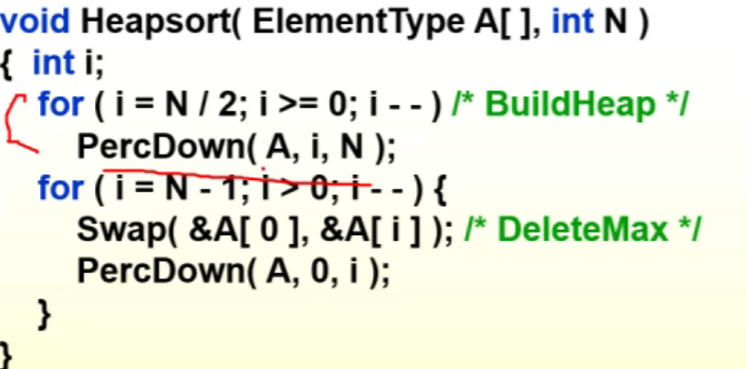
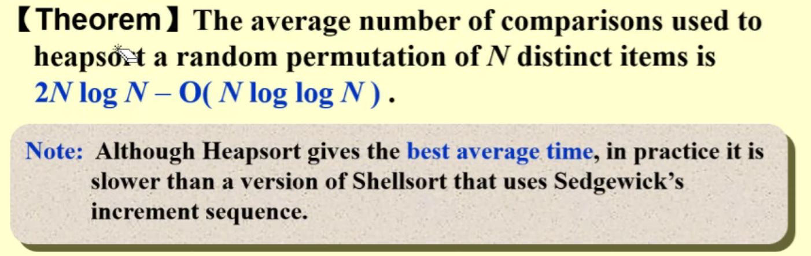
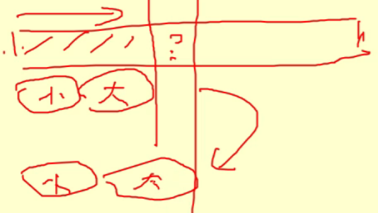
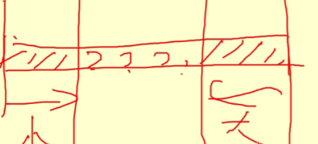

### 1. Shell(分组、插入)

#### 1.1 代码实现

- 方框里就是插入排序（当increment = 1，其实就是简单的插入排序）；
- Increment就是分组的组数；
- 第一个for循环是分组的标准；
- 第二个for就是从数组的的第Increments开始往前面插入，因为每个组的第一个肯定是有序的；
- 第三个for就是组内往前插入；
- 

#### 1.2 Worst-Case Analysis

- 

- 上一轮跟你一组，下一轮我又跟你一组了，重复比较，所以比较好的分组方法如下；

#### 1.3 Hebbard‘s Increment Sequence

### 2. Heapsort

#### 2.1 代码实现
- 
- 第一个for的意思是从最后一个结点开始建堆；
- 然后不断删除，不断把最大元素放到最后面去；
- 

- 

### 3. Mergesort(归并排序)
#### 3.0 思路
- 分组；（快速排序的重点）
- 递归；
- 合并几个已经被排序的组；（归并排序的重点）
#### 3.1 代码实现

- 

- 
- 

#### 3.2 分析

- 
- 可以用循环还代替递归：如上图所示，所有的方框内都是排好序的，不断地合并；

### 4. Qsort

#### 4.1 算法

- 
- 快速排序的核心是找到一个好的pivot，但是几乎不可能一半一半，但是差距最多不能超过1:3才行；
- 挑第一个元素，最后一个元素和中间的元素，三个里面取中间值；
- 或者选五个元素，但是五个元素选中间值比较烦；
- 怎么“原地”分成两堆（谈了一下循环不变式）：
  - 单向扫描：
    - 
    - 
    - 如果是大的就继续，如果是小的堆就和大堆的第一个位置交换，要有一个指针指向大小堆的分界线；
  - 双向扫描：
    - 
    - 
    - 小的往左走，要是还是小的，就继续走，遇到大的就停下；大的往右走，要是还是大的，就继续走，否则停下；两个都停了，就把两个头交换位置；

#### 4.2 对于小数组
- 

