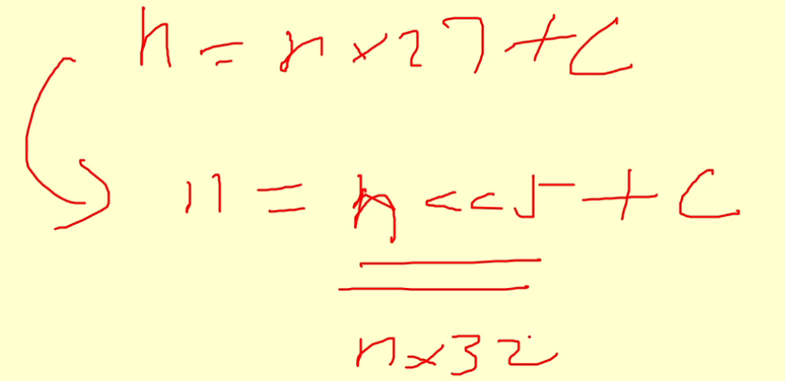
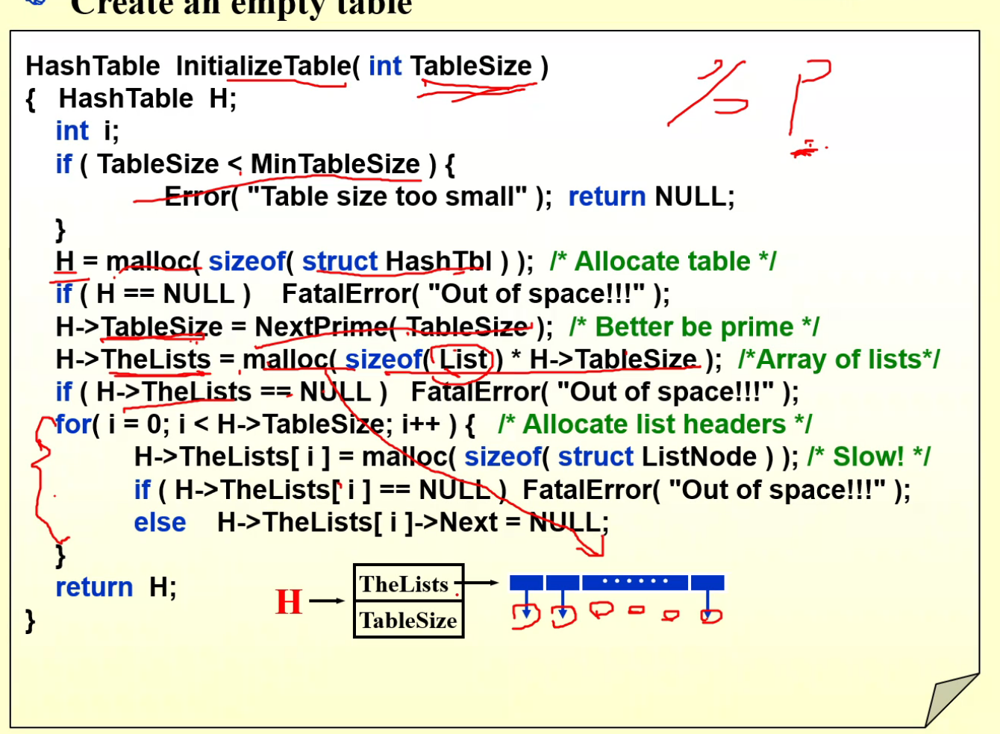
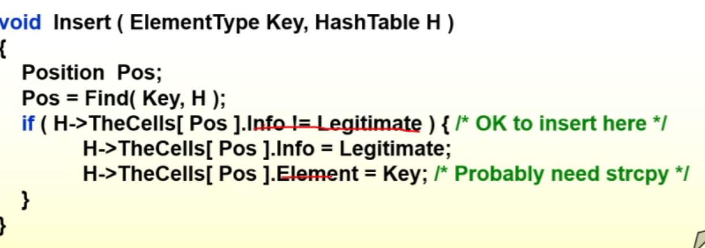
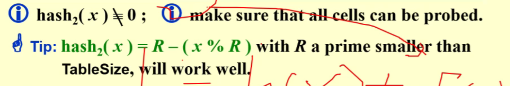
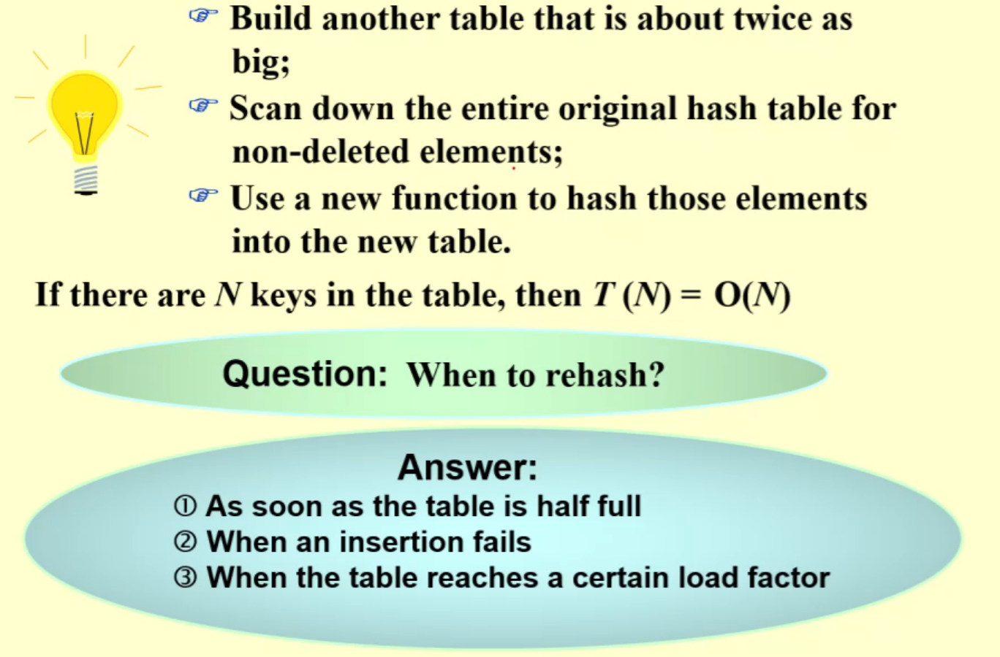

### 0. 复习排序

- 算法的特点
    - 给你一个序列，告诉你经过两轮排序的结果，问用什么方法；
- 各种算法的时间复杂性
    - 简单排序
    - 快速排序（基数排序跟位数有关系）
- 各种算法的空间复杂性（指要用多少额外的空间
    - 快速排序用到递归（O（logN））；
- 算法排序的稳定性问题
    - 保证相同的数值，本来在前面之后还是在前面，那么就是稳定的；
    - 一般会跨越交换的就是不稳定的；

### 1. HASHING

本质上是空间换时间；

#### 1.1 General Idea

管理与操作字典：插入单词，删除单词，查找单词（最主要）；

##### Hash Tables

**目标：**设计一个好的哈希函数；设计一个好的解决冲突算法；

#### 1.2 Hash Function

##### 特点

1. （好算）f ( x ) must be easy to compute and minimizes the number of collisions.

2. （没有偏见，均匀映射）f ( x ) should be unbiased.  That is, for any x and any i, we have that Probability( f ( x ) = i ) = 1 / b.  Such kind of a hash function is called a uniform hash function.

##### 哈希函数

1. 求余法；（用素数比较好）
2. 平方取中法（平方，取中间的数字为哈希值）；
3. 折叠法（分成n块，再加起来，就是最后的哈希值）；
4. 数字分析法；

##### 例子（整数、字符串

把x27改成向左移动五位；

#### 1.3 Separate Chaining（解决冲突）

##### 方法

- Separate Chaining，一层一层往上累加；
- 开放地址法之线性探测，有冲突就会往后找；
- 公共溢出区法，冲突的全部记在一起；

##### 创建代码

- 首先判断，如果比较小直接插入排序就好了，不需要哈希；

- 申请空间产生一个哈希表；

- 比table size大一点的素数作为table size；
- 产生指针数组；
- for循环，设置空头结点；

##### Find

-  通过算法算出哈希值，这就是链表所在地；
- 在单向链表里寻找；

##### Insert
- 首先Find，看看元素在不在里面，如果在里面就不需要插入了；
- 先申请空间，然后开始插入；
    - 先算出哈希值，然后接入（链表头插入）；

### 1 HASHING（12.20）

#### 1.4 Open Addressing

##### 基本思路

不断增加偏移量，看有没有冲突；

##### 1 线性探测

- **平均成功查找次数**（枚举法即可）

- **平均不成功查找次数**：根据哈希函数不成功查找的字符串分成若干种类型，全部加起来，除以类的总个数；

##### 2 Quadratic Probing

如果加的超过范围了就求余，二次查找避免了拥挤，但是他不一定能够找到空位；

##### 一些其他方法

##### Find Insert and Delete

##### 3 Double Hashing

##### 4 Rehashing

