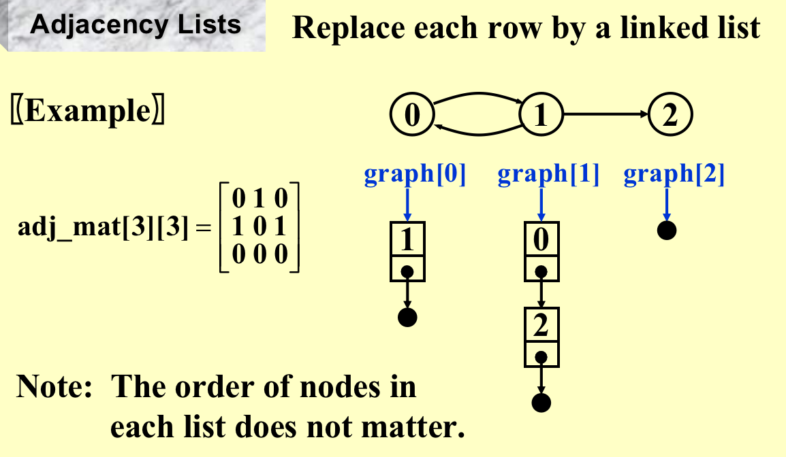
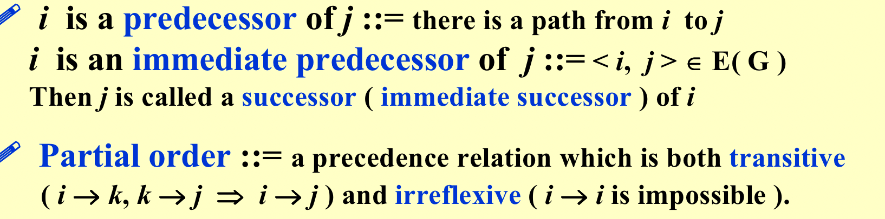
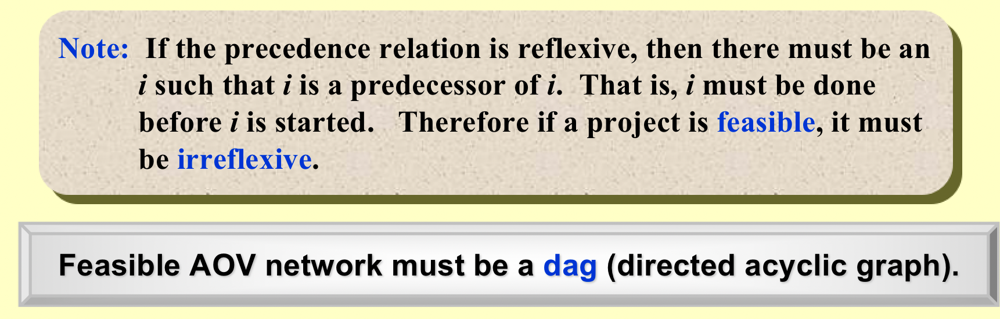
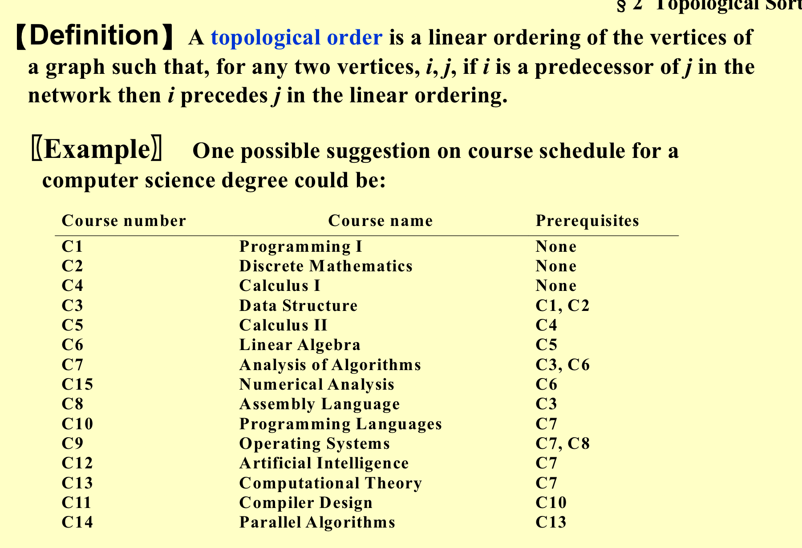
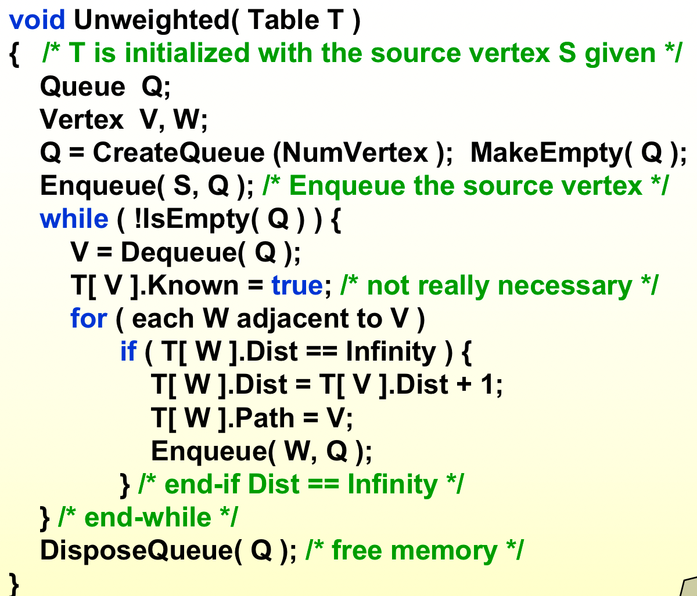

```toc
```
### 1. 一些定义
#### Adjacency Lists（邻接表）
指出去的表；



#### 逆邻接表
指进来的表；
#### 合并成十字链表


#### Adjacency Multilists（多重链表）
对于无向图：
- 若使用邻接矩阵，五条边要有十个结点；
- 类似上方的无向链表，构建多重链表；
- 多重链表左右位置互换都没有关系；


### 2. Topological Sort（拓扑排序
#### 一些定义
- DAG：有向无环图；
- AOV：用点来表示对象；


- AOV特征：传递性但不是对称的；





- 拓扑排序：一个一维序列，满足二维的表的关系即可；



#### 找拓扑排序
##### 方法一
- 拓扑排序第一个点入度为0；
- 对indegree数组进行查找，找到入度为0的点，若没有，则说明有回环，error；
- 找到后，进行相应的输出；
- 每次删除一个点后，把对应的出度的边也删除，把这个边的入度点的入度减1；


##### 方法二
- 创造一个队列；
- 找出所有入度为0的点，压入队列；
- while(!Isempty(Q))
	- 一个元素出队列，并放入输出列表；
	- 对于所有和此元素相连的元素，把他们的入度都减一，并判断是否在修改过后，入度为0；
	- 如果输出列表还没满就出来了，说明有环，error；


### 3. Shotest Path Algorithm


#### 3.1 Single-Source Shortest-Path Problem
Given as input a weighted graph, G = ( V, E ), and a distinguished vertex, s, find the shortest weighted path from s to every other vertex in G.
##### 3.1.1 Unweighted Shortest Paths
1. 距离为0列出所有，距离为1列出所有.......（宽度遍历）；
2. 实现思路：
	- Table[ i ].Dist：最短路径的长度；
	- Table[ i ].Known：是否已经算过，比如算2的时候，1就不用再算了；
	- Table[ i ].Path：记住上一个人；
3. 实现代码（**已知一个点的路径信息，修正附近点的路径信息**）；




##### 3.1.2 Dijkstra’s Algorithm (for weighted shortest paths)

- **在unkown的点中，dist值最小的点就是最短路径；**
- 找最小值可以用堆来提高效率；


##### 3.1.3 Graphs with Negative Edge Costs
- 原来是标记为known后不去碰它，但是有负数之后还是需要遍历known；**没有known和unkown之分**；
- 如果队列中已经有自己了，就不用再入队了；
- 因为每循环一次少一个点，当有更新的时候，就会入队，队列为空就结束；


### 4. Acyclic Graphs
- AOE——边代表对象（任务），边的权重代表时间，点代表依赖关系；

- 关键路径查找；