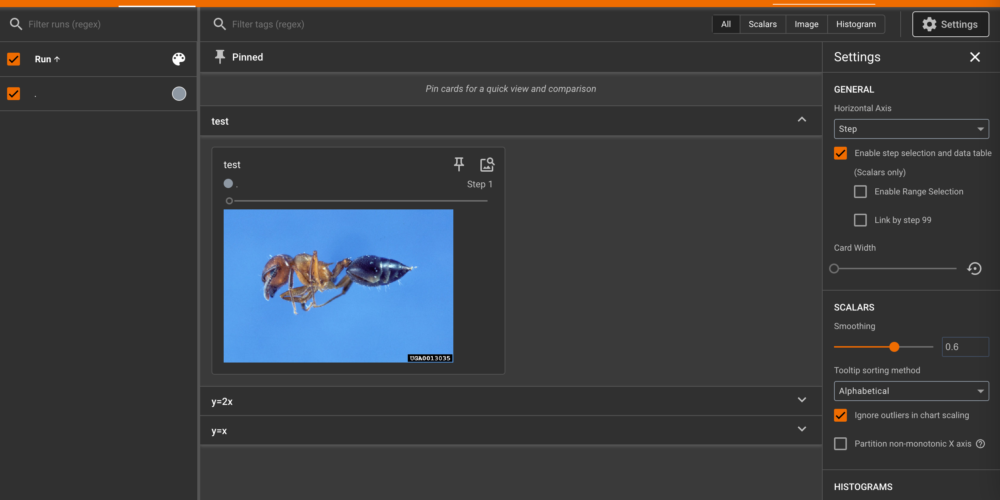
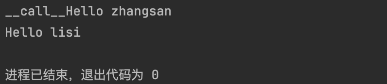

## 0. 安装

> 参考：[blog.csdn.net](https://blog.csdn.net/libing_zeng/article/details/96615716)、[cloud.tencent.com](https://cloud.tencent.com/developer/article/2221944)、[Mac M1芯片安装PyTorch、GPU加速环境_mac cuda-CSDN博客](https://blog.csdn.net/Waldocsdn/article/details/129673645)

- `conda create -n pytorch python=3.11`
- `conda install pytorch::pytorch torchvision torchaudio -c pytorch`

## 1. 法宝

- dir()：能让我们知道工具箱以及工具箱中的分隔区有什么东西；
- help()：能让我们知道每个工具是如何使用的，工具的使用方法；

## 2. Pytorch 数据处理

- Dataset：数据集，对海量的数据进行标注和编号
    - 如何获取每一个数据及其label
    - 告诉我们总共有多少的数据
- Dataloader：对Dataset进行打包，为后面的网络提供不同的数据形式

> 代码演示：2-Dataset.py、2-Dataset.ipynb

## 3. TensorBoard 的使用

### 安装 tensorboard

```python
conda activate pytorch
pip3 install tensorboard
```

### `add_scalar`

```python
from torch.utils.tensorboard import SummaryWriter

writer = SummaryWriter("logs")

# writer.add_image()
# y = x
for i in range(100):
    writer.add_scalar("y=2x", 2*i, i)

writer.close()
```

- 直接运行文件，之后命令后执行 `tensorboard --logdir=logs`
- 默认在本地 6006 端口
- 也可以指定端口，也就是命令后输入 `tensorboard --logdir=logs --port=6007`

> 注意：若修改变量但未修改 tag 可能发生两条曲线拟合而出错，解决方法是把 log 删除再生成，或修改 tag。官方建议训练新数据时，把 log 保存在一个新的子文件夹中。

### `add_image`

- 从 PIL 到 numpy, 需要在 `add_image()` 中指定 `shape` 中每一个数字/维表示的含义

```python
from torch.utils.tensorboard import SummaryWriter
import numpy as np
from PIL import Image

writer = SummaryWriter("logs")
image_path = "Dataset/train/ants_image/0013035.jpg"
img_PIL = Image.open(image_path)
img_array = np.array(img_PIL)
print(img_array.shape)

writer.add_image("test", img_array, 1, dataformats='HWC')
# y = x
for i in range(100):
    writer.add_scalar("y=2x", 2*i, i)

writer.close()
```

- 运行后观察



- 再把image_path修改一下，再修改一下add_image的参数`global_step`为2，再次运行`3-TensorBoard.py`
- 再刷新，可以看到“test”目录下的第二步变成了另外一张图片


> 代码演示：3-read_data.py、3-TensorBoard.py

## 4. Transforms

### Transforms 基本介绍和使用

Transforms本身指的是一个python文件，更像是一个工具箱，在工具箱中有很多的工具，比如`totensor`、`resize`等，它的作用是把特定格式的图片经过工具，输出一个我们想要的图片的结果。

通过transforms.ToTensor去看两个问题：

- transforms在python中该如何使用
- 为什么我们需要Tensor这个数据类型

> ToTensor可以将一个PIL Image或者一个numpy.ndarray类型转化为tensor。

#### transforms 该如何在 python 中使用

使用transforms的工具，来创建自己的具体的工具，比如

```python
from PIL import Image
from torchvision import transforms

img_path = "Dataset/train/ants_image/0013035.jpg"
img = Image.open(img_path)

tensor_trans = transforms.ToTensor()
tensor_img = tensor_trans(img)

print(tensor_img)
```

#### 为什么需要 tensor 数据类型

tensor 即“张量”。实际上跟numpy数组、向量、矩阵的格式基本一样。但是是专门针对GPU来设计的，可以运行在GPU上来加快计算效率，不要被吓到。

在PyTorch中，张量Tensor是最基础的运算单位，与NumPy中的NDArray类似，张量表示的是一个多维矩阵。不同的是，PyTorch中的Tensor可以运行在GPU上，而NumPy的NDArray只能运行在CPU上。由于Tensor能在GPU上运行，因此大大加快了运算速度。

一句话总结：一个可以运行在gpu上的多维数据而已

> - 在函数的括号里使用`command+p`可以看参数类型
> - [tensor一些用法](https://www.jianshu.com/p/314b6cfce1c3)

将img进行读取并写入tensorboard中

```python
from PIL import Image
from torch.utils.tensorboard import SummaryWriter
from torchvision import transforms

img_path = "Dataset/train/ants_image/0013035.jpg"
img = Image.open(img_path)

writer = SummaryWriter("logs")

tensor_trans = transforms.ToTensor()
tensor_img = tensor_trans(img)

writer.add_image("Tensor_img", tensor_img)

writer.close()
```

> 代码参考：4-Transforms.py

### 常见的 Transforms

#### python 中 `__call__` 的用法

这里为class创建`__call__`方法可以让对象直接被调用，更方便一点。

```python
class Person:
    def __call__(self, name):
        print("__call__" + "Hello " + name)

    def hello(self, name):
        print("Hello " + name)


person = Person()
person("zhangsan")
person.hello("lisi")
```

输出：



> 代码参考：4-CallTest.py

#### ToTensor() 的使用

```python
# ToTensor的使用
trans_totensor = transforms.ToTensor()
img_tensor = trans_totensor(img)
writer.add_image("ToTensor", img_tensor)
```

#### Normalize() 的使用

使用均值和标准差归一化一个 tensor 类型图片

```python
# Normalize 的使用
# Normalize a tensor image with mean and standard deviation.
# ``output[channel] = (input[channel] - mean[channel]) / std[channel]``
print(img_tensor[0][0][0])
trans_norm = transforms.Normalize([0.5, 0.5, 0.5], [0.5, 0.5, 0.5])
img_norm = trans_norm(img_tensor)
print(img_norm[0][0][0])
writer.add_image("Normalize", img_norm)
```

#### Resize() 的使用

把PIL图片resize为指定大小，注意，输出和输出的类型一样，都是PIL图片类型

```python
# Resize 的使用
print(img.size)
trans_resize = transforms.Resize((512, 512))
img_resize = trans_resize(img)  # 输出的还是PIL图片类型
img_resize = trans_totensor(img_resize)  # 把PIL图片转化回tensor数据类型
writer.add_image("Resize", img_resize)
print(img_resize)
```

#### Compose() 的使用

将多个步骤合并为一个，将上一步 resize 和 totensor 合并

```python
# Compose - resize - 2
trans_resize_2 = transforms.Resize(512)
trans_compose = transforms.Compose([trans_resize_2, trans_totensor])
img_resize_2 = trans_compose(img)
writer.add_image("Resize", img_resize_2, 1)
```

#### RandomCrop() 的使用

```python
# RandomCrop 的使用
trans_random = transforms.RandomCrop(512)
trans_compose_2 = transforms.Compose([trans_random, trans_totensor])
for i in range(10):
    img_crop = trans_compose_2(img)
    writer.add_image("Random Crop", img_crop, i)
```

#### 总结使用方法

关注输入和输出类型，多看官方文档，关注方法需要什么参数。不知道返回值的时候，使用`print()`或者`print(type())`。

> 代码参考：4-UsefulTransforms.py

## 5. torchvision 中数据集使用

> [torchvision官方说明](https://pytorch.org/vision/stable/index.html)

主要讲`torchvision.datasets`和`torchvision.datasets`如何跟`torchvision.transforms`进行联合使用。

### torchvision 概述

- `torchvision` 提供了一些常用的数据集，包括 `MNIST`（入门数据集 ｜ 手写文字）、`CIFAR10`、`COCO`、`Imagenet`、`CIFAR100`、`STL10` 等
    - 如下以CIFAR10为例，如下是官网对其的[说明](https://pytorch.org/vision/stable/generated/torchvision.datasets.CIFAR10.html#torchvision.datasets.CIFAR10)，

- `torchvision.io`：包含了一些图像的 `I/O` 工具，如 `PIL`、`opencv` 等。（输入输出模块，不太常用）

- `torchvision.models`: 包含了一些经典的神经网络模型（有些已经预训练好），如 `AlexNet`、`VGG`、`ResNet` 等。

- `torchvision.transforms`：这是之前第4章的内容。

### `torchvision.datasets` 的使用

```python
import torchvision

train_set = torchvision.datasets.CIFAR10(root="./Dataset", train=True, download=True)
test_set = torchvision.datasets.CIFAR10(root="./Dataset", train=False, download=True)

print(test_set[0])
print(test_set.classes)

img, target = test_set[0]
print(img)
print(target)
print(test_set.classes[target])
img.show()
```

修改`torchvision.datasets.CIFAR10`的参数，与transforms联合使用，也就是在读入数据集图片的时候，对每个图片先进行操作。

```python
import torchvision
from torch.utils.tensorboard import SummaryWriter

dataset_transform = torchvision.transforms.Compose([
    torchvision.transforms.ToTensor()
])
train_set = torchvision.datasets.CIFAR10(root="./Dataset", train=True, transform=dataset_transform, download=True)
test_set = torchvision.datasets.CIFAR10(root="./Dataset", train=False, transform=dataset_transform, download=True)

writer = SummaryWriter("log")
for i in range(10):
    img, target = test_set[i]
    writer.add_image("test_set", img, i)

writer.close()
```

> 代码参考：5-dataset_transform.py

## 6. DataLoader 的使用

dataset只是告诉程序我们的数据集在什么样的位置，然后可以获取数据集中的数据。

dataloader是加载器，比如一副扑克牌是数据集，那么我们的拿着牌的手就是就可以是一个dataloader，dataloader所做的事情就是每次从dataset中去取数据，每次取多少、怎么取，这个过程由dataloader当中的参数进行设置。

[dataloader官方文档](https://pytorch.org/docs/stable/data.html#torch.utils.data.DataLoader)


> num_workers设置成大于0时，在win系统下可能会报错brokenpipe。

准备测试数据集

```python
test_data = torchvision.datasets.CIFAR10("./Dataset", train=False, transform=torchvision.transforms.ToTensor())
```

准备dataloader：

- batch_size：每一次取出4个数据
- shuffle：每一次epoch是否对数据集进行打乱
- num_worker：是否多线程，0表示只使用主进程
- drop_last：当batch_size无法整除数据量时，是否舍去最后那几个数据

```python
test_loader = DataLoader(dataset=test_data, batch_size=4, shuffle=True, num_workers=0, drop_last=False)
```

遍历test_loader，可以看到是四个数据为一组

```python
for data in test_loader:
    imgs, targets = data
    print(imgs.shape)
    print(targets)
```

输出，可以看到4表示一组有4个数据，每个图片有3个通道，长和宽都是32像素，后面的，6表示本组第1张图片的类别为classes[6]，8表示本地第2张图片为classes[8]，以此类推。

```
torch.Size([4, 3, 32, 32])
tensor([6, 8, 2, 9])
torch.Size([4, 3, 32, 32])
tensor([8, 2, 4, 8])
torch.Size([4, 3, 32, 32])
tensor([2, 4, 7, 4])
torch.Size([4, 3, 32, 32])
tensor([3, 6, 3, 2])
...
torch.Size([4, 3, 32, 32])
tensor([0, 8, 2, 9])
torch.Size([4, 3, 32, 32])
tensor([5, 6, 5, 0])
```

现在我们将图片写入tensorboard中

```python
writer = SummaryWriter("logs")
step = 0
for data in test_loader:
    imgs, targets = data
    # print(imgs.shape)
    # print(targets)
    writer.add_images("test_data", imgs, step)
    step = step + 1

writer.close()
```

注意，在查看tensorboard的时候，需要在终端命令中输入`tensorboard --logdir=logs --samples_per_plugin=images=2000`，后面的参数可以增加step的显示个数，否则step无法显示完全。

为了查看shuffle是否有效，我们在外面再套一层epoch循环来进行验证，可以看到每次对test_loader进行读取的时候都是不一样的。

```python
writer = SummaryWriter("logs")
for epoch in range(2):
    step = 0
    for data in test_loader:
        imgs, targets = data
        # print(imgs.shape)
        # print(targets)
        writer.add_images("Epoch: {}".format(epoch), imgs, step)
        step = step + 1
```

> 代码参考：6-dataloader.py

---

> 参考：Enl_Z、小土堆教程

