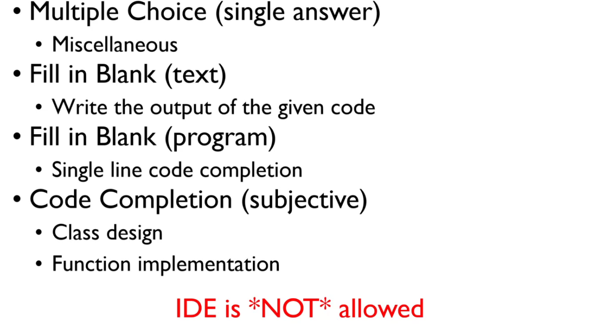

```toc
```
### 1. 问题类型

（跟往年一样）

- 单选题：小的知识点；

- 填空题：写出一段代码的output；（千万别多空格）
- 程序填空题
- 编程题



### 2. 考试内容


[关于初始化列表](https://blog.csdn.net/Nire_Yeyu/article/details/102520602)


**default parameters：**

编译的时候，一看到基类指针，就直接编译x=0进去了；


### 3. 考试


