### 1. 运算符重载

#### 1.1 运算符样本
##### stream extractor && inserter

- 必须是两个参数的全局函数；
- 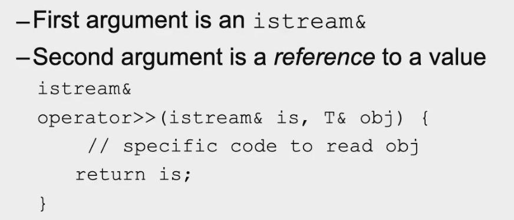

- 

- return is是为了链式法则；

- Creating manipulators：
- 

##### Automatic operator =

- member wise 和 bit wise 相对；
- 

##### Assignment operator
- 记得要判断是否是自赋值；
- 

- 

- 如果不想赋值不被别人用，可以设置成private或者加=delete；
- 

##### Operator()

- 不是什么重点；

- 

#### 1.2 Value classes（值类）

- 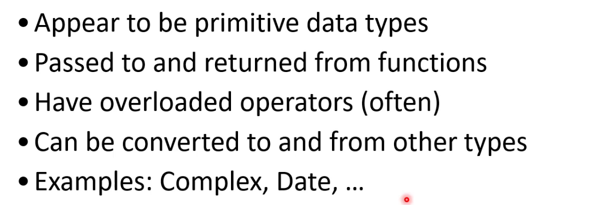

#### 1.3 User-defined type conversions

- 

- 当有单个参数的构造函数时，编译器可以自动地进行隐式类型转换；要是不想隐式类型转换，可以在构造函数前面加 explicit；

##### Conversion operations

##### General form of conversion ops

- 前面没有return类型，后面没有参数；
- 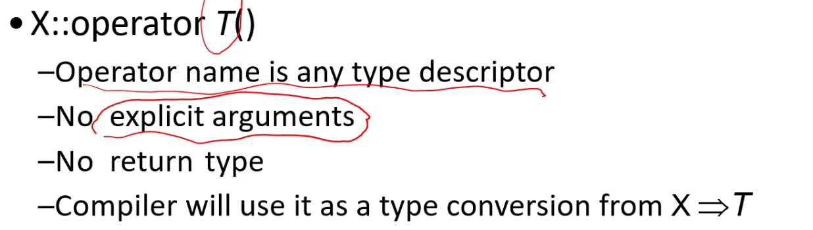

##### C++ type conversions

- 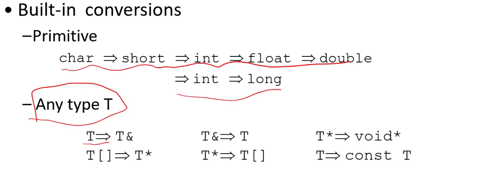

- 以下两者不能同时存在；

##### Do you want to use them？

- 

##### some rules

- 调用函数时，先找完全一样的，再找系统自动转化，再找用户定义的转化；

#### 1.4 Casting operators

##### static_cast

- 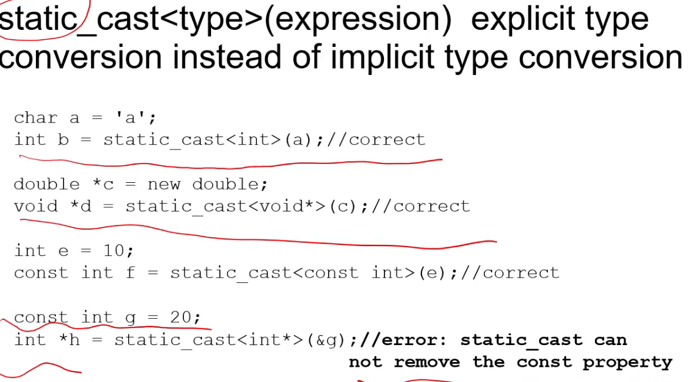

- 

##### dynamic_cast

- 

##### const_cast

- 把常量指针或者引用便成非常量指针或者应用；

##### reinterpere_cast

- 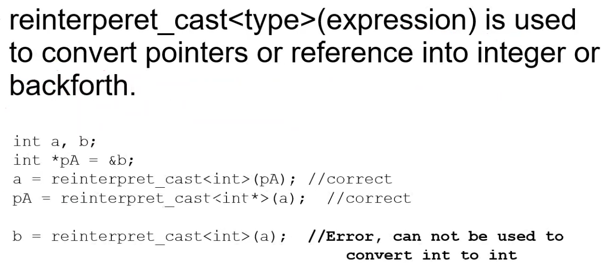

### 2. Streams

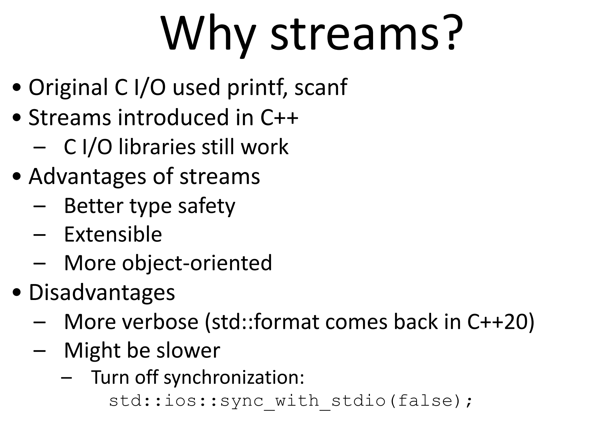

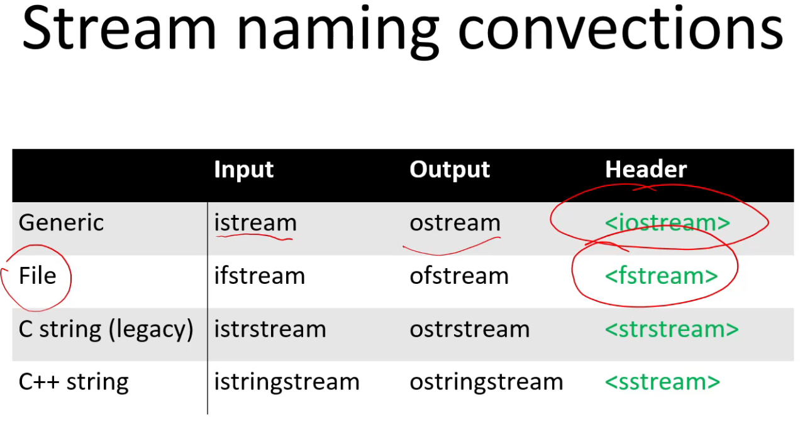

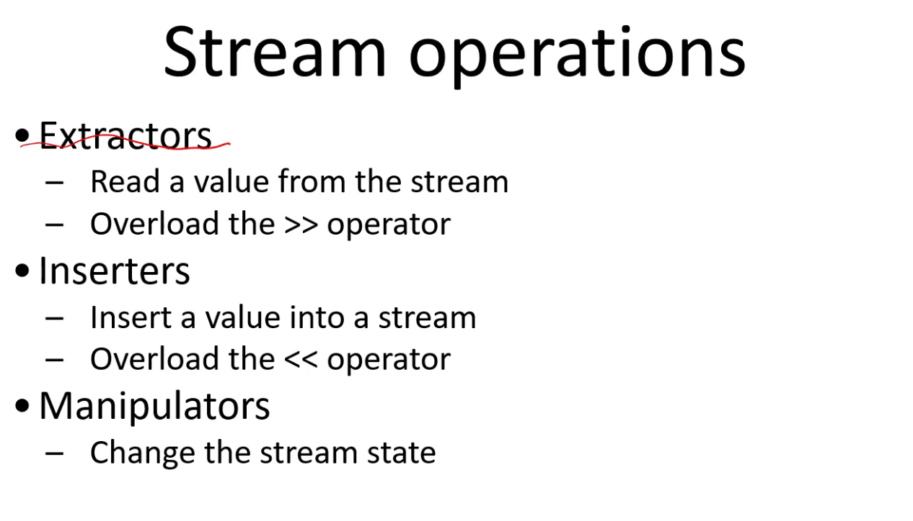

Manipulator可以改变流的状态，比如控制流的输入输出形式；

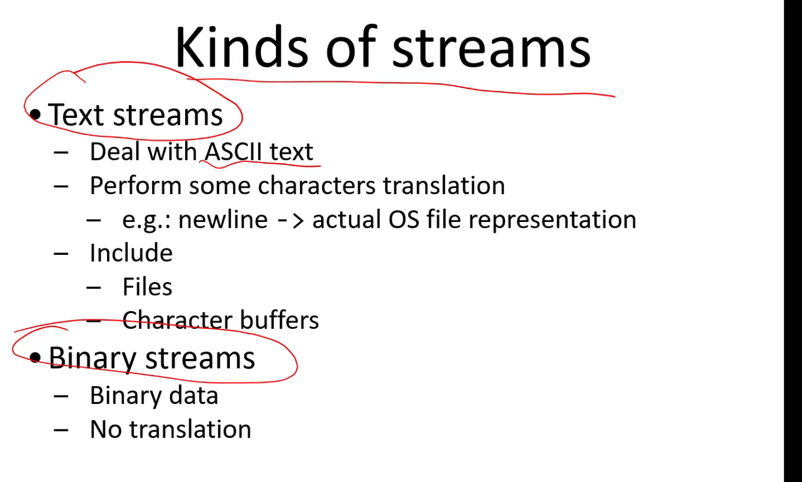

cin和cout有缓冲；

cerr与clog的区别，两者都是标准错误流，**区别在于cerr不经过缓冲区，直接向显示器输出信息，而clog中的信息存放在缓冲区，缓冲区满或者遇到endl时才输出。**

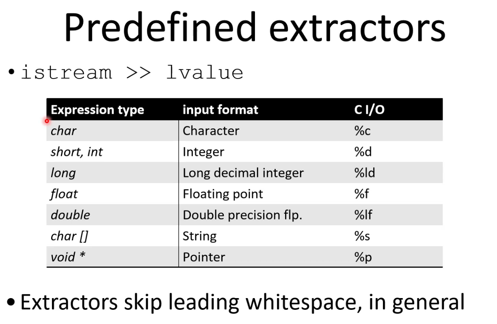

get会在\n之前停下来，而getline是直接吃掉\n。

