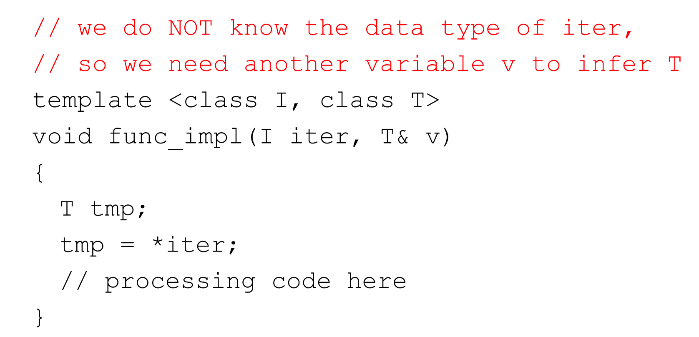

### 1. Iterators
#### 1.1 作用
- Provide a way to visit the elements in order, without knowing the details of the container.
    - Generalization of pointers(泛化的指针)

- Separate container and algorithms with standard 
  iterator interface functions.
    - The glue between algorithms and data structures.

#### 1.2 用法

#### 1.3 实现

#### 1.4 函数模版推导类型

##### 1.4.1 方法一

##### 1.4.2 方法二

typename是一个关键字，表示可以被推导出来的类型；

 

为了不与double、int等本来就有指针的重合，使用partial initialization；

**具体不太懂，设计STL实现泛化迭代器，自行了解，应该不太重要**

### 2. Exception
运行过程中的一些特殊情况；
#### 2.1 要点
throw不会离开函数；

异常的处理模式：

首先看是不是在一个try里面，如果不是，就要一直离开直到遇到一个try或者程序结束，遇到try之后，如果有catch可以捕捉，那就继续离开，直到try或者程序结束。

抛了一个子类的异常对象，也能被一个父类对象捕捉到；

catch的时候，小类放前面，大类放后面（不然会报warning）；

try只要发生一个异常，后面的语句就不会在执行了；

##### 函数与异常

第三个的意思是保证什么异常都不会被抛出，第四个的意思是什么异常都可能被抛出，不要检查了；

