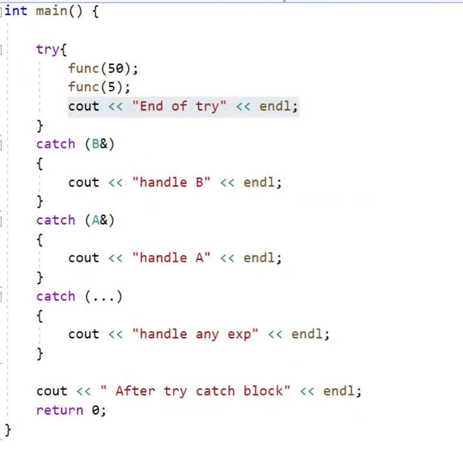
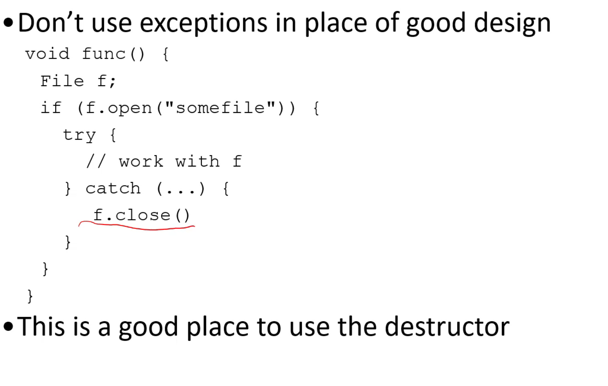
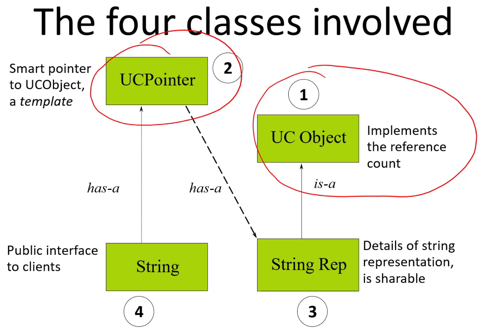
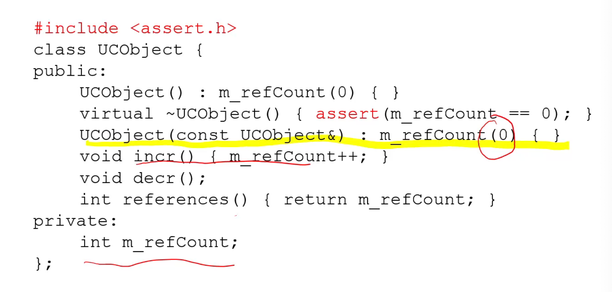
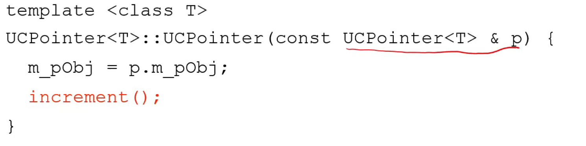
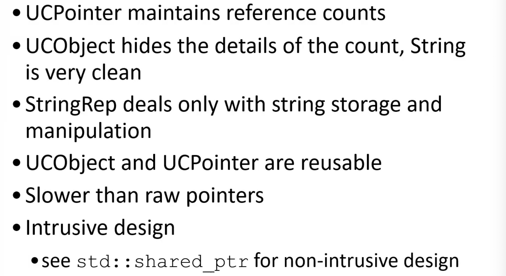

```toc
```
### 1. Exception

（考试还是很会考的，虽然比较“简单”）

抛出异常之后，就算异常会被处理，这个异常也不会被执行！

但是try这个模块之外的是可以运行的，比如以下情况，After try catch block是可以被输出的；



#### 1.1 Exception and new


#### 1.2 Design considerations




#### 1.3 Summery

最好用reference来接异常；


#### 1.4 两阶段的构造函数

第一个阶段的构造函数做的事情保证不会发生任何异常，把会发生异常的部分都挪到第二部分，这样就算第二部分的构造函数发生了异常，也能正常调用析构函数。

### 2. Smart Pointers（智能指针）

#### 2.1 Goals


**下面这张图的关系是最主要的！**



#### 2.2 UCObject



如果没有任何人来引用自己，那就自己把自己给删了；

如果delete this之后还有代码，只要不涉及对象本身（因为对象本身已经被析构掉了），还是会继续做完的；


#### 2.3 UCPointer





题外话：哪些操作符可以被重载，也是会常常被拿来考的；


#### 2.4 String

string就是一个总的对外的接口；


#### 2.5 StringRep

这是UCObject的子类；


#### 2.6 总结


