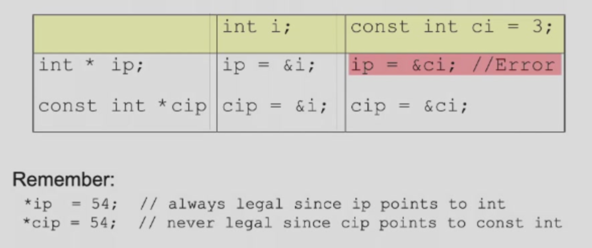
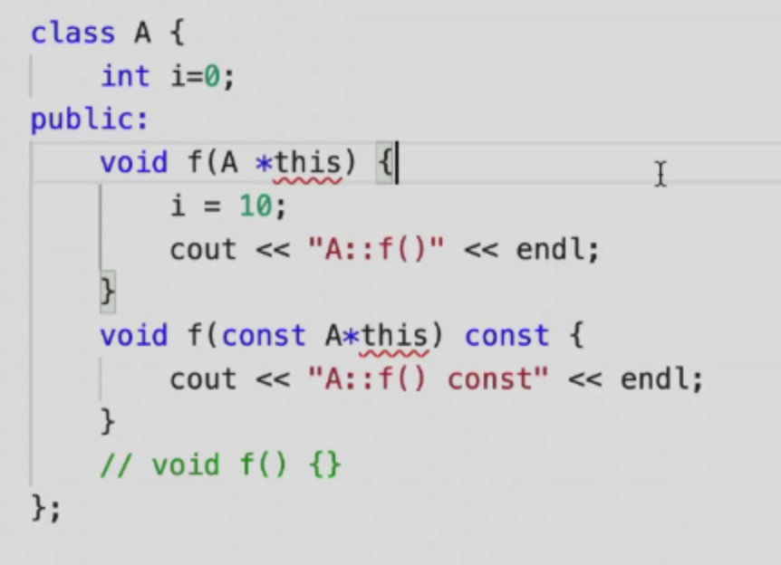

### 1. inline
#### 1.1 注意事项：
  - inline是最前面的关键字；
  - 声明和定义都要加inline；
#### 1.2 一些原理：
  - 编译器在编译的时候只会看当前文件，如果编译器没有看见inline函数的body，在某个函数调用这个inline函数的时候，就只能放弃； 
  - 而对于想单独在另一个文件编译inline函数时，编译器什么都不做，因为看到了inline，它不进行编译，只是当作声明记下来；
#### 1.3 使用方法：
  - 全局：
    - inline函数的正常行为是把整个inline函数放在头文件里；
    - 如果把inline函数放在cpp里面，等同于在说这个函数是只能本地使用的；
  - 成员函数：
    - 直接放在类定义里面；
    - 或者放在头文件里，类定义外；
#### 1.4 影响
- 以空间换时间；
- 编译器其实会自动地进行inline或者不inline的函数；

#### 1.5 如何选择
- inline:
  - 只有两三行的小型函数；
  - 频繁地调用；
- Not inline:
  - 比较大的函数，大于二十行；
  - 递归函数（无法被inline）；
- A lazy way:
  - 所有函数都inline；
  - 所有函数都不inline；

### 2. const
#### 2.1 一些基本概念
- 

- constant仍然是变量（编译器去保证他是不变的），而运行时候可以被做手脚；

- 变量不会被编译器优化掉的三种情况：
  - 非静态全局变量；
  - 函数参数（调用时候初始化）；
  - 成员变量（生成时候初始化）；

#### 2.2 const指针
- 

  - 前者：指针是const，不能指向其他内存；
  - 后者：（不是所指向的内存不能变！！！），而是不能通过这个指针来改变所指向内存的内容；

- 

  - 第一个和第二个等价，区分的标志是星号；

#### 2.3 const指针和指向的对象之间的关系

- 

#### 2.4 字符串数组

- 

#### 2.5 const和函数
- 没什么意义；
- 返回值是const也没什么意义；

#### 2.6 const project
- 成员函数与const：
  - 成员函数不修改成员变量的，可以在后面加const；
  - 

- 因此如果一个对象是const，那么它只能使用const的成员函数；
- 如果是const的对象，必须给成员变量初始值；
- 看如下图，这两个函数可以构成重载，因为其实是有参数的，this指针省略了而已，const作用在了this指针上，构成了重载；

- 如果一个类有const的成员变量，那么必须有恰当的方式给这个成员变量初值；

### 3. static
- **静态本地变量的静态表示持久存储**（存储空间在全局存储区）；
- **静态全局变量的静态表示访问受限**；
- 静态本地变量只有在定义的那句话到了的时候才会调用构造函数，而且有机制去防止第二次；
- 全局对象，构造在main之前，析构在ret之后；
- 静态成员变量实际上是全局变量（在全局数据区），但访问限制于类的内部，就像静态本地变量实际上是全局变量，但访问受限于函数内部；
- 所创建的这个类的所有对象的这个静态成员变量都在同一个地址，**==很重要很重要！！！静态成员变量必须在最前面定义！！！因为类中的只是声明，而且还不能定义成static==**；
- 静态成员函数是只能访问静态成员变量的函数，不能访问非静态成员变量；
- 这些东西可以消除全局变量；
