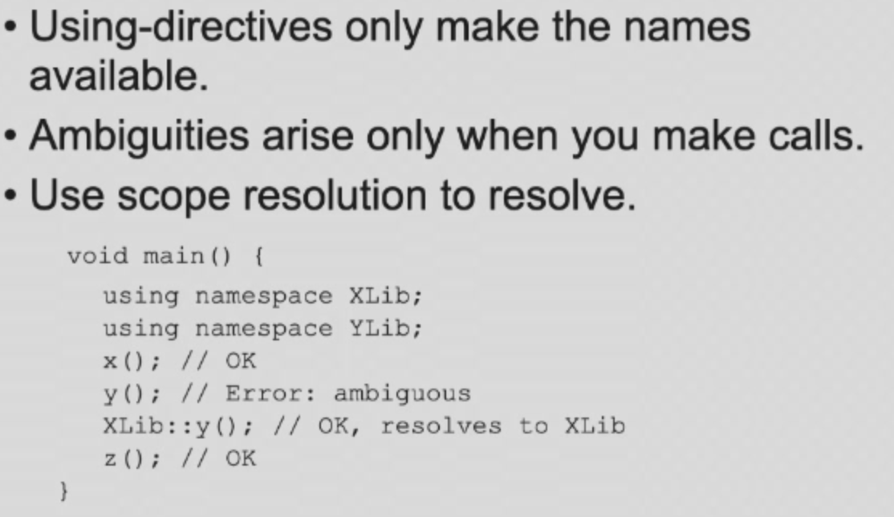

### 1. namespace
#### 1.1 声明namespace

#### 1.2 对namespace里的函数进行定义

#### 1.3 使用namespace三种方式

#### 1.4 一些注意点

- Ambiguities
- 
- Namespace aliases
- 

- Namespace conposition（合并namespace）
- 

- Namespaces are open
- 

### 2. Inheritance
- （引入情境讲了很久，但是其他就没什么了）；
- （用法就自己在书上看吧）；
- 父类的private在子类还是存在的，但是子类无法直接访问，而是得通过可以访问的父类函数（public和protected）访问；
- 父类的重载的函数，只要在子类重载过一个，那么父类的其他重载函数都没有了（cpp特有），叫做name hide（名字隐藏）；

