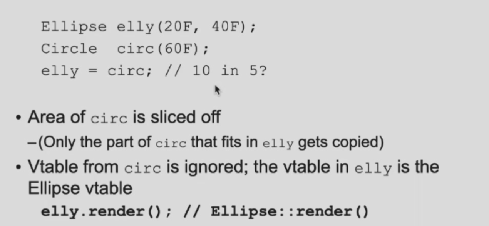
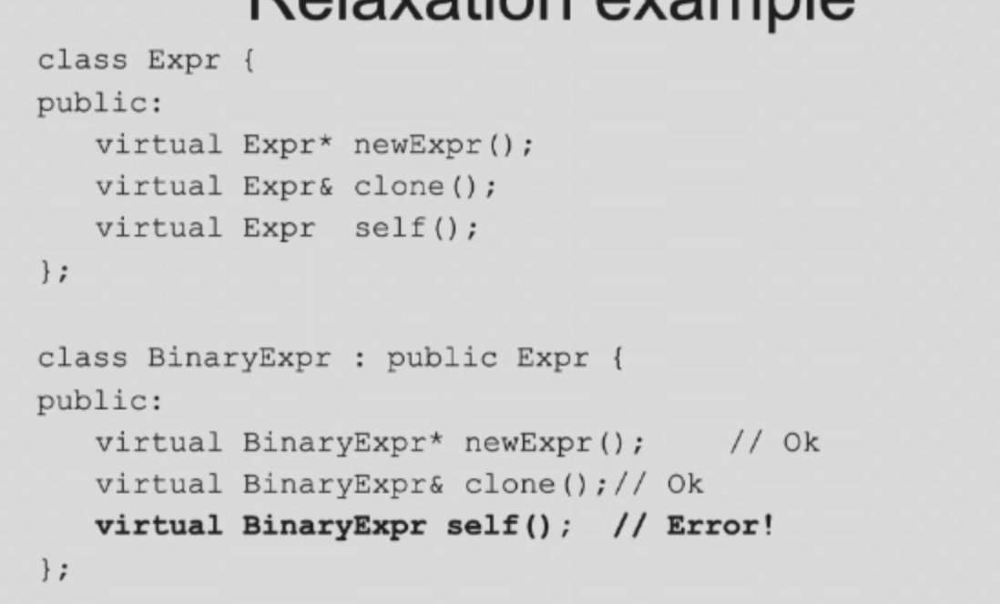

```toc
```

### 1. 多态的一些例子

#### 1.1 直接赋值

- 

#### 1.2 指针

- 可以实现；

#### 1.3 引用

- 可以实现；

   ### 2. Virtual destructors

- 通常需要析构的是，成员变量有指针或者有其他资源（比如打开文件）；

-  

- 其实只要写一个类，这个类的析构函数就应该是virtual的，因为你不能保证它以后不被其他类继承；

### 2. Override

#### 2.1 namehide

- 父类的重载的函数，只要在子类重载过一个，那么父类的其他重载函数都没有了（cpp特有），叫做name hide（名字隐藏）；

#### 2.2 条件

- 父类必须virtual，子类不一定virtual；

#### 2.3 注意

- 
- 如下图，会表现得没有动态绑定关系，子类构造函数先调用了父类构造函数，再调用了自己的构造函数；


#### 2.4 tips

- 继承时候不要用同个名字，否则会误以为override；
- virtual函数，不要用默认参数；

#### 2.5 Abstract base classes

- 比如shape父类，和circle，ranctangle；有一个函数叫render()，就是画图，而shape类的render()是没有意义的，他只是为了给子类调用函数提供接口；
- 所以我们要保证shape没有对象的构造；

- 

- 只需要有一个虚函数为0，那么这个就是纯虚函数；只要有纯虚函数，那么这个对象就不能被构造出来，这就是抽象类（不能构造对象）；

- 

- C++是唯一一个能够多继承的面向对象语言，定义时候用逗号隔开，多继承问题如下；
- 

- 解决：

### 3. Copy ctor

#### 3.1 定义

- 
- 什么时候要写拷贝构造函数？一般是类里面有指针，或者不想全部拷贝过去；
- 什么时候会拷贝构造？拷贝构造只可能在构造时候出现：
  - 主动构造；
  - 函数参数（是本身！）传递；
  - 函数返回（返回了一个对象）；
