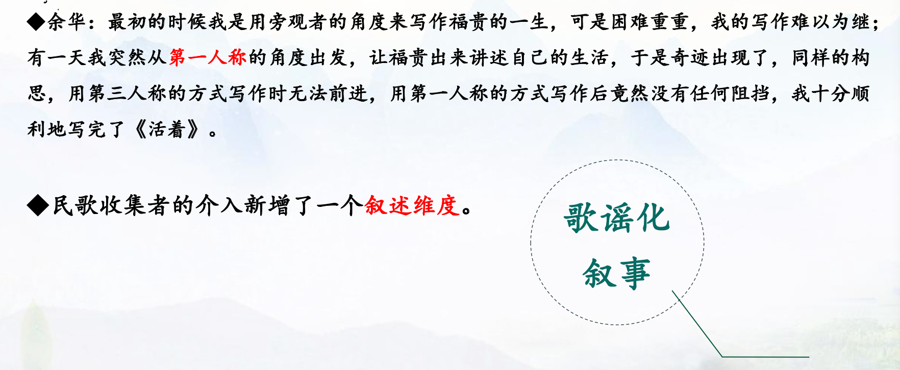
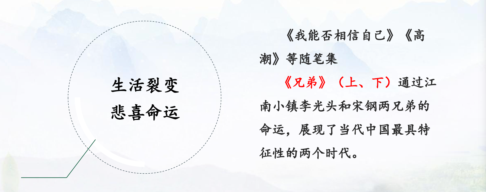

```toc
```
### 一、余华简介
- 余华(1960-)，主要作品有《在细雨中呼喊》《活着》《许三观卖血记》《兄弟》等。
- 《活着》获意大利格林扎纳卡佛文学奖
- 小说集《往事与刑罚》获澳大利亚年度悬念句子文学奖
- 《许三观卖血记》获美国巴恩斯-诺贝尔新发现图书奖
- 《兄弟》获法国国际信使外国小说奖

### 二、余华的小说创作阶段及代表性作品
#### （一）1983-1986年
- 以异常执着的精神做着文学的梦
- 洞悉小说细部叙事的魅力
- 余华：“那五六年的时间我打下了一个坚实的写作基础，就是对细部的关注。现在不管我小说的节奏有多快，我都不会忘了细部。”


#### （二）1987-1990年


#### （三）1991-1995年
以长篇小说为主，多讲述平民对苦难的承受和对命运的抗争。叙述特质变化：从冷漠叙事向温情叙事的转变。

1. 《在细雨中呼喊》
童年生活、追忆、梳理、时间、生命、性意识、死亡、苦痛、感伤、温情
2. 《活着》



3. 《许三观卖血记》

#### （四）1996年以后


