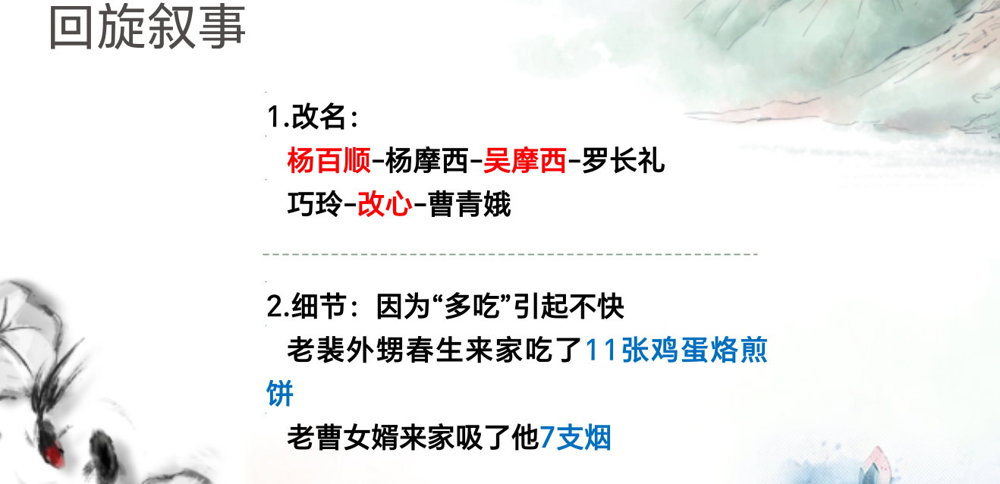

### 一、刘震云简介及其小说创作概况

刘震云（1958-），河南延津人。以**《塔铺》**和**《新兵连》**一举成名，“新写实主义”代表作家之一。
《单位》《一地鸡毛》《官场》《官人》
用冷静客观的叙事笔调书写日常生活、刻画小人物的生存境遇和生活态度，反讽日常权力关系。
1988年，《文学评论》和《钟山》联合举办“**现实主义与先锋派**”研讨会。《钟山》1989年第3期开辟“**新写实小说大联展**”。

### 二、《一地鸡毛》赏析

- 笔触冷静客观而略带讥讽
- 现实境遇与复杂心态
- 平庸琐碎的日常生活
- 隐约而颇为尖锐的反讽

读者观点评价：

- 读者观点：我突然想起刘震云的小说《一地鸡毛》，生活繁琐的小事再加上生存的压力，让原本清晰的视野，骤然模糊。就像旅途中的游客，磨灭他前进意志的不是旅途的艰辛，只是鞋子里的几粒沙。小人物同体制的抗争到屈服到最后变为体制的一部分，这是中国式的悲剧。在这样一种无谓的轮回中，生命毫不可惜地被消耗掉了，就像大学生小林。
- 读者观点：我不否认现实对人的庸俗化作用，我明白每一个爱幻想的人都会在成家立业后重重地摔回现实的地面。
- 读者观点：大受震动既而恐慌是在读完刘震云的《一地鸡毛》后，因为我深深领悟到了世俗对理想的侵蚀力。从中我看到很多人的影子，并隐约读出自己的模样来。
- 读者观点：不知道为什么，我的脑海里一直盘旋着刘震云的《一地鸡毛》中小林的形象。近四年的工作生活，褪去了当初的年少轻狂。我现在很温文尔雅，很彬彬有礼，尤其是在见到领导的时候，他们说我是个好青年。但我发现我丢了什么东西，一种能使人的心变成水晶的东西，一种被成熟的人称为幼稚的东西，一种常常被刻意掩饰的东西。我有时冷静得近似于麻木，理智得好像白痴。

#### 1. 叙事策略

- “原生态”
- i琐屑庸常的现实欲望
- 冷峻的笔调 平静的口吻
- 纠缠和磨损
- 放弃理想 消解诗意 不断沉沦

#### 2. 人物刻画

- 小林：富有理想信念、勇于进取，一步步走向世故、 庸俗。
- 小李：富有诗情画意、纯真高雅，变成斤斤计较、蓬头垢面、学会偷水的家庭主妇。
- “小李白”：丧失诗情才情 。
- 
- “人世间的一切不平凡，最后都要回归平凡，都要用平凡生活来衡量其价值。”
- “伟大、精彩、成功都不算什么，只有把平凡生活真正过好，人生才是圆满。”

### 三、《温故一九四二》赏析

历史上还发生了一些事：宋美龄访美、甘地绝食、斯大林格勒在血战、邱吉尔感冒。这些事情中的任何一桩，放到一九四二年的世界环境中，都比三百万人重要。

我从发黄的五十年前的报纸上看到，一个外国天主教神父在谈到设立粥场的动机时说：至少要让他们像人一样死去。

（尽管受灾人口正在大面积死亡，政府向灾区所征收的实物税和军粮任务不变。）这实际等于政府又拿了一把刀子，与灾害为伍，在直接宰杀那些牲口一样的两眼灰蒙蒙、东倒西歪的灾民。于是，死的死了；没死的，发生大面积背井离乡的逃荒。

人类的同情心可以轻易跨越民族的界线，却难以逾越权力设定的屏障。

刘震云：《一地鸡毛》主要关心人的身体，对物质层面的关心比较多，就是吃喝拉撒睡，具体到“小林家一块豆腐馊了”。小林家的一块豆腐馊了，比八国首脑会议都重要。到了《故乡面和花朵》和《一腔废话》是关心人精神的东西多一些，主要说人的胡思乱想。《我叫刘跃进》说的是心与心之间出现的横七竖八的拧巴。“拧巴”的另一个词就是“别扭”，看看我们的四周，有多少别扭的事，但我们却无能为力。《手机》写的不是男女关系，而是“口”和“心”的关系，探讨说对想的背叛，嘴对心的背叛，以及话语如何改变人与人之间的关系。关注的则是物质和精神之间这一夹缝对接处的东西，最大的体现就是话语了，话语既是精神的又是物质的，听得着但看不见。

### 四、《一句顶一万句》赏析

3. 令人深思的传教士形象：老詹（此处省略文章内容引用）

4. 人与话：两任县长的“说”
5. 独与某人说得着

