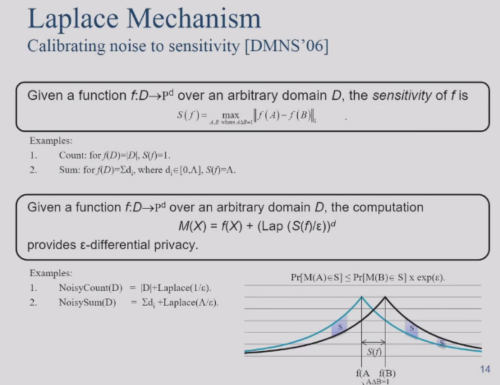

### 差分隐私概述

保持隐私信息的机密性，还需要保持可用性。也就是加密之后仍可使用。

关于隐私的定义：

我们需要保证可用性，比如送外卖必须要知道家庭住址，所以隐私不可能是完全保密的。

有趣的问题：政府研究出吸烟可能会得肺癌，政府没有调查bob的信息。但是bob觉得自己被冒犯了，因为这个研究会让bob有更高的医疗保险，也更容易被歧视。

研究的结果，其实是一个基本事实，只是把这个事实说出来，这并没有针对某个人，**当你的参与度影响到公共信息，那么这个公共信息包含了某个人的隐私**，不能因为公共信息对你不利就侵犯隐私。

**差分隐私**：自己的信息有没有参加到研究中，并不能被看出。如果不能被看出，那么代表保护了查分隐私。

**关于差分隐私的严格定义**：在最坏的情况下，自己的信息没有被泄露。neighbor就是差别很小的两个数据库。

### 拉普拉斯机制

DP的性质：

数据安全再见～