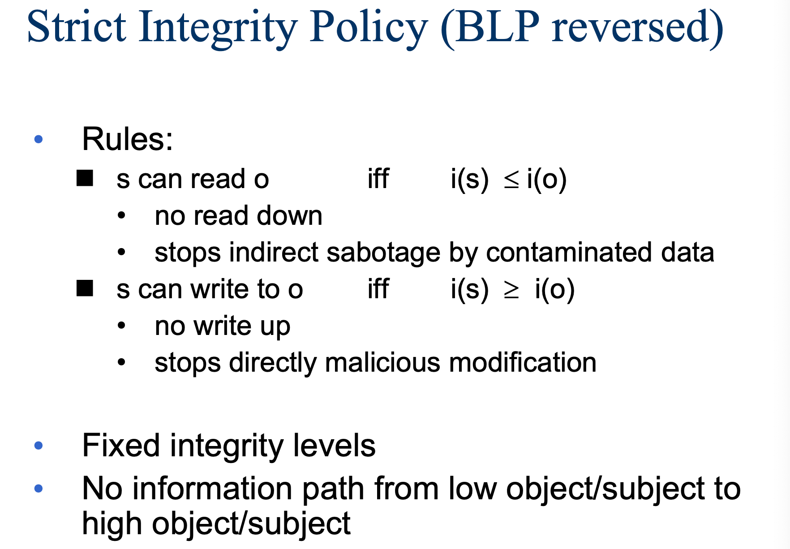
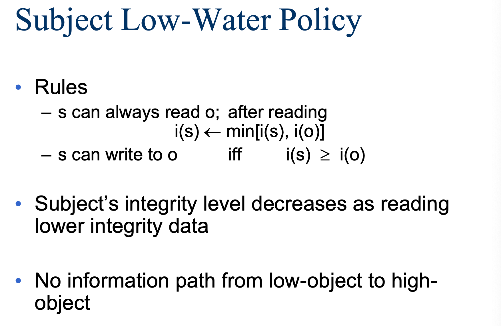
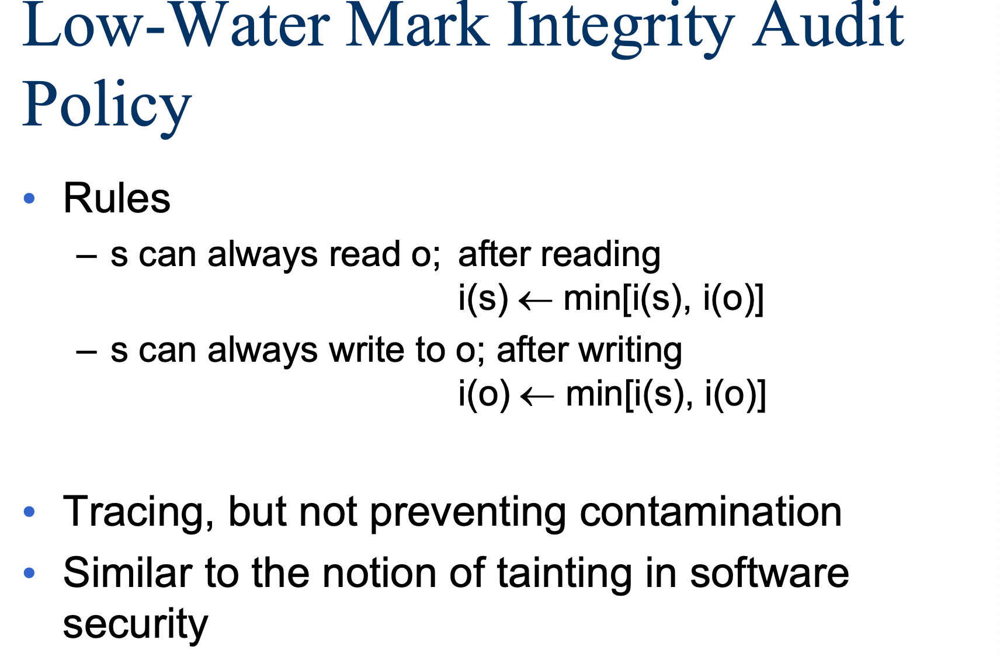
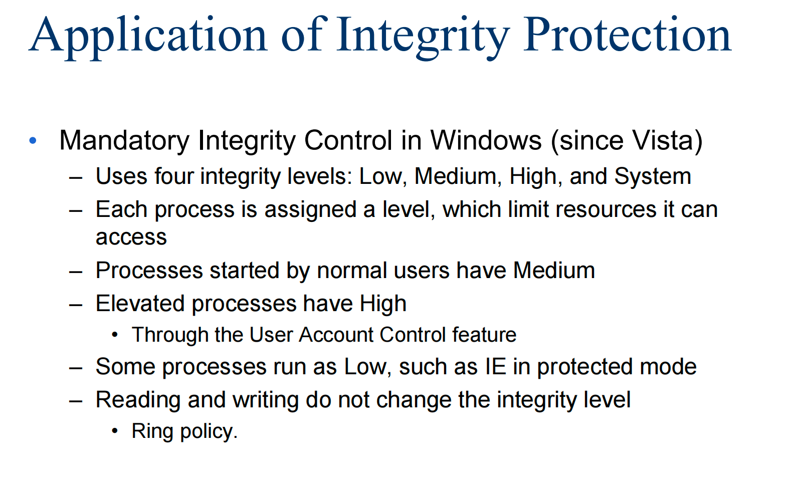
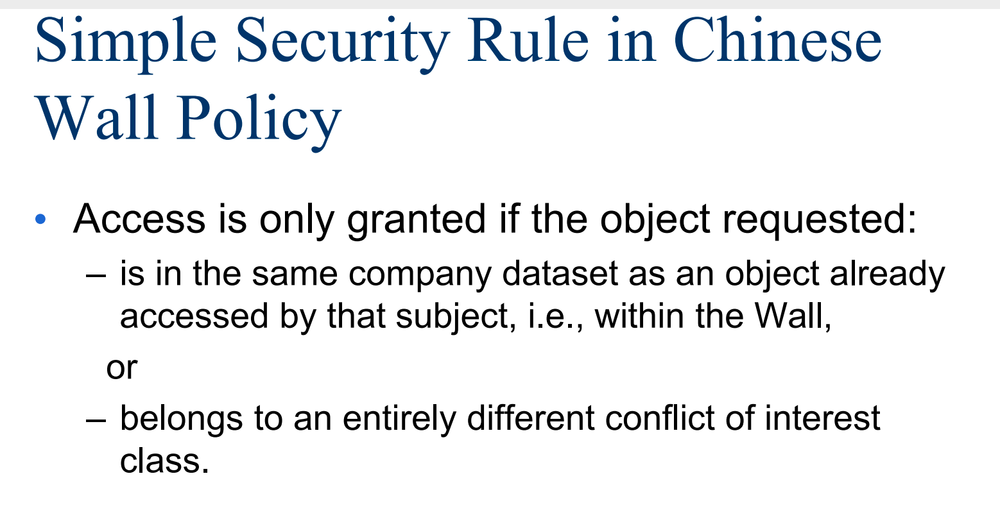

## Lec
### 不同抽象的访问控制

使用principals

- 确定哪些principals（用户帐户）可以访问哪些文档

使用subjects

- 确定哪些subjects（进程）可以访问哪些资源，不再是继承
- 这就是BLP的重点

### Multi-Level Security(MLS)

存在安全分类或安全级别

- Users/principals/subject拥有安全许可
- Object具有安全分类

安全级别示例：绝密、秘密、机密、未分类。在这种情况下，“绝密”>“机密”>“保密”>“未分类”。

安全目标（机密性）：确保信息不会流向更低级别的安全级别。

计算机系统携带不同敏感度的信息（即不同安全级别的机密信息）的能力，允许具有不同安全许可和需要知道的用户同时访问，并防止用户获取他们未经授权的信息。

- 自由访问控制无法实现MLS

通常使用强制访问控制

主要安全目标：机密性Confidentiality

### Mandatory Access Control

强制访问控制（MAC）根据系统范围的策略限制subject对object的访问

- 拒绝用户对其创建的资源的访问进行完全控制。就算是用户自己创建的资源，权限也是admin说了算。

### 安全模型

模型描述系统。安全策略：定义给定系统的安全要求。

系统模型(功能性)+安全策略(安全性)=安全模型

### BLP模型

- 简单安全属性（no read up）：
  - 当Lm(S) ≥ L(O)时，S可以读取O；表示低安全级别的主体不能从高安全级别客体读取数据。
- 星属性安全属性（no write down）：对于任何不受信任的S
  - 当Lc(S) ≥ L(O)时，S可以读O（no read up）；
  - 当Lc(S) ≤ L(O)时，S可以写O（no write down）
  - 表示高安全级别的主体不能对低安全级别的客体写数据。
- 强星属性安全规则(strong star property)：表示一个主体可以对相同安全级别的客体进行读和写操作。
- 自主安全属性：使用访问矩阵来规定自主访问控制。

BLP模型侧重于数据的保密性和对机密信息的受控访问，如果主体对对象的所有访问模式符合安全策略，则该系统的状态被定义为“安全”。为了确定是否允许特定的访问模式，系统需要将主体(subject)的许可权与对象(object)的等级进行比较。

!!! question "Hw1"

    A是secret级别的用户，F是top级别的对象，有一群人是top级的用户，A可以和这群人交流，证明F依然无法被A读取。（首先解释一下unreadable，基于定义尝试阐释BLP机制满足条件）

    hint:如何解释unreadable?
    - step1: A选择两个文件F0和F1
    - step2: A把这两个文件发送给一个裁判
    - step3: 裁判随机选择其中一个文件放入一个级别为"top"的盒子中，B1...Bn都可以看到，但是不能直接告诉A，A看不到但能与B们交流
    - step4: A能否猜出盒子中的文件？
    如果猜对概率大于50%，说明打破了BLP机制。
    

### 系统中的完整性

之前机密性是足够好的可以读，现在完整性是足够好的级别可以写，形成了矛盾，完整性和机密性一定程度上是矛盾的。

### Biba模型

和BLP模型形成对比，Biba只关注完整性而不关注机密性，所以对于每一个主体和客体都会有完整级别。

不能往上写，不能往下读，主体不能请求（调用）完整性级别更高的主体的服务。

---

**Five Mandatory Policies in Biba**

- 严格完整性模型：往上读，往下写，当且仅当主体和客体拥有相同的完整性级别时，主体可以同时对客体进行“读”和“写”操作。

- 主体毕巴低水标模型：主体总可以读客体，但是在读取之后主体要调整完整性级别。

- 客体毕巴低水标模型：主体总可以写客体，但是在写回之后客体要调整完整性级别。

- 低水标完整性审计模型：将前面两个模型进行合并。

- 毕巴环模型：不管完整性级别如何，任何主体都可以读任何客体。假设subject比较智能，能够分辨级别低的文件的内容，不会被污染。

在实践中，人们可能会使用这些政策中的一个或多个，对不同的主体应用不同的政策。例如，毕巴环模型的主体被信任能够正确地处理输入，比较智能。

!!! question "Hw2"

    对于一个主体，可以实现多少种政策的组合。有没有可能在机密性上作对应呢？（第一个）

### 客体的完整性等级

一个客体的完整性等级可能取决于

- 信息的质量（可能会改变）：可信度、污染程度；
- 客体的重要程度（不会改变）：被信任的程度、保护等级；

### Trusted vs. Trustworthy

某个系统的一个部件是**被信任**的意味着：系统的安全性一定程度上依赖这个部件、如果这个部件出现问题可能会破坏安全策略、这是由他在系统中的角色决定的。

某个系统的一个部件是**值得被信任**的意味着：这个部件应该被信任、这个部件的实现很正确、由该组分的固有性质所决定的。

比如说中国的高铁，工艺是可信的，所以品牌是指得信赖的。

### Integrity vs. Confidentiality

机密性不需要主体，比如说高等级主体和低等级主体交流，机密性还是可以保证，但是完整性就不一定保证（因为高等级主体可能被“洗脑”）。

所以**完整性需要信任主体！**

对于机密性来说，控制读写已经足够；对于完整性来说，这是不够的，它还需要信任所有可写的主体。

### 一些例子

这些了解即可。

两个公司，一个人如果能操作公司A的文件，那么这个机制保证这个人不能操作公司B的文件。

## Hw1

### 问题

A是secret级别的用户，F是top级别的对象，有一群人是top级的用户，A可以和这群人交流，证明F依然无法被A读取。（首先解释一下unreadable，基于定义尝试阐释BLP机制满足条件）

hint: 如何解释unreadable?
- step1: A选择两个文件F0和F1
- step2: A把这两个文件发送给一个裁判
- step3: 裁判随机选择其中一个文件放入一个级别为"top"的盒子中，B1...Bn都可以看到，但是不能直接告诉A，A看不到但能与B们交流
- step4: A能否猜出盒子中的文件？
如果猜对概率大于50%，说明打破了BLP机制。

### Answer

BLP模型不能解决隐通道问题。虽然BLP模型的机制控制信息不能直接由高到低流动，但是高级别的主体还是有办法来同低级别的主体进行通信，如可以通过影响一些共享资源的方式来传达信息给低级别的主体。

当然这种传递信息的方式需要高级别和低级别的主体通力合作，而A和B们可以交流，我感觉不能排除B们通过一些类似隐通道的手段进行一些消息的传递使猜对的概率大于50%。

如果剔除这类情况，B们因为不能write down，所以不能创建低等级的消息，所以在这个问题下，B不能创建A能够读取的关于文件的消息传递，所以概率仍然是50%，所以unreadable。

所以就算top级用户能够知道top级信息，但是无法创建低等级信息进行传递，所以A无法知道文件F，所以BLP机制满足条件。

## Hw2

### 问题

对于一个主体，可以实现多少种策略的组合。有没有可能在机密性上作对应呢？

### Answer

- 严格完整性模型：往上读，往下写，当且仅当主体和客体拥有相同的完整性级别时，主体可以同时对客体进行“读”和“写”操作。
- 主体毕巴低水标模型：主体总可以读客体，但是在读取之后主体要调整完整性级别。
- 客体毕巴低水标模型：主体总可以写客体，但是在写回之后客体要调整完整性级别。
- 低水标完整性审计模型：将以上两个模型进行合并。
- 毕巴环模型：不管完整性级别如何，任何主体都可以读任何客体。假设subject比较智能，能够分辨级别低的文件的内容，不会被污染。

---

毕巴环模型可以与客体毕巴低水标模型组合：不管完整性级别如何，任何主体都可以读任何客体。主体也总可以写客体，但是在写回之后客体要调整完整性级别。

（似乎只有这一种多出来的组合，其他的似乎都已经给出，比如低水标完整性审计模型就是主体毕巴低水标模型和客体毕巴低水标模型的组合）

---

- 严格完整性模型：
  - 完整性：往上读，往下写
  - 机密性：往下读，往上写

- 主体毕巴低水标模型：
  - 完整性：主体可以往下读，但是在读取之后主体要向下调整完整性级别。
  - 机密性：主体可以往上读，但是在读取之前主体要向上调整机密性级别。
- 客体毕巴低水标模型：
  - 完整性：主体可以向上写，但是在写回之后客体要向下调整完整性级别。
  - 机密性：主体可以向下写，但是在写回之后客体要向上调整机密性级别。
- 低水标完整性审计模型：略
- 毕巴环模型：
  - 完整性：不管完整性级别如何，任何主体都可以读任何客体。
  - 机密性：不管机密性级别如何，任何主体都可以写任何客体。低级别主体可以写高级别的客体（但是在修改的时候不能看到原来的内容）。

