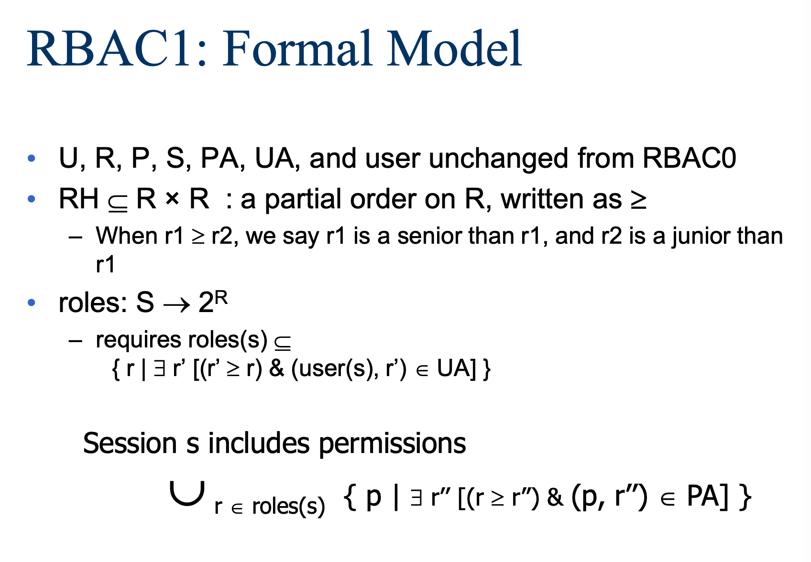

## 1. 应用白名单

**应用白名单**

与其查找恶意软件然后那些软件，不如列出所有已知的良好的允许的程序并只运行它们。通常由企业部署，企业有能力维护允许的程序列表。

---

**现状**

用户被问到他们不知道如何回答的问题，以及他们面对的是难以理解的信息。用户会经常被要求做出决定。通常用户被要求被动地回答，并提供了一个简单而不安全的出路。

**设计原则：**

- Reduce-减少要求用户做出决策的次数
- Simplify-问用户能够理解的问题
- Safe-不要提供一条简单而不安全的出路
- Active-避免被动响应安全提示

**个性化白名单的设计**：

- 正常模式：只运行已知在白名单内的软件，把受信任的签名加入白名单，把受信任的安装程序加入白名单，其他所有的都block。
- 下载模式：可以运行所有的软件，所执行的程序和安装程序全都放到白名单里面，但是要快速退出这个模式（因为这个模式很危险）。

这种双模式可以更接近于一个典型用户的心理模型，下载模式下，所提出的问题更加简单（你是否允许这个程序作出更改->你是否真的需要这个程序）。另外，让用户记住，不用的时候就要把下载模式关闭。

**两种模式的切换**

- 简单地切换到下载模式：优点是简单，缺点是用户常常会打开下载模式，因此会变得不安全。
- 高开销切换到下载模式（比如重新启动）：让用户再三斟酌是否需要切换到下载模式，但这可能会让用户感到厌倦。
- 重新启动的优势：清除内存，内存中的恶意软件无法利用安装模式，在重新启动后应用程序数量比较少。

## 2. Role Based Access Control

- 白名单机制是RBAC的基础。

- 激励问题：如何管理用户权限关系，不同于DAC和MAC（DAC和MAC处理操作系统中的进程），RBAC允许通过分配一组权限来创建和实施高级访问，权限基于特定用户类别执行其职责所需的访问级别。

- 角色作为一个级别的间接(Roles as a level of indirection)，使用RBAC，可以为每个用户分配一个或多个角色，然后为这些角色分配允许的权限。

- RABC是多方面的、开放的，有很多的扩展

---

**为什么要使用角色**

- 需要管理的关系更少：可能从$O(mn)$到$O(m+n)$，其中m是用户数，n是权限数。
- 角色增加了一个有用的抽象级别
- 组织基于角色来进行运作
- 角色更加稳定，在组织中不容易变化

**Groups vs. Roles**

- Group是用户的集合，Group对对象的访问权限是由客体来决定的。而Roles不仅有用户，还包括权限，角色本质上是指用户权限的集合。在RBAC的上下文中，权限与角色绑定，而不是与身份直接连接。

- Role可以主动激活和注销，可以灵活变换，但是Group不容易改变。

- 角色比组更稳定，因为角色是围绕访问管理组织的，在一个典型的组织中，功能和活动的变化不像身份那样频繁。

**总框架**

### RBAC0: Formal Model

基本模型有三个元素：用户、角色和权限。模型设计基于“多对多”原则，即多个用户可以具有相同的角色，一个用户可以具有多个角色。同样，可以将同一权限分配给多个角色，也可以将同一角色分配给多个权限。

静态关系：一个user有很多role，一个role可以有很多权限。（由管理员决定）

动态关系：某个user打开session，这个session可以选择要登陆的role，而这个session继承了所有role的permission。

### RBAC1: Formal Model

相比RBAC0，对于Role进行了更加细粒度的划分（添加了Role的等级划分），怎么方便机构的运行怎么来。

**Role等级制度的一些定义**

- User inheritance：$(r_1 \ge r_2)$如果我有$r_1$身份，我就有$r_2$的身份。
- Permission inheritance：$(r_1 \ge r_2)$$r_2$的每个权限也被授权$r_1$。
- Activation inheritance：$(r_1 \ge r_2)$如果我们激活了$r_1$的身份，我们就自动激活了$r_2$。

如果我们激活了$r_1$，那么我们自动激活了所有比$r_1$小的身份。

### RBAC2: RBAC0 + Constraints

RBAC2在RBAC0之上加入了一些限制：

- 互斥原则：比如银行中一个人不能同是是出纳和会计。
  - 静态原则：没有任何用户可以同时拥有某两个角色，通常被称为静态分离约束，阻止单个用户拥有太多的权限。
  - 动态排除：没有用户可以在一个会话中同时激活某两个角色，通常被称为动态的职责分离约束，与角色层次结构解释进行交互。
- 前提条件：必须满足某个条件才能成为某个角色的成员，比如用户必须是本科生才能被分配UTA角色。
- 基数
  - 关于用户角色分配：最多有k个用户可以属于该角色，至少有k个用户必须属于该角色，恰好有k个用户必须属于该角色。
  - 激活时：比如一个用户可以拥有两个角色，但是运行时只能激活一个角色。

好处：为了在存在利益冲突策略的情况下提供帮助，将根据用户分配添加角色之间的关系。帮助制定更高层次的组织政策，可以方便错误检查，到时候可以知道哪个角色的权限需要修改或者调整，这同时也是当管理分散时执行高级策略的工具。

### RBAC3

RBAC3是RBAC1和RBAC2的合集，所以RBAC3既有角色分层，也包括可以增加各种限制。

## 3. 古典密码学

