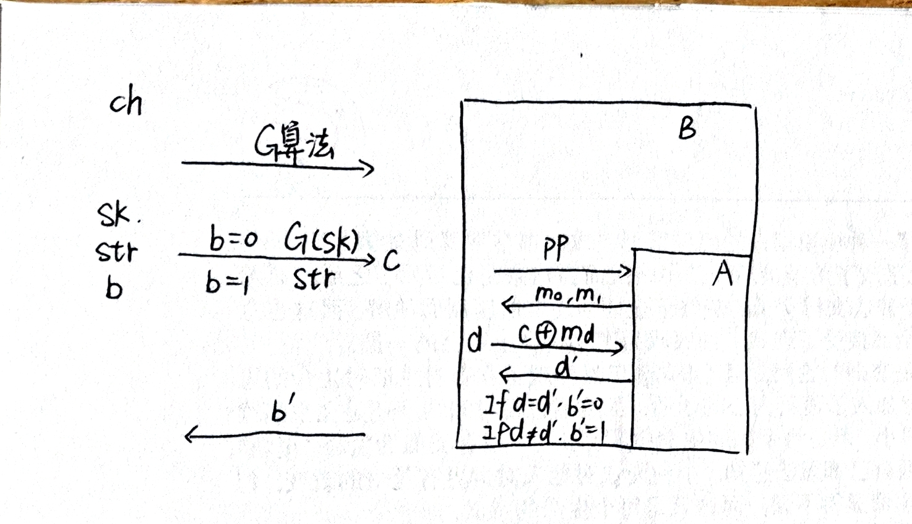
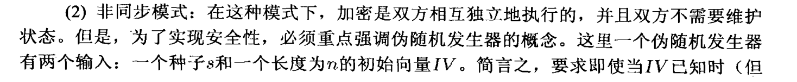
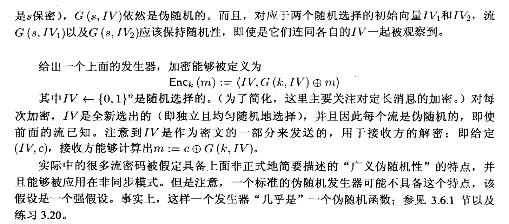

## 流密码

在一次一密里面，我们要求密钥一定至少要和明文一样长。

对于流密码来说，通过伪随机来代替随机，所以我们需要使用伪随机生成器（PRNG, Pseudo Random Number Generator）。比如使用128bit生成$10^6$bit的串，让他看起来随机但是事实上不随机。

注意PRNG是一个确定性算法，也就是说seed相同，则输出也相同。

### 随机和伪随机

如果一个流密码（PRNG）是好的，它需要是“伪随机的”。随机性不是一个字符串的属性，“000000”是否比“011001”“随机性更小”？随机性是分布的性质，或者从分布中提取的随机变量。

类似地，伪随机是分布的性质。如果长度为l的字符串上的分布D与随机分布无法区分，我们说它是伪随机的。

---

#### Distingusher

如果$D(str)$和$D(G(sk))$两个函数输出1的概率差不多，那么就说明无法区分。输出端发出一个字符串，Distingusher判断这个字符串是G(sk)还是真的是真的随机字符串。

现在我们定义D为攻击者，D的攻击目标就是分辨这个串是随机的还是不随机的。

- 裁判把PRNG的程序发给D，PRNG源代码可见。
- 裁判选取seed key和一个随机串str，定义一个随机变量b，如果b=0，发送G(sk)，否则发送str。
- D收到后，判断裁判发送的是哪个，输出b’。
- 如果b=b‘，则最终输出1，也就是D成功。

思考：但是在这个定义中裁判只发送了一个串，如果是同时发送多个串又是什么情况？

---

#### Pseudorandom Generator Definition

思考：伪随机生成器拓展1bit和拓展nbit是否等价？如果等价，那么我们只需要研究1bit的拓展，之后重复即可。

### 流密码的安全性证明

我们考虑攻击者的能力只限于窃听，就是只能窃取发送端加密后接收端解密前的密文信息，并且我们假设只能看到一个密文。

**One-Wayness**：攻击者知道加密算法，知道密文，通过密文猜原文，如果原文完全等于猜测，那么成功。（很苛刻，在我们的印象中，猜出一部分已经不安全了）

**EAV（防窃听）**：攻击者知道加密算法，自己选择了两个不同的明文，发送给裁判，裁判选取其中一个进行加密发送给攻击者，攻击者猜是哪个明文。

---
$1^l$：长度为$l$的的字符串，$l$一般称为安全参数。

$\{0,1\}^n$：由0和1组成的长度为n的串。

**证明目标**：如果G是PRG[[#Distingusher]]Distingusher（伪随机），那么如上的加密构造算法是EAV-secure的。

**证明过程**：

- 如果存在一个攻击者A打破了EAV-secure，那么我们构造另外一个攻击者B能够打破了PRG。
- B是PRG[[#Distingusher]]的攻击者，又是EAV-secure的裁判。
- 裁判告诉B伪随机生成器算法，B再转告给A。
- 裁判自行生成seed key和b，像PRG[[#Distingusher]]里提到的那样，发送G(sk)或者str给B，发送的数据记为c。
- A自己选择了两个明文$m_0,m_1$发送给B，B随机选一个$m_d$和c（也就是说B的密钥是从裁判手中来的，不是自己生成的）异或加密发送给A。
- A看到密文之后会猜一个d’发送给B，如果A猜对了，那么b’输出0，否则输出1，然后b‘发给裁判。
- 

现在我们要证明B能够利用A来破解PRG，假设A有$\epsilon$的概率破解EAV-secure，那么我们只需证明B能够破解PRG的概率为$O(\epsilon)$即可：

- 如果b=1，那么就是随机串当作密钥，不管A多厉害，赢的概率都是$1/2$。
- 如果b=0，A有$(1/2+\epsilon)$的概率破解，所以B赢的概率也是$(1/2+\epsilon)$。
- 所以B赢的概率是$1/2+1/2 \times \epsilon$。

### 处理变长消息

设计一个能够生成不同长度密钥的伪随机生成器

我们对n个bit的串，通过$n \to n+1$的PRG算法进行生成，生成第n+1位，再对原来的那n个bit进行生成，生成第n+2位，以此类推。我们如何证明n+1到n+s位也是像random的？

### 处理单个消息和多个消息

#### 引入

所有的确定性算法都无法实现多个明文的加密。
所有的伪代码生成器的seed key都只能使用一次。
否则无法实现防窃听。当然对于One-Wayness来说没有什么区别

#### 多消息流密码算法加密

- 同步模式：用输出流密钥的不同部分去加密新的信息，发送端和接收端需要知道用流的哪部分去加密特定的某个消息，而这常常会出现很多问题。
- 异步模式：再加一个参数IV，只要IV不同，PRG生成的流就不同，加密每一个消息的时候先随便取一个IV。

## CPA安全

之前的对手只能被动地窃听，现在的对手可以选定明文并知道对应的加密得到的密文。目标是确定其他密文对应的明文。

没有什么确定性加密算法（每次加密相同消息都获得相同密文）是CPA安全的。所以CPA安全算法必须将随机性作为加密过程的一部分。

