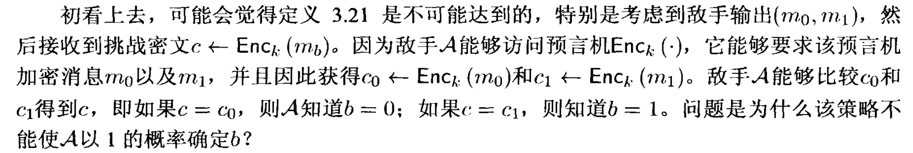
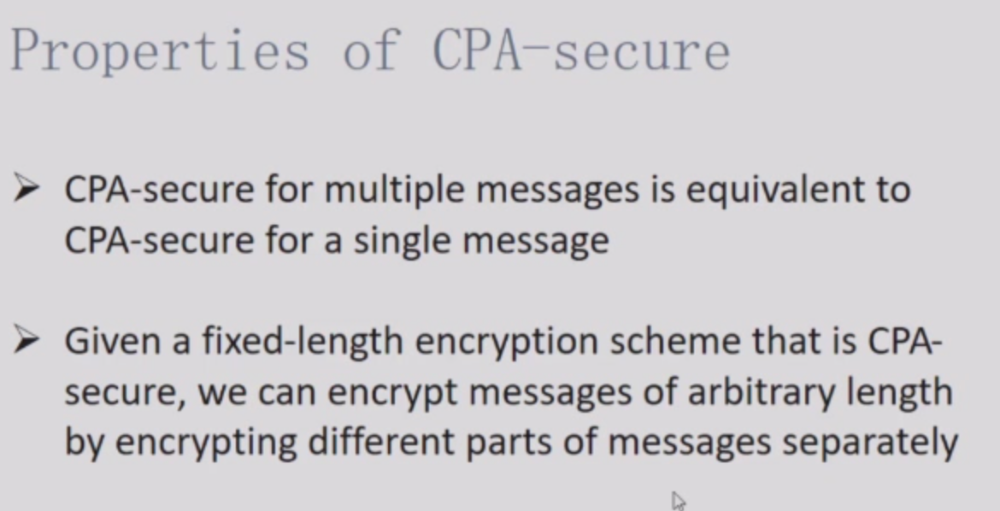

>5.24 & 5.19
## CPA安全

### 1. 概述

之前的对手只能被动地窃听，现在的对手可以选定明文并知道对应的加密得到的密文。目标是确定其他密文对应的明文。

!!! example "现实中的明文攻击"

    美军vs日军，中途岛海战：美军监听到日军要攻击“AF”，但是无法破解“AF”是什么地方。美军猜测是“中途岛”，于是让中途岛发假信息说缺水，日本截获了这个信息并立即报告给总部：“AF”缺水，这就让美军知道了在日军的加密方案中“AF”就是“中途岛”。这就是选择明文攻击，美军选择了明文“中途岛”，日军加密得到“AF”，虽然不是日军自愿参与的，但美军仍达到了他们的需要。

没有什么确定性加密算法（每次加密相同消息都获得相同密文）是CPA安全的。所以CPA安全算法必须将随机性作为加密过程的一部分。否则

单次加密的CPA安全即意味着多次加密的CPA安全，这和EAV安全不同。

(pp: public parameter

(CPA: chosen plaintext attacks

**定理1：没有什么高效的算法可以隐藏明文的长度。**

**定理2：如果一个算法是CPA安全的，那么这个算法只会泄露明文的长度。**

### 2. CPA安全的加密方案创建

#### 伪随机函数

有效函数：

我们考虑一个将nbit字符串映射到nbit字符串所有函数的集合$Func_n$。那么这个集合的大小为$(2^n)^{2^n}$。

伪随机：

#### PRF（伪随机）函数的CPA安全加密

PRG可以实现EAV（上节课已经证明），PRF可以实现CPA（先把他当作已知），我们是否可以从PRG构造出PRF？

静态攻击者，不会修改消息，动态攻击者，会修改消息（即使不知道明文是什么，直接对密文进行修改）。CPA对于静态攻击是没问题的，但是对于动态攻击者是不安全的。

## CCA安全性

目前我们定义了两种类型攻击的安全性。一种是被动攻击，只是窃听；另一种是主动攻击，选择明文攻击。而还有第三种类型的攻击，即选择密文攻击，也就是**攻击者可以加密其选择的明文，也可以解密其选择的密文**。CCA安全性可以抵御动态攻击。

攻击者可以加密其选择的明文，也可以解密其选择的密文，这样的攻击者已经涵盖了修改密文也就是动态攻击的能力。（为什么？因为如果攻击者具备了选择密文解密的能力，他就可以通过修改传递的密文，因为修改后的密文我们可以进行解密，通过比较两个密文的不同，通过我们解密出来的明文反推原来的明文） 

现在我们引入“错误密文”的概念，错误密文$m_1$就是相比原来的密文$m_0$修改了一点，通过解密错误密文$m_1$，获得对应的明文$p_1$，再通过这个明文$p_1$和两个密文的差别 $m_1 \oplus m_0$ 来反推我们的目标明文$p_0$。我们需要有一个检测机制，如果检测到攻击者发送错误密文，那么我们就直接宕机。如果收到的密文与目标密文没有什么关系，那么就是正确密文，我们依照规则给出明文。
