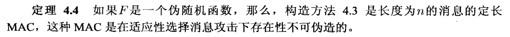
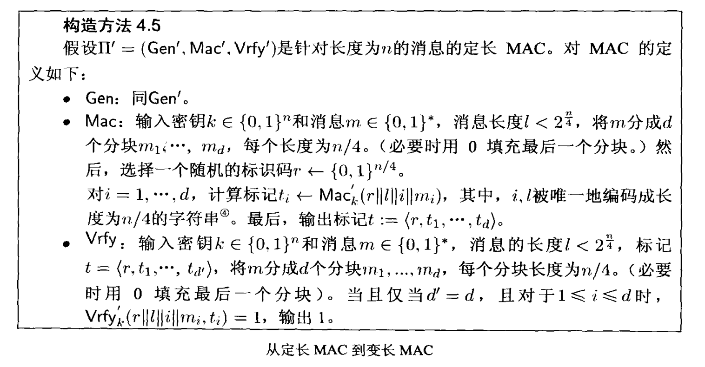

### 概述

**目的**

确认是发送者发送的，并且确保消息完整性。阻止敌手进行不被检测到的对消息的修改。（在加密情况下，只有通信双方都掌握了敌手不可知的秘密时才能实现，否则敌手可以伪装某一方来发送消息）

**语法**

假设发送端和接收端共享一个密钥，用来身份认证。发送端直接发送m和标记t($Mac_k(m)$)，只有key是不被知道的，利用消息验证算法进行验证。

**攻破**

**安全性定义**

**重放攻击**

发送之前发送过的消息，MAC并不能阻止重放攻击，为了应对，可以添加序列号或者时间戳。但是序列号的缺点是需要被记录，时间戳的缺点是不能防御足够快的重放攻击。

### 构造安全的MAC

从定长MAC到变长MAC

### CBC-MAC

### 抗碰撞散列函数

**抗碰撞的定义**

!!! note 

    lost~

