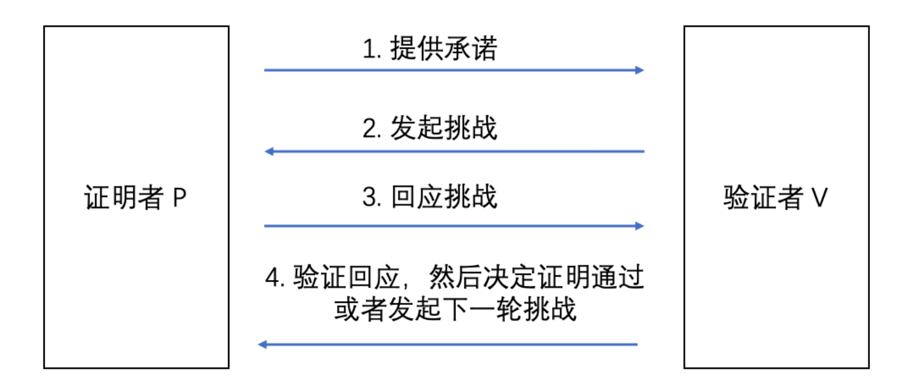

### 1. 什么是零知识证明

### 1.0 为什么零知识证明重要

1. **保护隐私**：在许多场景下，我们需要证明我们拥有某些信息，但又不希望泄露这些信息。零知识证明可以帮助我们在不泄露任何关于信息本身的情况下，证明我们拥有这些信息。
2. **安全性**：零知识证明可以增强系统的安全性，因为它们允许验证者在不获得敏感信息的情况下验证某个声明的正确性。这有助于防止数据泄露、黑客攻击和欺诈行为。
3. **去中心化应用**：在区块链和去中心化应用中，零知识证明可以提高系统的隐私性和安全性。例如，通过使用零知识证明，用户可以在不泄露自己身份的情况下进行交易，从而保护他们的隐私。同时，零知识证明还可以确保交易的正确性，保障整个系统的安全。
4. **提高效率**：在某些情况下，零知识证明可以提高验证过程的效率。例如，通过使用零知识证明，验证者无需访问或处理完整的数据集，即可验证数据的正确性。这有助于降低计算和通信成本。
5. **广泛应用**：零知识证明可应用于许多领域，如金融、医疗保健、投票系统、身份验证等。它可以帮助我们在保护隐私和安全的同时，实现各种功能。

### 1.1 定义

零知识证明（Zero-Knowledge Proof，简称ZKP），最初由 S.Goldwasser、S.Micali 及 C.Rackoff 在 1985 年的论文《互动证明系统的知识复杂性》提出，指是一种加密技术，它允许一个证明者向一个验证者证明某个陈述是正确的，而不需要透露任何证明相关的信息。这意味着，证明者可以证明自己知道某个信息，而不需要透露这个信息本身，从而保护了隐私。

- Children：零知识证明是对某句话的证明，你没有告诉别人这句话为什么是对的，你只告诉别人一点点信息，或者用了某个神奇的技巧，他们就可以确信这句话是真的。

- Teen：如果你想让别人确信你知道一个非常重要的秘密信息，但你不想告诉让别人知道秘密信息是什么，你可以使用零知识证明来证明你知道这个秘密信息但不需要把秘密信息告诉别人。

> 例子：A想证明手中的两张卡片上的数字是不同的，但是不能让验证者知道卡片上的数字。这时候A可以把卡片交给验证者B，让验证者B操作，然后交给证明者A，证明者A告诉验证者B卡片是否被交换。如果多次都成功，那么可以证明A手中两张卡片的数字是不同的。

### 1.2 数据 信息 知识

> 为什么不是零数据证明，或者是零信息证明，而是零知识证明？

**数据**： 指的是事实和数字传递的一些具体的东西，但不以任何方式组织起来，简要概括就是一些非结构化事实和数据。

**信息：**要使数据成为信息，必须对其置于背景中进行研究、分类、计算和压缩。因此，信息描绘了一幅更大的图景：它是具有相关性和目的性的数据。它可以传达外界的一种趋势，也可以表示一段时间段内的销售模式。简言之，就是结构化的数据。

**知识**：与计算能力有关的概念。越来越多的人将知识视为一个更复杂、更个性化的概念，它不仅仅包含信息。知识是你通过学习或经验获得的信息、技能和理解力，即为在知识管理范围内通常被视为知识的方式，是你通过学习或经验获得的信息、技能和理解力。

> 例子：A随机抛硬币，把结果告诉B，B没有获得知识，只是获得了当次抛硬币这一信息（不确定到确定），但是B其实可以自己抛硬币来获得结果，他并没有获得什么知识。

**零知识证明**：验证者并没有获得他之前所没有的某种知识和能力，则可以被视作零知识。零知识证明更强调的是一种能力，如果在某个证明之后，我们获得之前没能力获得的一些信息，或者是获得了之前没有的能力，那么这就不是零知识证明。假设我们之前不知道某个信息，但是我们有能力知道，证明只是告诉了我们有能力知道的信息，那么也可以被称为零知识证明。

（**如何证明证明是零知识的？**之后的例子中会讲到。）

### 1.3 三+一个性质

- **完备性：**如果statement为true，则诚实的验证者可以相信诚实的证明者确实拥有正确的信息。”凡是正确的都能够证明。“
- **可靠性：**如果statement为false，则任何不诚实的证明者都无法说服诚实的验证者相信他拥有正确的信息。 ”凡是错误的都不能够被证明。“
- **零知识性：**如果statement为true，则验证者除了从证明者那里得知statement为true以外，什么都不知道。

- **简洁性（可扩展性）**：验证证据的复杂度远小于计算的复杂度（O(log)），生成证据的复杂度近似于计算的复杂度（O(n)）

### 1.4 发展历史

关于零知识证明的概念，最早来自于1985年，由 Goldwasser、Micali 和 Rackoff 合作发布的一篇论文 **《The Knowledge Complexity of Interactive Proof Systems》** 。

2010年，Groth 在它的一篇名为《Short Pairing-based Non-interactive Zero-Knowledge Arguments》的论文中提出了**目前零知识证明的关键性理论**，即**zk-SNARK**，在这个理论中，证明提供者可以向验证者以数学的方式证明信息的准确性，从而避开了需要向验证者提供的除真实性和完整性以外的其他内容。

2016年提出的**Groth16算法**就对证明的大小进行了精简，是目前主流的ZK算法中的基础性算法之一。

2017年提出的**Bulletproof算法**，设计出了一种**非交互式的零知识证明**，这**让证明者和验证者不必在同时在线**，是一种很有用的算法协议。

2018年的**zk-STARKs**更是提出了一种不需要可信设置的算法，这让zk-STARK的发展有了一个新的突破口。目前，很多区块链项目的零知识证明都是通过zk-STARKs算法协议来实现。

### 1.5 随机性

> 通过无数次施展神迹。来表明我就是神。

随机性可以帮助我们来完成证明，如果我们研究这一柏拉图似的证明思想，又会发现这里面没有了随机性，整个证明过程又都是确定性的。我们需要在脑海中通过增加和移除随机性来完成证明。

**在传统证明中，随机性是我们实现最终目标的一个障碍**，因为你希望所有过程都是明确的，你希望理解信息的整个流动过程。

然而，一旦你需要在脑海中设置随机性，而不是设法移除随机性，我们会立刻发现随机性所引入的糟糕性质反而能帮助到我们，因为随机性是不可预测的，而我们要的就是**不可预测性来帮助我们隐藏好我们想隐藏的信息**。

（由随机性引出交互式零知识证明）

### 2. 交互式零知识证明

### 2.1 例子

可以想象一个山洞只有一个入口，洞里面有两条路（路径A和路径B），这两条路由一扇门连接，要说出密码才能通过这扇门。Alice希望向Bob证明她知道开门的密码，但不想将密码透露给Bob。因此，Bob需要站在山洞外，Alice从其中一条路走进山洞，而Bob并不知道她选了哪条路。接着，Bob指定Alice从其中一条路回到山洞入口（注：这是随机选择的）。如果Alice最初选择从路径A走到门口，但Bob让她从路径B回来，唯一的方法就是穿过那扇门，而穿过门必须知道密码。为了充分证明Alice真的知道门的密码，而不是运气好刚好选到了同一条路，这个过程可以反复重复好几次。

这一步操作完成后，Bob就可以非常确信Alice知道门的密码，与此同时Alice也不用向Bob透露密码是什么。虽然以上只是零知识证明机制简单的概念演示，但真正的零知识证明运用的是密码学，在不透露数据的情况下证明数据的存在。在这个山洞的示例中有一个输入数据，一条路径和一个输出数据。在计算机中也存在类似的系统和电路，传入数据，数据通过某些电路门之后再输出。零知识证明利用了类似这种电路机制来创建证明。 

**那么如何证明这是零知识的？**模拟！时间倒流

现在我们假设有一个人Fake Alice，这个人不知道Alice拥有的那个开门的密码，但是这个人拥有超能力，她知道每次Bob将要说什么，她总能选择Bob要说的入口进去。这时候Bob并不能区别Alice是真的还是假的，所以真假Alice等价，而假的Alice什么知识都不知道，所以不可能泄露知识，所以说Alice是零知识证明。但是如果Alice泄露了一定的知识，比如她让Bob看到了钥匙是金色的，但这个时候Fake Alice是不知道这个知识的，所以不可能构造出一个Fake Alice来混淆，所以这不是零知识证明。

证明的零知识过程，等价于构造（寻找）一个「模拟」算法，这个算法能够让模拟器来模拟出一个「没有知识」的理想世界。如果这个算法存在，而且两个世界不可区分，那么就证明完毕。

> 那万一现实世界的Alice也这样来欺骗Bob呢？不可能，因为现实世界并没有超能力，Alice无法用超能力来欺骗我们。

<https://zhuanlan.zhihu.com/p/76849956>

### 2.2 具体算法

### 2.3 局限性

交互式零知识证明要求验证者不断对证明者所拥有的“知识”进行一系列提问。证明者通过回答一系列问题，让验证者相信证明者的确知道这些“知识”。

1. 每次验证都需要进行整个**冗长的过程；**
2. 证明方与验证方都需要**同时在场**，不管是在线还是面对面；
3. **只能够取信于一个验证者**，如果要取信于多个验证者，则对每个验证者都需要进行一遍证明过程；（因为只有验证者才知道提出的挑战是随机的，还是和证明者串通作弊的。这一限制在传统的中心化节点的架构中并不严重，我们可以相信中心化节点的验证以及颁发的证书（比如在DNS，HTTPS等协议中）。但是在区块链领域，用户信奉着“Don't trust, verify it”（别相信，验证它）的理念。）
4. **只在某个时刻有效**。

综上所述，交互式零知识证明的应用场景有局限性。

