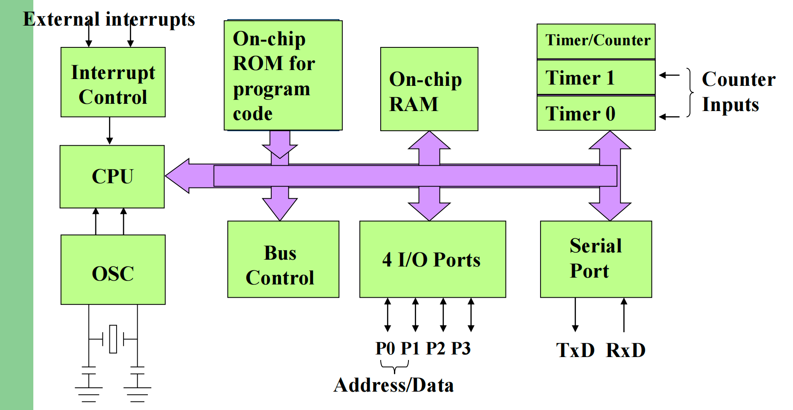
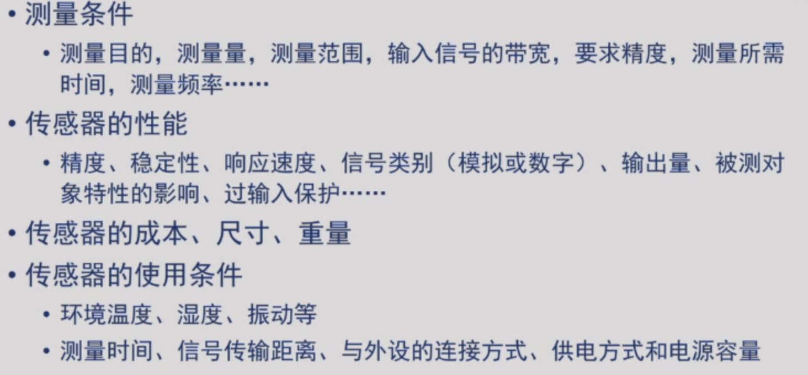
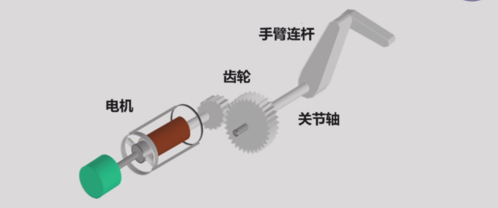
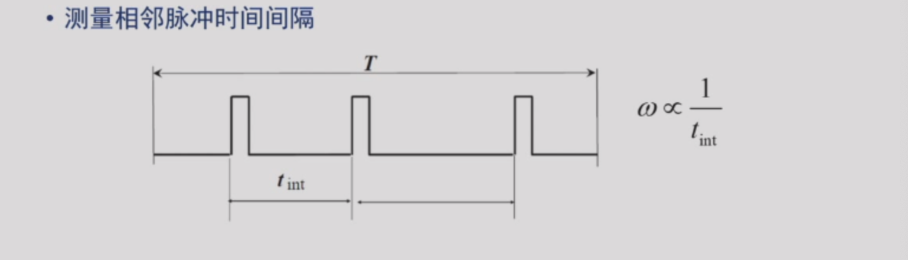
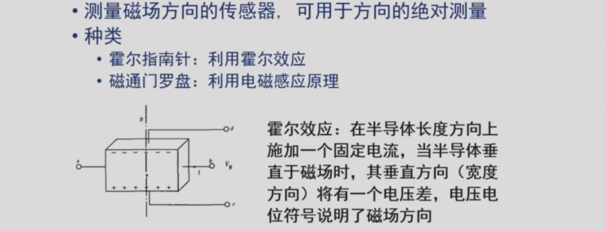
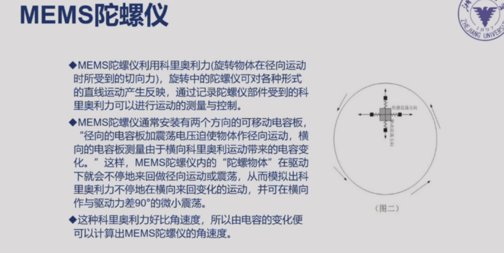
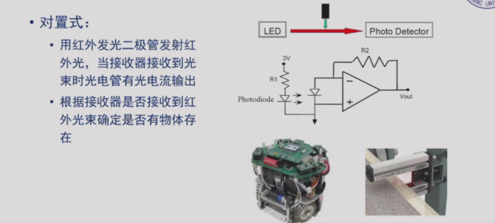
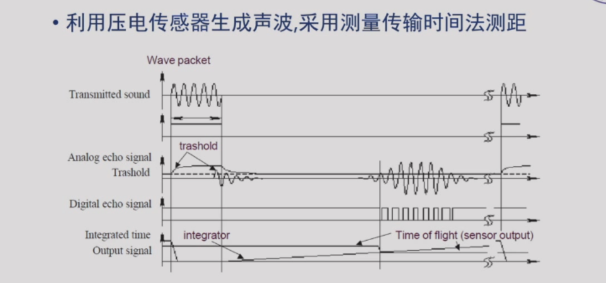
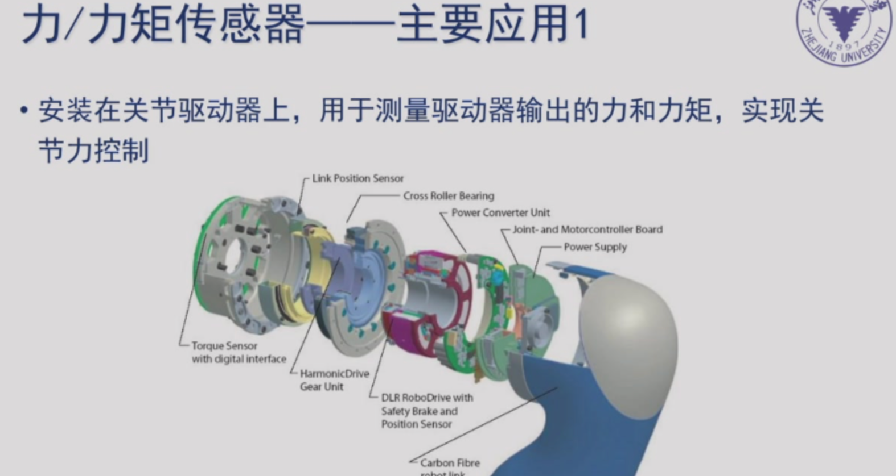
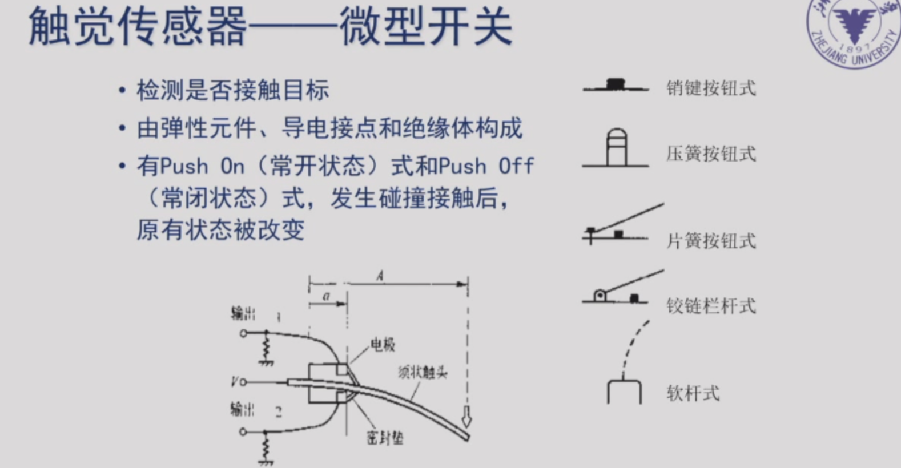

## 第三课(3.6) 微控制器
### 期末大作业tips
- 组成部分：
  - 对题目的分析（实验要求）；
  - 策略；
  - （核心）机器人设计，关键部件的零件图；
  - 电器控制系统（纸上谈兵），可以简化，比如搞个控制系统框图；
  - 分工，最好每个人自己写一段自己的心得（不是废话，验证分工）；
- 给出的三个资料：
  - 给的材料清单（允许用一定的经费去买一些材料）；
  - 题目；
  - 学长题目分析与心得；

### 上课要点（微控制器/Arduino语言）
- 计算机：
  - 计算、逻辑、程序、存储、控制
- 存储：
  - 磁盘（磁）、光盘、闪存（电子）
- 冯诺依曼计算机结构

- 微控制器工作
  - 输入输出接口（数字信号（0101这样））

- Arduino语言
  - 所有的都有以下这两个函数；
  - 


## 第四课(3.10) 机器人传感器
### 考试

重要的是传感器的原理，比如光电码盘的原理？
还有可能列举机器人里面的内部传感器？

### 一个例子


### 1. 定义（重要）

用于**定量**感知环境**特定物质属性**的**电子、机械、化学设备**，并能够把各种物理量和化学量等精确地变换为电信号，再经由电子电路或计算机进行分析与处理，从而对这些量进行检测。

```
自然界中的物理量或化学量
++++++++++++++++++++
			  电信号
++++++++++++++++++++
		信息分析与处理
	（电子电路或计算机）
```

### 2. 分类-内部传感器（重要）

- 测量机器人自身状态；
- 常用语底层运动控制；

|传感器|检测功能|
|---------|-----------|
|电位器、旋转变压器、码盘|角度、位移|
|测速发电机、码盘|速度、角速度|
|加速度传感器|加速度|
|倾斜仪|倾斜角度|
|陀螺仪|方位角|
|力/力矩传感器|力/力矩|

### 3. 分类-内部传感器（重要）

- 测量机器人所处环境；
- 部分用于底层运动控制，部分用于上层运动规划；

| 传感器         | 感知内容                                   |
| -------------- | ------------------------------------------ |
| 视觉           | 环境图像                                   |
| 触觉、滑动觉   | 物体存在检测、尺寸、形状、材质、硬度、光滑 |
| 接近觉（蝙蝠） | 障碍检测、距离（人其实不能）               |
| 热觉           | 温度                                       |
| 嗅觉           | 气味                                       |
| 听觉           | 声音                                       |
| 味觉           | 味道                                       |
| 力觉           | 力和力矩                                   |

### 一个例子


### 4. 传感器的特性

#### 静态特性

指检测系统的输入为不随输出时间变化的恒定信号时，系统的输出与输入之间的关系；

- 基本要求：输出相对于输入保持一定的对应关系；
- 主要静态特性：
  - 灵敏度：对输入信号变化的响应敏感度；
  - 信噪比（S/N）：传感器输出信号中信号分量与噪声分量的平方平均值之比；
  -  线性：输入与输出量之间为线性比例关系；
  -  稳定性：输入量恒定，输出量向一个方向偏移（温漂/零漂）；
  -  精度：
    -  准确度：测量值对真值的偏离程度；
    -  精密度：测量相同对象，每次测量会得到不同测量值；

#### 动态特性

指检测系统的输入为随时间变化的信号时，系统的输出与输入之间的关系；

- 也称为响应特性；
- 要检测的输入信号是随时间而变化的，则传感器应能跟踪输入信号的变化；
- 瞬态响应特性；
- 频率响应特性；

### 5. 传感器选择



### 二、机器人运动传感器

#### 要素与分类


#### 1. 电位器
- 工作原理：算是直接测量；
- 用处
  - 通常用作内部反馈传感器，可以检测关节和连杆的位置；
- 类别
  - 旋转式：测量角位移；
  - 直线式：测量线位移；
- 使用方法

#### 编码器

##### 分类
- 根据测量介质分
  - 光电码盘
  - 磁编码器
- 根据测量结果分
  - 增量式
  - 绝对式

##### 光电码盘 各种例子

- 增量式光电编码器
- 绝对式光电编码器

- 两种编码器比较

##### 磁编码器

多用于测量可以连续变化的，或者是光电码盘收到影响；



#### 2. 速度传感器

测速度都不是直接测，而是求位移比时间；



#### 3. 加速度传感器

- 基本原理：利用加速度造成某个介质产生变形，通过测量其变形量并用相关电路转化成电压输出，如电压晶体；
- F = ma，算是直接测量；
- 做三个，就可以在xyz三个方向进行测量；

### 三、机器人方位角传感器


#### 指南针



#### 陀螺仪


##### 光纤陀螺仪


##### MEMS陀螺仪



- 缺点：东南西北分不清；

### 四、机器人测距传感器

#### 接近觉


##### 光学接近觉传感器



##### 超声波接近觉传感器

而且因为是发散的，所以不能分辨障碍物的大小；

##### 激光测距仪


### 五、其他传感器

#### 力/力矩传感器



#### 触觉传感器



- 人体红外传感器
- 远红外传感器（火焰检测/定位）
- 震动传感器
- 语音识别模块
- 颜色传感器
  - 有高强度白光LED在目标表面反射，从反射光中分析的RGB值和强度；
- 气体传感器
  - 有点化学、物理吸附、光学；

---
password: zhz0725
---

