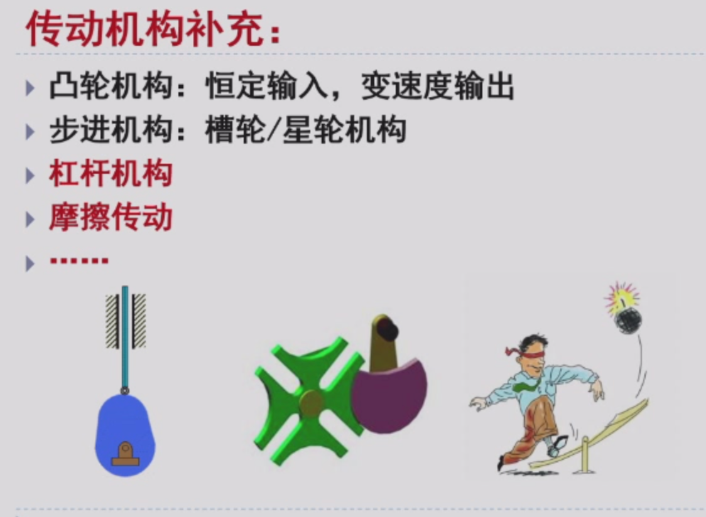
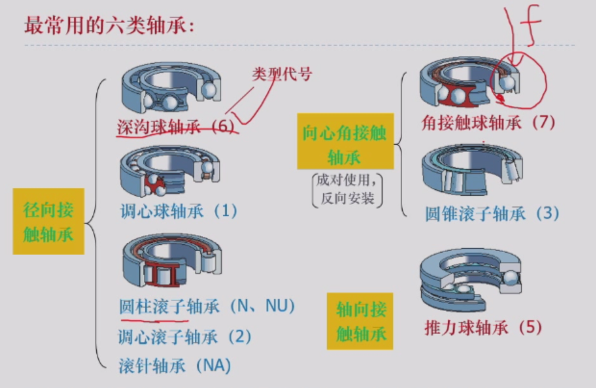
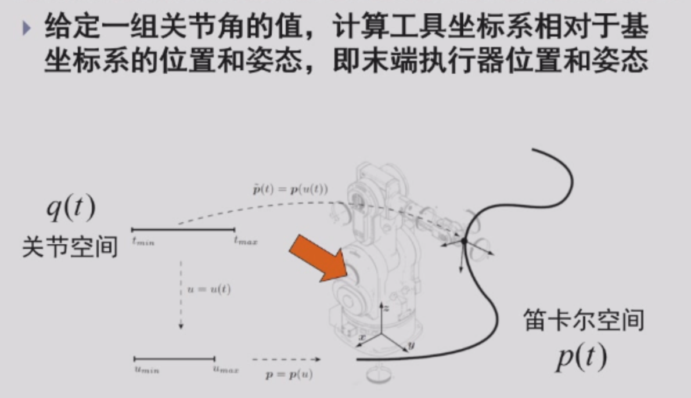

## 课程回顾

## 机器人机械设计 

### 1. 机械设计——轴系和链接

#### 1.1 轴系设计——滚动轴承

- 作用：用来支撑轴；（滚动摩擦代替滑动摩擦）
- 滚动轴承是标准件，非常精密；
- 特点：旋转精度高、气动力矩小、是标准件，选用方便；
- 组成：

- 按照可承受的荷载方向不同，滚动轴承分为三类（但是径向接触轴承其实可以承受一定的轴向力）：
- 选择：

- 滚动轴承的安装：

- 滚动轴承的拆卸：

- 无油润滑轴承：

- 轴承的安装与固定

#### 1.2 轴系设计——联接（轴向固定）

- 轴在轴向上的固定

## 机器人运动学

- 分类：平面四连杆运动学、三维机器人运动学

- 正运动学
- 逆运动学

路径没有时间概念，轨迹有时间概念

## 坐标变换（重点！）

- 考试会考，但是不需要把这个东西记住，会给出公式
  如果只有两个，那么不动的维度角度为0代进去

- 转动特性

- 坐标变换
