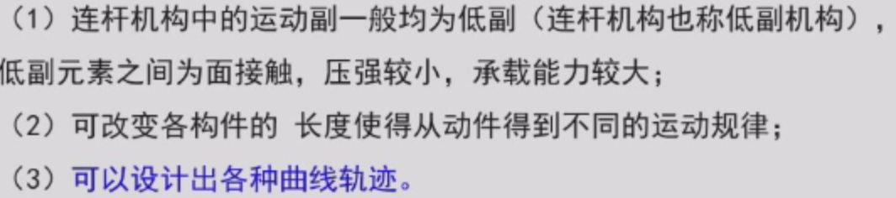
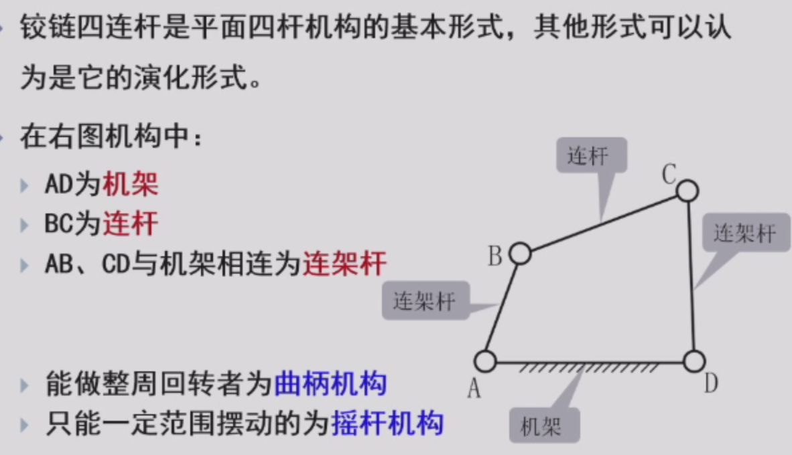
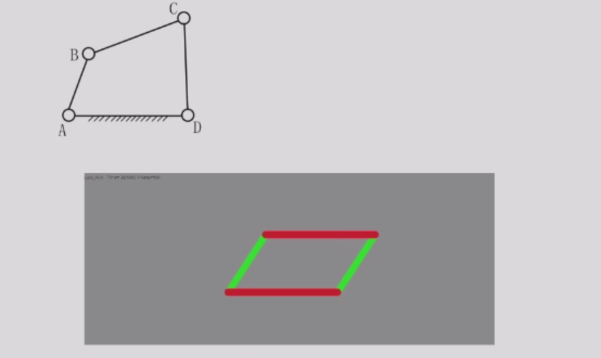
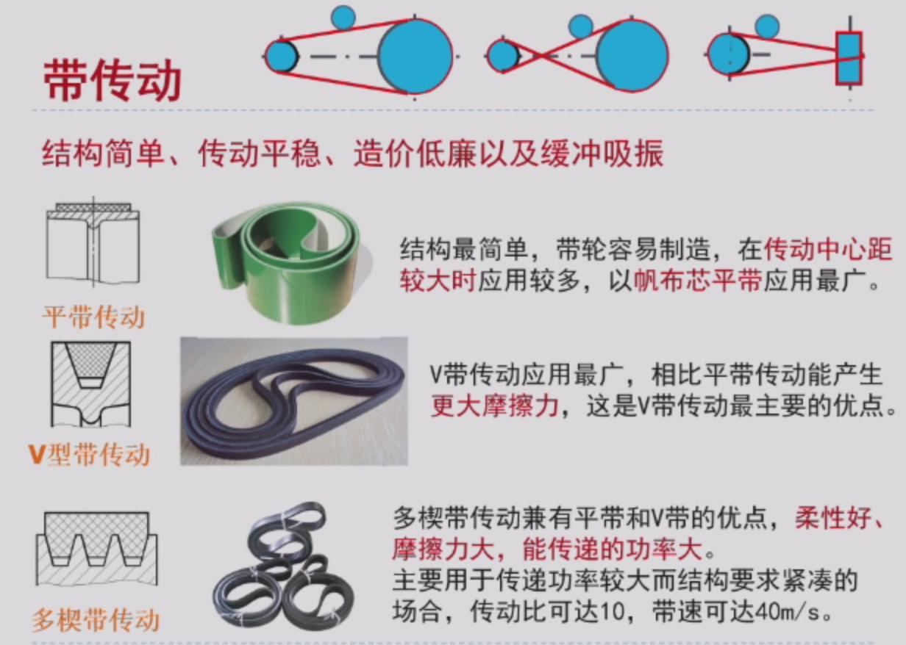
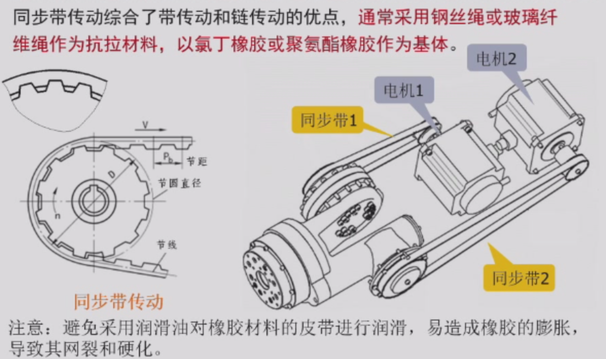
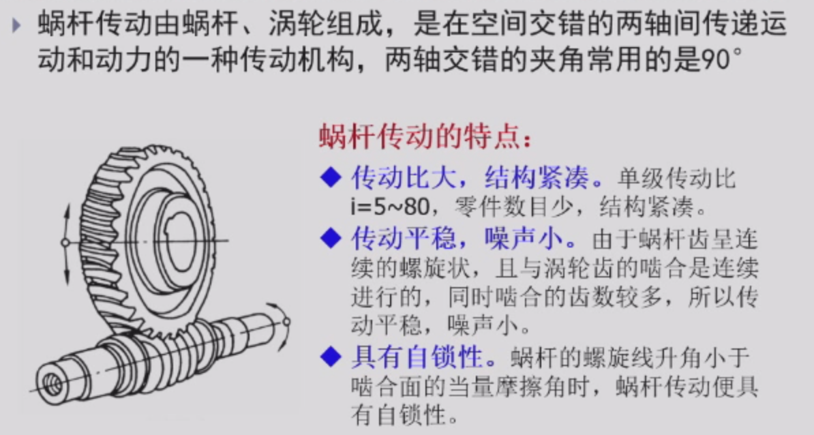
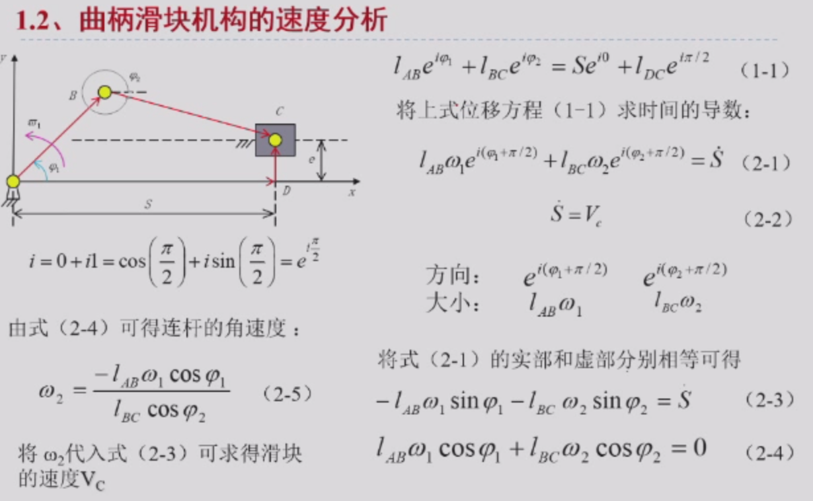
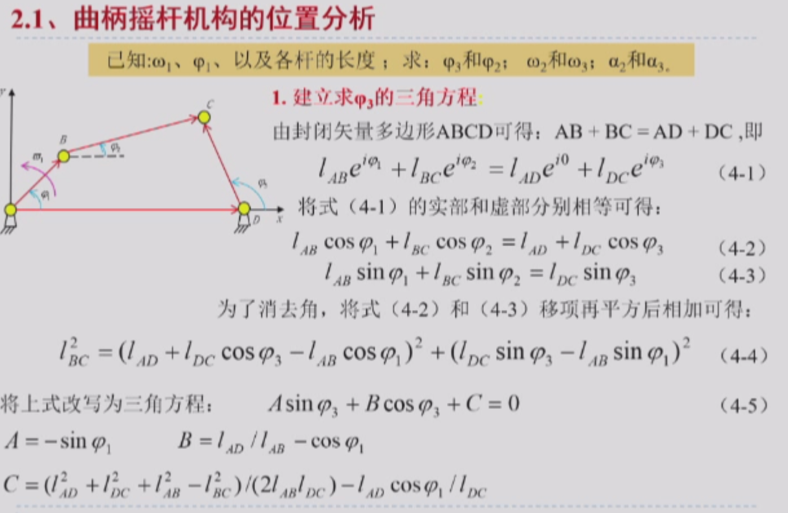
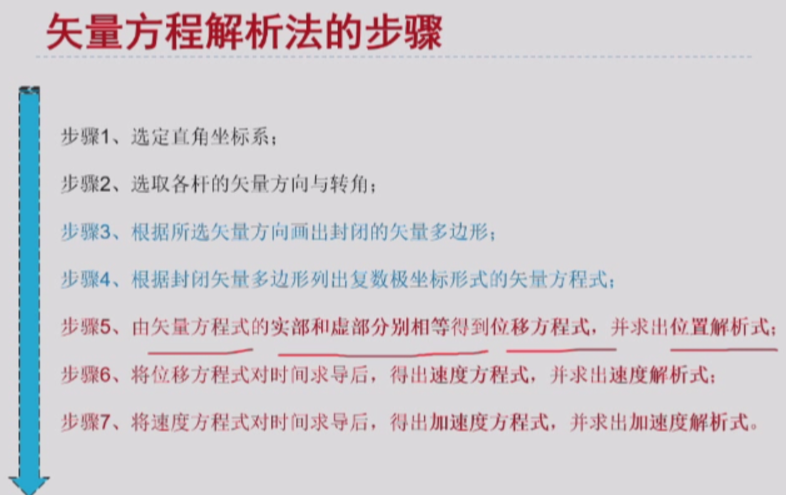

### 4. 齿轮轮系
#### 定轴轮系

#### 周转轮系
- 

- 2和1通过行星架连接，2和3通过内啮合传动；

- 

    - 行星轮系：1输入、H输出或者H输入、1输出；

    - 差动轮系：需要运动的合成与分解；

- 减速比的计算和转向方向没讲；
- 讲了一下行星轮的应用，没听懂……

## 机器人设计与传动-2

### 5. 连杆传动

- 平面连杆：公交车车门、火车车轮、缝纫机、起重机……
- 平面四连杆机构：1输入，通过连杆2，3输出；

- 优点：

- 缺点：

- 组成：

#### 5.1 基本形式一：曲柄摇杆机构

- 铰链四杆机构的两个连架杆中，有一个为曲柄，另一个为摇杆；
- 
- 条件：输入杆必须是最短的；

#### 5.2 基本形式二：双曲柄机构

- 
- 当最短杆为机架l~4~时，则为双曲柄机构；

#### 5.3 基本形式三：双摇杆机构

- 
- 当最短杆为连杆l~2~时，则为双摇杆机构；

#### 演化形式一：曲柄滑块机构

- 

#### 演化形式二：平行四边形机构

- 连杆始终与地面平行，但是不一定是真的平行于水平面（地面），固定在地面上也是可以的。
- 

### 6. 滑轮组

- 固定轮只能用于改变力的方向，而运动轮可以降低输入力量的大小；
- 

### 7. 带传动

- 容易打滑，传动精度不太好；

- 

### 8. 链传动

- 

### 9. 同步带

- 

### 10. 蜗杆传动

- 

### 9. 平面四连杆运动学——解析法

