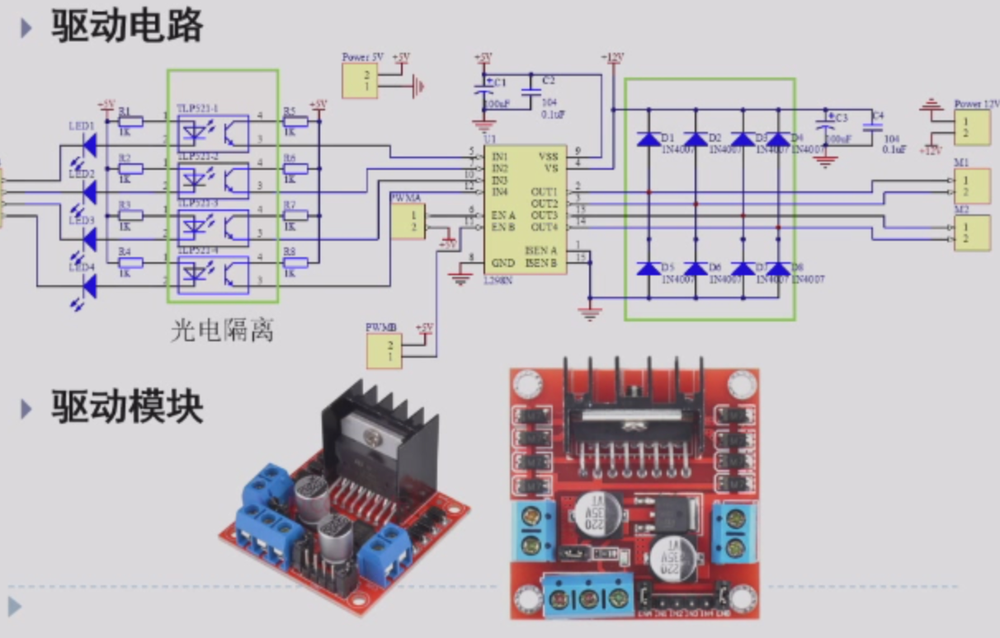
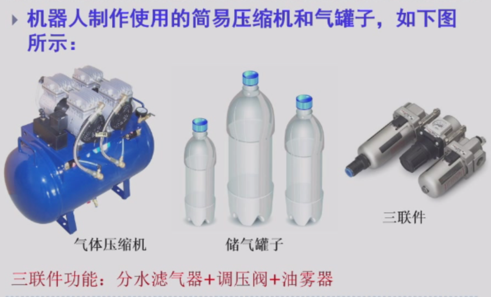
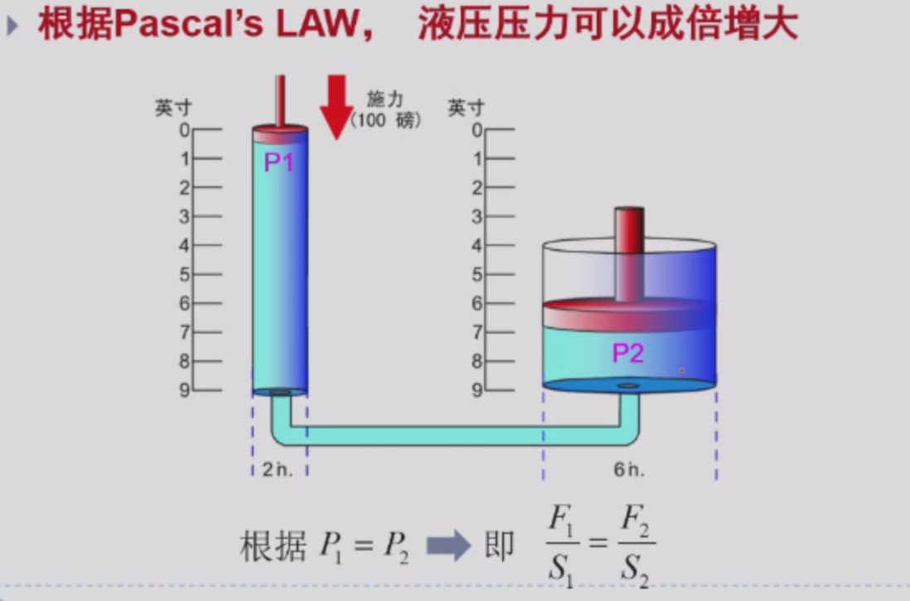

- 你认为一个机器人应该具备哪些主要特征？
- 答：运动、感知、决策、交互。
## 电机驱动
### 1.1 有刷电机（H桥驱动）

- 最常用的一种驱动方式
- 

- 
- 

- 光电隔离电路（过滤环境因素，因为本身的电压比较小，可能只有3.3V，很容易受到环境影响）
- 驱动电路与模块

### 1.2 基本控制方式

#### 开环伺服系统

#### 闭环伺服系统

#### 半闭环伺服系统

对于机械执行部件不进行检测，所以还是要优化机械结构；

## 气动驱动

### 组成

- 包括气压发生装置、辅助元件、控制元件和执行元件；

- 简易版：气压元件、控制元件、执行元件和辅助元件组成；
  - 

### 气动器件

### 气体特性

### 简易气缸

### 气动基本回路

### 方向控制回路（重要）

#### 单作用气缸换向回路

- 掌握几位几通的概念
- 对于两位三通，电磁铁工作，黄色区域接入工作，气缸向上；蓝色时候，气缸向下；
- 对于三位四通，下面电磁铁工作，蓝色区域接入，气缸向上；上面电磁铁工作，黄色区域工作，气缸向下；电磁铁不工作，红色工作，气缸不动；

#### 双作用气缸换向回路

- 
- 

### 气动肌肉

## 液压驱动

### 液压驱动原理

### 组成

### 驱动例子

