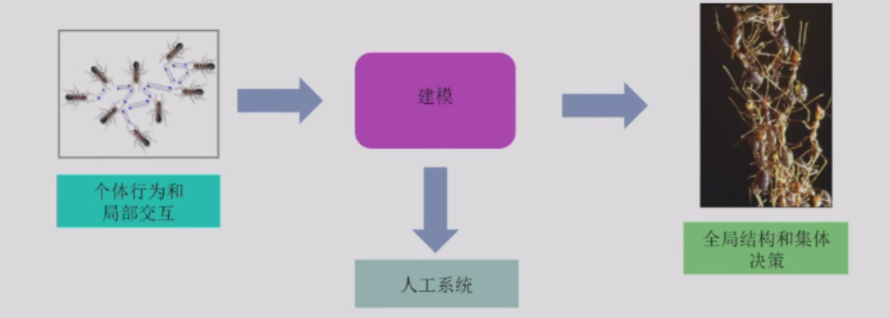
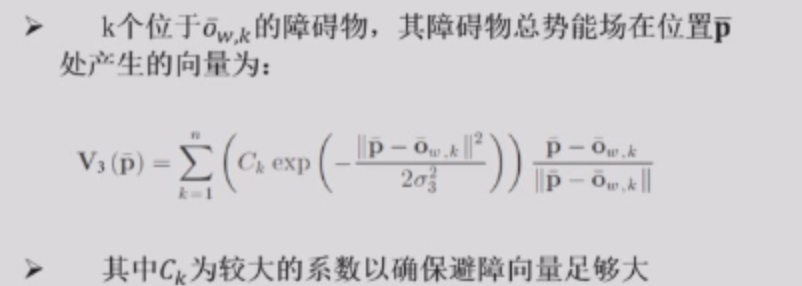
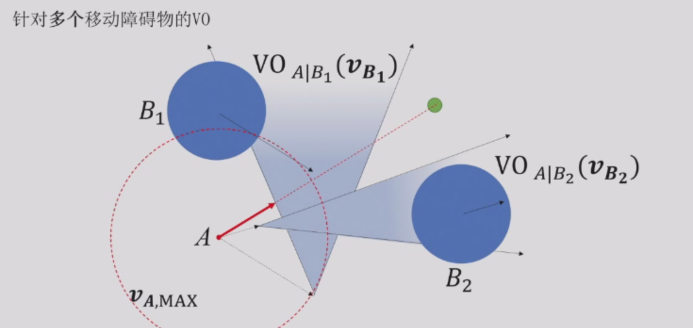
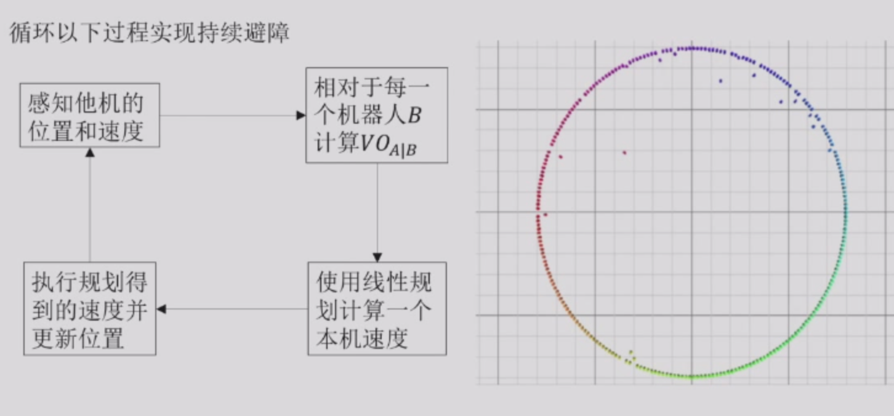
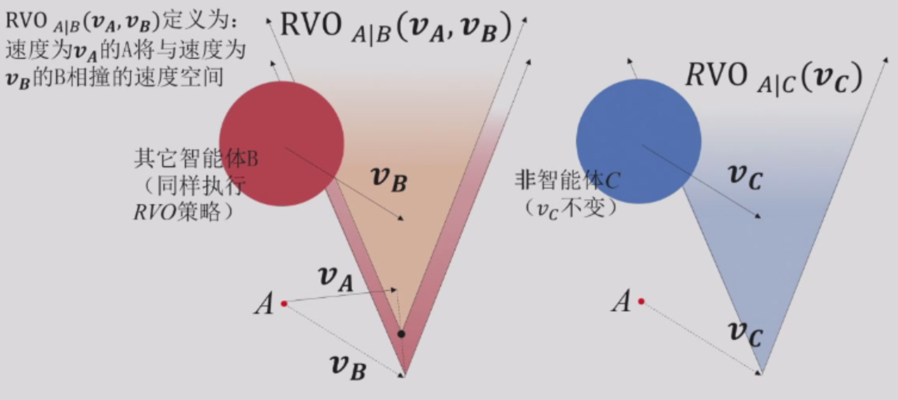
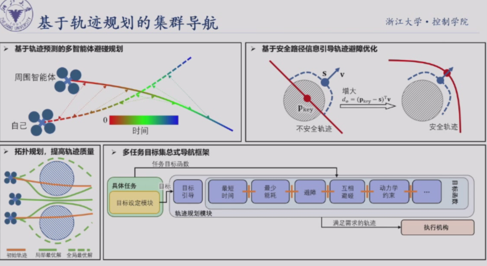

## 经典集群算法
### 群体行为的特点

- 有限的局部信息
群体中的每个个体只能获得有限的局部信息，对群体中其他个体共同参与构建的结构没有全局性的了解。

- 简单的个体规则
每个个体仅遵从一些简单的行为规则，这套规则允许群体协调其活动，并建立一个全局结构或构型。

- 全局结构涌现出有利的功能
这些结构使群体能够解决一些个体无法完成的问题，并体现出灵活性和鲁棒性。

### 从自然界到人工系统

- 从微观系统到宏观系统的转变
- 建模人工系统感知和决策机制

### 群体智能的关键机制

群体智能的关键机制：通过局部的个体之间相互作用涌现
出具有全局效果的结构；

指定系统个体之间交互的规则是在**局部信息**的基础上执行
的，而不参考全局模式，这是系统的一种**涌现属性**，而不
是外部排序影响强加给系统的属性：

- 聚合（Aggregation）
集合在一起，不要分开太远。

- 图案形成（Pattern Formation）
用很多个微观个体表现出一个宏观事物。

- 自组装（Self-assembly）
多个机器人自己组合在一起。

- 群体搬运（Collective Transport）
个体合作搬运重物（个人无法完成的任务）。

- 群体探索（Collective Exploration）
个体专注于覆盖一个区域以寻找资源，然后利用发现的路径来开发资源。

### 经典集群导航算法

#### 1. 基于Virtual Structures的编队控制

##### 核心思想

- 集群编队结构表示：将整个集群用virtual structure表示为一个世界坐标系下的整体（virtual rigid body，VRB）；
- 多目标需求：基于势场法表示集群中每架无人机编队保持、相互躲避、障碍物避障的需求；
- 控制：在VRB坐标系下统一上述各个势场得到相应的控制指令。

##### 在障碍物环境下基于势场法的编队控制

- 编队势能场
- 相互躲避势能场
- 障碍物势能场

认为机器人的速度是可以突变的，在速度比较小的时候是可以的，但是如果速度变快了，就不行了。

而且很容易卡住，因为每个机器人只管自己的规划，而且只规划下一步，所以非常短视。

#### 2. 基于速度障碍物（VO）的集群导航算法

##### VO

把两个球的关系变成一个点和一个球的关系

##### RVO

RVO则在VO的基础上进行了一些改进，解决了VO**抖动**的问题。为什么会发生抖动？双方为了避障，都**偏移了当前速度太多**，导致更新速度后，原来速度不再会发生碰撞，更倾向于原来的速度。

Reciprocal的理解是：相对于VO**完全把对方当做木头**，RVO假设对方在避障中也**会承担一定责任**，所以**不用完全靠自己**改变速度来走出VO，有种**互相合作**避障的感觉。

#### 3. 基于生物群落模型的集群导航算法

**基本思想**：为实现像鸟群一样的一致飞行，每一个体的运动由三股力量（速度）决定：

- 短距离：与邻居、障碍物的排斥速度vrep，越靠近斥力越大；
- 中距离：运动对齐速度vfrict，越偏离权重越大；
- 长距离：远方目标的引力vflock，一定范围内维持未定；

执行速度为三类速度的矢量 v^exe^=v^rep^+v^frict^+v^flock^.

**应用难点**：参数繁多且对参数灵敏

**解决办法**：进化算法调参

## 先进的集群算法

