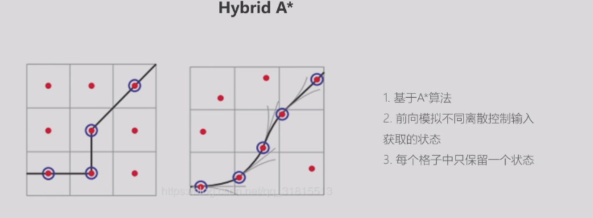
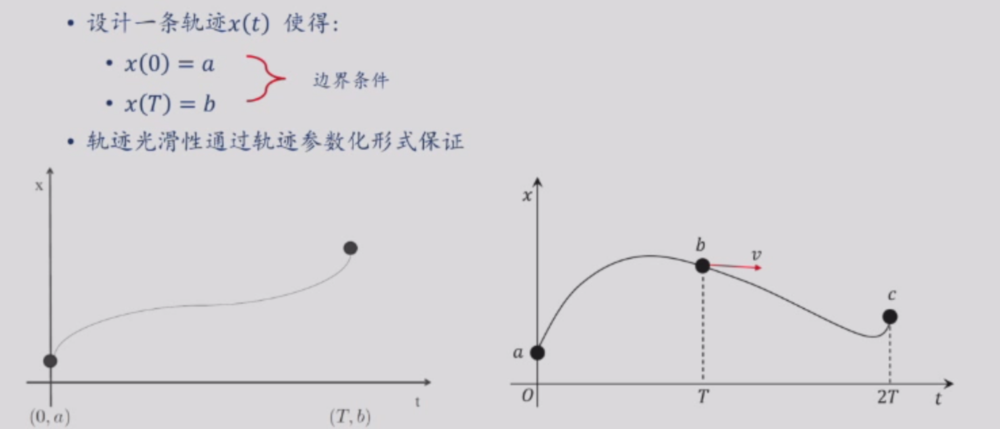

### 规划导论

- 系统软件框架
- 先基于环境进行路径搜索，之后再考虑动力学约束进行优化

### 导航地图与路径规划

- 数据结构 + 融合方法（滤波/优化） = 地图

- 栅格地图

  - 高程图（一个网格只能记录一个信息），拓展高程图（一个网格中还存着一个一维数组，可以表示不连续的高度比如桥）
  - 最为稠密，有结构的，直接索引查询

- 八叉树地图

  - 对于可以合并的，直接表示，对于需要精细化表示的，在进行切分

  - 稀疏，有结构的，直接索引查询

- 点云地图

  - 精度最高，无顺序，无法索引查询

- ESDF地图

  - 

#### 路径搜索

- 分类

  - 基于采样的算法：PRM、RRT、RRT*
  - 基于搜索的方法：DFS、BFS、Dijkstra、贪心算法、Jump Point Search
- PRM
- 

- RRT
  - 

- 基于搜索的方法
  - 

- 基于动力学运动规划的路径搜索
  - 
- 光滑一维轨迹
