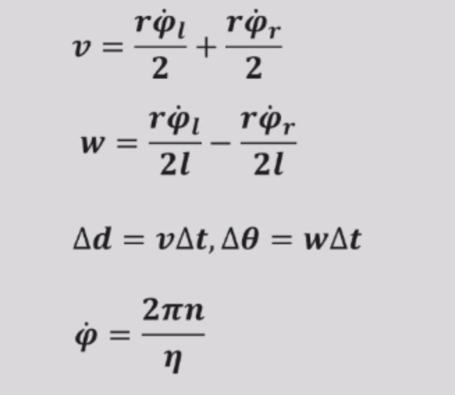
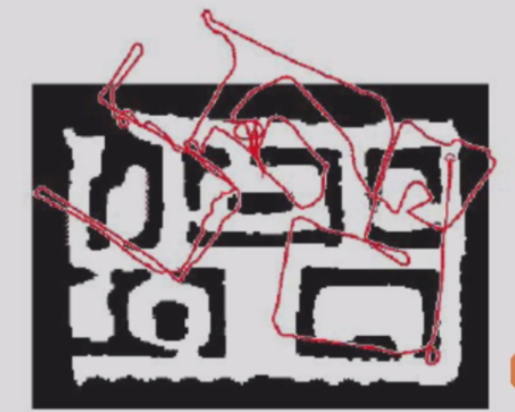
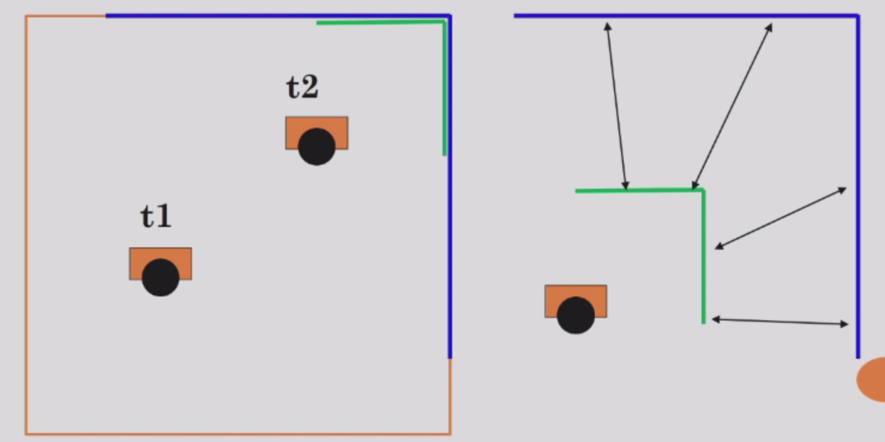
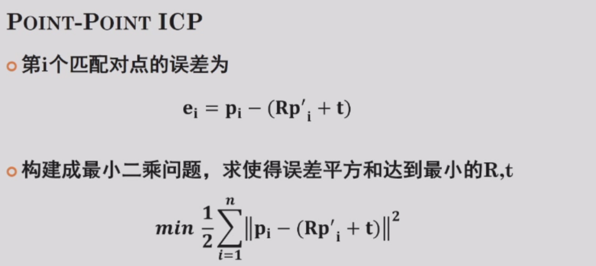

### 1. 里程估计

- 定义：根据传感器感知信息推导机器人位姿（位置和角度）变化；
- 用途：
  - 航位推算：基于已知位置，利用里程估计，推算现在的位置；
- 里程估计方法：
  - 电机码盘可以计算电机转了多少圈，从而计算速度和里程；
    - 电机码盘和IMU都有比较大累积误差，所以还要对里程估计进行修正；
  - 比如走向一头门，门越来越大，可以根据这种静态环境的变化，反算速度和里程；
  - 

#### 1.1 基于电机码盘的轮式移动机器人里程估计

- 1）根据电机码盘获得轮子转速
- 2）结合运动学模型计算参考点速度（利用多个轮子的速度计算出比如质心的速度）
- 3）假设短时间片内为匀速运动，计算位姿变化
- 运动学模型方程样例：

- 基于位姿变化的航位推算

- 轮式里程估计误差
  - 系统误差：轮半径误差、轮子安装精度误差（不平行，两边距离不相等）、编码器精度误差、采样精度误差、齿轮减速比精度；
  - 偶然误差：地面不平（轮子动了实际上没动）、轮子打滑（轮子不动但实际上动了）
  - 但是，虽然里程估计误差会积累，里程估计对于每个`Delta t` ，误差是有上界的，所以相对误差是挺小的；

- 基于惯性单元的里程估计
  - 惯性单元IMU(Inertial Measurement Unit)
  - 
  - 优点：全天候、采样频率高、短时精度较好；
  - 缺点：积分是误差的根源，长距离长时间工作得不精准，需要其他传感器进行组合导航；

#### 1.2 激光里程计
- 总是会看不到最开始的参考点，这样的话就要多次参考，又会有累积误差，所以距离越远误差越大

### 2. 定位

- 确定机器人在世界（全局）坐标系中的位置/位姿

#### 2.1 基于外部设备感知的定位

- 例子：GPS、全局视觉观测定位；
- 当只见到一颗卫星的时候，只能知道在一个球面上，只有同时见到三颗卫星，才能确定位置；
- 全球定位系统存在问题：
  - 基于直线距离测量，如果有反射；如果有错，那三个球就不会重合于一个点，所以为了克服多路径的算法，需要同时有更多的卫星来排除测量错误的卫星的数据；
  - 如果在室内，那么还会有遮挡问题，无法直接进行信号的接收；
- 全局视觉观测定位：
  - 搭建一套外部视觉系统，识别机器人，确定其位置；
  - 如果需要更大的视野，则架设多个相机，非常类似于GPS测量定位；
- 全局视觉观测定位应用约束：
  - 1）摄像头有视野范围约束，当环境较大时需要多个摄像头；
  - 2）机器人上也需要有一定的标识方便图像识别定位；

#### 2.2 （不知道是什么标题

- 基于环境人工标识的定位（把编码放到环境当中）

  - 在环境中部署特殊标签，减低成本，确保可靠性把相机装到自己身上（比如淘宝仓库的地面二维码、安装在某一高度的激光发射板）；

- 基于环境自然标识的定位

  - 比如高速公路上看路标；
  
### 3. 总结
- 控制感知信息融合的自定位：
  - 用二维码观测作为感知数据有观测时利用二维码修正定位，没有观测时利用里程估计；
  - 用交通标志观测作为感知数据有观测时利用标志位置修正定位，没有观测时利用里程估计；

- 定位问题可以定义为最优估计问题；
- 最优估计的一个体现是估计的方差很小；

- （三头门无法区分，只能知道在门前），原理是：**正确的东西会叠在一块，而错误的会变小**；
