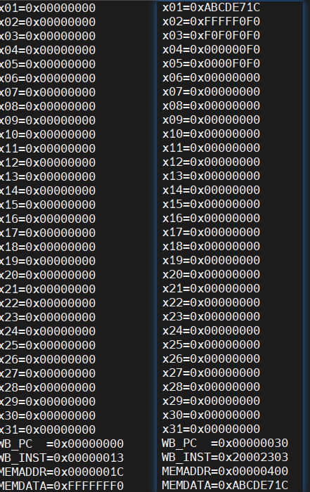

# 实验 2：Cache

## 1、实验目的
-  了解cache 在CPU 中的作用。
-  了解cache与流水线和内存的交互机制。
-  理解存储层次（Memory Hierarchy）。

## 2、实验环境
- HDL： Verilog。
- IDE： Vivado。
- 开发板： Nexys A7。

## 3、实验原理

### 3.1 Cache

Cache分为控制模块和存储模块，控制模块负责维护用于管理Cache状态的有限状态机，同时对Cache同上层CPU与下层Memory的交互起到调控作用。存储模块中则是Cache中存储的实际内容，一般为了保证Cache功能的正确实现，每个Block还需要辅助Tag（地址高位）、V（有效位）、D（脏数据）等信息进行管理。

### 3.2 Cache控制逻辑

CMU 是一个专门的控制模块，用于控制数据的读写，对于其控制逻辑一般采用状态机的模式来管理，**CMU在CPU、Cache和Menory三者之间起到了沟通的作用**。

Cache的行为分为如下五个状态（实验书上的状态似乎与实验代码的状态不太一致），如下为实验书上的状态机：


1. S_IDLE：cache正常读写，即Load/Store命中或者未使用Cache。
2. S_BACK：发生cache Miss，且被替换块中存在脏数，此时需要对脏数据先进行写回。
3. S_BACK_WAIT：写回等待阶段，完成后自动跳转至S_FILL状态。
4. S_FILL：发生Cache Miss或者写回已经完成，目标位置上不存在脏数据，可以直接从Memory中取回数据进行替换。
5. S_FILL_WAIT：填充等待阶段，完成后表示目标数据已经加载到Cache中，自动跳转至S_IDLE状态。

如下为实验代码的状态机

1. S_IDLE: cache正常读写，即load/store命中或者未使用cache。
2. S_PRE_BACK: 即将进行写回，先读一次cache。
3. S_BACK: 因为上升沿会将上个状态的数据写回到memory，下降沿从cache读下次需要写回的数据，因此最后一次读是没有意义的，所以S_PRE_BACK先读了一次。由计数器控制直到整个cache block全部写回。
4. S_FILL: 上升沿从memory读取数据，下降沿向cache写入数据，由计数器控制直到整个cache block全部写入。事实上和S_BACK类似，需要等待ack信号。
5. S_WAIT: 执行之前由于miss而不能进行的cache操作，自动跳转至S_IDLE状态。

## 4、实验步骤和代码解读

### 4.1 cmu.v

**接口**

```verilog
module cmu (
        // CPU side
		input clk,
		input rst,
		input [31:0] addr_rw,//ALUout 访存地址
		input en_r,//DatatoReg load指令写回使能
		input en_w,//mem_w store指令写回内存使能
        input [2:0] u_b_h_w,//u_b_h_w func3 用于区分lblhlw等
		input [31:0] data_w,//Dataout 写入的值
		output [31:0] data_r,//Datain 读出来的值
		output stall,//cmu_stall 暂停等待mem

        // mem side
		output reg mem_cs_o = 0,//ram_cs
		output reg mem_we_o = 0,//ram_we
		output reg [31:0] mem_addr_o = 0,//ram_addr
		input [31:0] mem_data_i,//ram_dout 内存读出来的值
		output [31:0] mem_data_o,//ram_din 内存要写入的值
		input mem_ack_i,//表示mem是否已经完成读或者写

        // debug info
        output [2:0] cmu_state
	);
```

**状态定义**

```verilog
//把状态定义成宏
localparam
	S_IDLE = 0,
	S_PRE_BACK = 1,
	S_BACK = 2,
	S_FILL = 3,
	S_WAIT = 4;
```

**状态传递**

```verilog
    //保存并传递状态
    reg [2:0]state = 0;
    reg [2:0]next_state = 0;
    //cache里一个element有四个字，记录读取或写到了哪个字
    reg [ELEMENT_WORDS_WIDTH-1:0]word_count = 0;
    reg [ELEMENT_WORDS_WIDTH-1:0]next_word_count = 0;
    assign cmu_state = state;

    //每次上升沿进行状态的更换
    always @ (posedge clk) begin
        if (rst) begin
            state <= S_IDLE;
            word_count <= 2'b00;
        end
        else begin
            state <= next_state;
            word_count <= next_word_count;
        end
    end
```

**状态转移**

本模块实现几个状态之间的转换，实现的是有限状态机。

- 初始在S_IDLE状态，读写命中时无需额外操作，一直在该状态；
- 读写miss时，需要把mem的数据写到cache的一个element中；
- 若此时分配的element是dirty的，则说明需要先将这个element原来的数据写到mem，此时会经过S_PRE_BACK和S_BACK两个状态把cache的数据先写到mem；
- 若分配的element是clean的或者已经把dirty的数据写回mem，则直接进入S_FILL状态，这个状态会把miss的数据从mem写到cache，完成后进入S_WAIT；
- S_WAIT状态时，cache中已经有需要的数据，此时cache进行读写，完成后会回到S_IDLE状态；

```verilog
//状态转移
    always @ (*) begin
        if (rst) begin
            next_state = S_IDLE;//初始化next_state
            next_word_count = 2'b00;
        end
        else begin
            case (state)
                S_IDLE: begin
                    if (en_r || en_w) begin
                    //指令有对于内存的读或者写 
                        if (cache_hit)
                        //命中就继续在IDLE状态
                            next_state = S_IDLE;
                        else if (cache_valid && cache_dirty)
                        //miss，dirty，valid，说明要先把原来的脏数据写回mem
                        //去S_PRE_BACK，准备写回之后再写入
                            next_state = S_PRE_BACK;
                        else
                        //miss，no dirty
                        //去S_FILL，准备直接写入
                            next_state = S_FILL;
                    end
                    next_word_count = 2'b00;
                end

                S_PRE_BACK: begin
                    next_state = S_BACK; //先读一次cache
                    next_word_count = 2'b00;
                end

                S_BACK: begin
                    if (mem_ack_i && word_count == {ELEMENT_WORDS_WIDTH{1'b1}})    // 2'b11 in default case
                    //脏数据全部已经写回内存
                        next_state = S_FILL;
                    else
                    //还没有把脏数据全部写回，所以要继续等待
                        next_state = S_BACK;

                    if (mem_ack_i)
                    //如果已经成功完成一个单词，那么进行下一个
                        next_word_count = next_word_count + 1;
                    else
                        next_word_count = word_count;
                end

                S_FILL: begin
                    if (mem_ack_i && word_count == {ELEMENT_WORDS_WIDTH{1'b1}})
                    //如果是写的操作，那么这样cache中已经有地址了，直接跳转
                    //如果是读操作，那么要从cache中读取
                        next_state = S_WAIT;
                    else
                        next_state = S_FILL;

                    if (mem_ack_i)
                        next_word_count = next_word_count + 1;
                    else
                        next_word_count = word_count;
                end

                S_WAIT: begin
                    next_state = S_IDLE;
                    next_word_count = 2'b00;
                end
            endcase
        end
    end
```

**Cache控制**

S_IDLE, S_WAIT:  在 S_IDLE/S_WAIT 模式下，cache 正常运行即可，cache_store 为 0 是因为无需从mem向cache中放入数据；

```verilog
S_IDLE, S_WAIT: begin
    cache_addr = addr_rw;
    cache_load = en_r;
    cache_edit = en_w;
    cache_store = 1'b0;
    cache_u_b_h_w = u_b_h_w;
    cache_din = data_w;
end
```

S_BACK, S_PRE_BACK: 需要从cache向mem中写回脏数据，此时cpu不能对cache进行操作；

```verilog
S_BACK, S_PRE_BACK: begin
    cache_addr = {addr_rw[ADDR_BITS-1:BLOCK_WIDTH], next_word_count, {ELEMENT_WORDS_WIDTH{1'b0}}};
    cache_load = 1'b0;
    cache_edit = 1'b0;
    cache_store = 1'b0;
    cache_u_b_h_w = 3'b010;
    cache_din = 32'b0;
end
```

S_FILL: S_FILL 是从 mem 中读取数据放入 cache 中，为了防止意外如数据的写覆盖，需要停止 cpu 对 cache 内数据的写和修改操作，若 mem_ack_i 为 1 即 cache 从 mem 成功读取数据可以进行cache数据写回mem，即cache_store 置为1，由于是从 mem 中读出数据所以 cache_din 为 mem_data_i；

```verilog
S_FILL: begin
                cache_addr = {addr_rw[ADDR_BITS-1:BLOCK_WIDTH], word_count, {ELEMENT_WORDS_WIDTH{1'b0}}};
                cache_load = 1'b0;
                cache_edit = 1'b0;
                cache_store = mem_ack_i;
                cache_u_b_h_w = 3'b010;
                cache_din = mem_data_i;//从mem中读出来的值给cache
            end
```

**stall**

cmu中的 stall 会暂停 cpu 中指令的执行，当 cache 与 mem 进行沟通时需要设置 stall 为 1， 故除 S_IDLE 状态均需进行停顿；

```verilog
assign stall = (next_state != S_IDLE);
```

### 4.2 cache.v

**地址解析**

 一个地址有 32 位，其中 23 位为 Tag，5 位为 index，说明该 cache 共有 32 行， 剩余有 4 位，可知每行有 4words，16bytes，每行两路，可以计算出一路为 8bytes，即64 bit。

```verilog
// | ----------- address 32 ----------- |
// | 31   9 | 8     4 | 3    2 | 1    0 |
// | tag 23 | index 5 | word 2 | byte 2 |
```

**接口**

```verilog
module cache (
	input wire clk,  // clock
	input wire rst,  // reset
	input wire [ADDR_BITS-1:0] addr,  // address
    input wire load,    //  read refreshes recent bit
	input wire store,  // set valid to 1 and reset dirty to 0
	input wire edit,  // set dirty to 1
	input wire invalid,  // reset valid to 0
    input wire [2:0] u_b_h_w,   // select signed or not & data width
                                //000 >>> unsigned byte
                                //001 >>> signed half word
                                //010 >>> word
                                //011 >>> word
                                //100 >>> signed byte
                                //101 >>> unsigned half word
                                //110 >>> word
                                //111 >>> word
	input wire [31:0] din,  // data write in
	output reg hit = 0,  // hit or not  
	output reg [31:0] dout = 0,  // data read out
	output reg valid = 0,  // valid bit
	output reg dirty = 0,  // dirty bit
	output reg [TAG_BITS-1:0] tag = 0  // tag bits
	);
```

**cache定位**

```verilog
    assign addr_tag = addr[31:9];             //need to fill in
    assign addr_index = addr[8:4];           //need to fill in
    assign addr_element1 = {addr_index, 1'b0};
    assign addr_element2 = {addr_index, 1'b1};      //need to fill in
    //定位到具体的某个word，一个element有4个word
    assign addr_word1 = {addr_element1, addr[ELEMENT_WORDS_WIDTH+WORD_BYTES_WIDTH-1:WORD_BYTES_WIDTH]};
    assign addr_word2 = {addr_element2, addr[ELEMENT_WORDS_WIDTH+WORD_BYTES_WIDTH-1:WORD_BYTES_WIDTH]};           //need to fill in

```

**从cache取数据**

对word、half_word、byte 进行填空，只需要根据addr 中对应的byte 位置、word 位置以及前面所求的addr_word1、2 进行赋值即可。
word2 被存储在 inner_data 之中，我们利用之前计算出的addr_word2 即可获取。
half_word2 即word2 的前后部分，byte2即half_word2的前后部分，只要根据addr里的值即可取出。

```verilog
assign word1 = inner_data[addr_word1];
    assign word2 = inner_data[addr_word2];                //need to fill in
    assign half_word1 = addr[1] ? word1[31:16] : word1[15:0];
    assign half_word2 = addr[1] ? word2[31:16] : word2[15:0];           //need to fill in
    assign byte1 = addr[1] ?
                    addr[0] ? word1[31:24] : word1[23:16] :
                    addr[0] ? word1[15:8] :  word1[7:0]   ;
    assign byte2 = addr[1] ?
                    addr[0] ? word2[31:24] : word2[23:16] :
                    addr[0] ? word2[15:8] :  word2[7:0]   ;              //need to fill in

    assign recent1 = inner_recent[addr_element1];
    assign recent2 = inner_recent[addr_element2];              //need to fill in
    assign valid1 = inner_valid[addr_element1];
    assign valid2 = inner_valid[addr_element2];               //need to fill in
    assign dirty1 = inner_dirty[addr_element1];
    assign dirty2 = inner_dirty[addr_element2];               //need to fill in
    assign tag1 = inner_tag[addr_element1];
    assign tag2 = inner_tag[addr_element2];                 //need to fill in

```

**命中判断**

```verilog
// 当element的valid bit为1且tag位和addr的tag部分相同时命中
 assign hit1 = valid1 & (tag1 == addr_tag);
 assign hit2 = valid2 & (tag2 == addr_tag);             
```

**读数据(load)**

```verilog
// read $ with load==0 means moving data from $ to mem
        // no need to update recent bit
        // otherwise the refresh process will be affected
        // 命中时候将数据通过dout输出，然后更新recent来实现LRU算法
        if (load) begin
            if (hit1) begin
                dout <=
                    u_b_h_w[1] ? word1 :
                    u_b_h_w[0] ? {u_b_h_w[2] ? 16'b0 : {16{half_word1[15]}}, half_word1} :
                    {u_b_h_w[2] ? 24'b0 : {24{byte1[7]}}, byte1};
                
                // inner_recent will be refreshed only on r/w hit
                // (including the r/w hit after miss and replacement)
                inner_recent[addr_element1] <= 1'b1;
                inner_recent[addr_element2] <= 1'b0;
            end
            else if (hit2) begin
                dout <=
                    u_b_h_w[1] ? word2 :
                    u_b_h_w[0] ? {u_b_h_w[2] ? 16'b0 : {16{half_word2[15]}}, half_word2} :
                    {u_b_h_w[2] ? 24'b0 : {24{byte2[7]}}, byte2};
                
                // inner_recent will be refreshed only on r/w hit
                // (including the r/w hit after miss and replacement)
                inner_recent[addr_element1] <= 1'b0;
                inner_recent[addr_element2] <= 1'b1;
                //need to fill in
            end
        end
        //如果不读取数据的话
        else dout <= inner_data[ recent1 ? addr_word2 : addr_word1 ];

```

**写数据（edit）**

```verilog
//将din写入cache，写完之后还是一样的将recent进行置位，然后修改dirty位
        if (edit) begin
            if (hit1) begin
                inner_data[addr_word1] <= 
                    u_b_h_w[1] ?        // word?
                        din
                    :
                        u_b_h_w[0] ?    // half word?
                            addr[1] ?       // upper / lower?
                                {din[15:0], word1[15:0]} 
                            :
                                {word1[31:16], din[15:0]} 
                        :   // byte
                            addr[1] ?
                                addr[0] ?
                                    {din[7:0], word1[23:0]}   // 11
                                :
                                    {word1[31:24], din[7:0], word1[15:0]} // 10
                            :
                                addr[0] ?
                                    {word1[31:16], din[7:0], word1[7:0]}   // 01
                                :
                                    {word1[31:8], din[7:0]} // 00
                ;
                inner_dirty[addr_element1] <= 1'b1;
                inner_recent[addr_element1] <= 1'b1;
                inner_recent[addr_element2] <= 1'b0;
            end
            else if (hit2) begin
                inner_data[addr_word2] <= 
                    u_b_h_w[1] ?        // word?
                        din
                    :
                        u_b_h_w[0] ?    // half word?
                            addr[1] ?       // upper / lower?
                                {din[15:0], word2[15:0]} 
                            :
                                {word2[31:16], din[15:0]} 
                        :   // byte
                            addr[1] ?
                                addr[0] ?
                                    {din[7:0], word2[23:0]}   // 11
                                :
                                    {word2[31:24], din[7:0], word2[15:0]} // 10
                            :
                                addr[0] ?
                                    {word2[31:16], din[7:0], word2[7:0]}   // 01
                                :
                                    {word2[31:8], din[7:0]} // 00
                ;
                inner_dirty[addr_element2] <= 1'b1;
                inner_recent[addr_element2] <= 1'b1;
                inner_recent[addr_element1] <= 1'b0;
                    //need to fill in
            end
        end
```

**将内存数据写进cache(store)**

```c++
// miss时，需要从内存取数据并且写到cache，此时需要替换，如果element是最近访问过那么就替换另一个
// 因为是刚从内存写进来的数据，那么此时这个element是clean的，dirty位置0，valid位需要置1
if (store) begin
            if (recent1) begin  // replace 2
                inner_data[addr_word2] <= din;
                inner_valid[addr_element2] <= 1'b1;
                inner_dirty[addr_element2] <= 1'b0;
                inner_tag[addr_element2] <= addr_tag;
            end else begin
                inner_data[addr_word1] <= din;
                inner_valid[addr_element1] <= 1'b1;
                inner_dirty[addr_element1] <= 1'b0;
                inner_tag[addr_element1] <= addr_tag;
                // recent2 == 1 => replace 1
                // recent2 == 0 => no data in this set, place to 1
                //need to fill in
            end
        end
```

## 5、实验验证

### 仿真验证

**对于cache部分的仿真代码**

```verilog
initial begin
    data[0] = 40'h0_2_00000004; // read miss 1+17
    data[1] = 40'h0_3_00000019; // write miss 1+17
    data[2] = 40'h1_2_00000008; // read hit 1
    data[3] = 40'h1_3_00000014; // write hit 1
    data[4] = 40'h2_2_00000204; // read miss 1+17
    data[5] = 40'h2_3_00000218; // write miss 1+17
    data[6] = 40'h0_3_00000208; // write hit 1
    data[7] = 40'h4_2_00000414; // read miss + dirty 1+17+17
    data[8] = 40'h1_3_00000404; // write miss + clean 1+17
    data[9] = 40'h0; // end total: 128
end
```

**第一次读取的 read miss(clean)**

`data[0] = 40'h0_2_00000004; // read miss 1+17`
	
解释：在read miss发生的情况下，且cache中有空闲位置可替换的情况下，状态转换为 S_IDLE->S_FILL（从mem中把数据写入cache）->S_WAIT（此时数据已经在了，从cache中read）->S_IDLE。S_FILL 过程中，由于 cpu 需要地址 0x4 处的数据，cache读取了 mem中从 0x0 到 0xc 的block，在读取了 0x4 处数据后 cache_hit 与 cache_valid 变为1。

时间上，S_FILL状态中，一个word需要4个时钟周期，而这个状态要写4个word进去，所以应该停16拍，wait状态判断停顿一拍，然后再转到S_IDLE。

**第一次写入的 write miss(clean)**

`data[1] = 40'h0_3_00000019; // write miss 1+17`
	
解释：状态转换依旧为S_IDLE->S_FILL->S_WAIT->S_IDLE，代表write miss且clean情况下将 mem 中对应数据写入 cache。并且，写数据地址为 0x19，故将 0x10-0x1c 的块放入 cache 中，cache hit与cache valid也变为1。

时间上，S_FILL状态中，一个word需要4个时钟周期，而这个状态要写4个word进去，所以应该停16拍，wait状态判断停顿一拍，然后再转到S_IDLE。


**Read hit 与 Write hit**

```
data[2] = 40'h1_2_00000008; // read hit 1 		
data[3] = 40'h1_3_00000014; // write hit 1
```

解释：read hit 与 write hit 发生时状态机始终在 S_IDLE 状态下，cpu 不会发生停顿故第 3、4 条指 令直接执行完成，且在该过程中 stall 为 0，cache_hit 也为1。

时间上，同时，由于都在IDLE状态。所以这里都是1拍过，hit下直接读。


**dirty 情况下的miss替换**

```
data[4] = 40'h2_2_00000204; // read miss 1+17
data[5] = 40'h2_3_00000218; // write miss 1+17
data[6] = 40'h0_3_00000208; // write hit 1
data[7] = 40'h4_2_00000414; // read miss + dirty 1+17+17
```

解释：前几条，依旧是执行正常替换，经历S_IDLE->S_FILL->S_WAIT->S_IDLE的状态，并装入cache，在对应的遇到时转换cache_hit为1，接着wite hit不停顿，正常为0。而data[7]，也就是第八条指令，由于所写cache为二路组相联，为了实现dirty情况下的替换需要填满cache中所要操作位置的数据并对其中一个数据进行修改使之dirty为1，在写入时替换掉改数据块。data[7]前面的几个访问正是为了创造这样的条件，可以看到此时的状态变化S_IDLE->S_PRE_BACK->S_BACK->S_FILL->S_WAIT，符合dirty情况下的miss替换。

时间上，在PRE_BACK停1拍，然后需要处理写回和新写入，同样都是4个word，所以各自4*4为16拍，因此2和3都停留了16拍，4状态停留1拍。


**clean 情况下的 miss 替换**

`data[8] = 40'h1_3_00000404; // write miss + clean 1+17`

再次对clean的块进行替换，经历S_IDLE->S_FILL->S_WAIT->S_IDLE；

时间上和前面的差不多。


### 上板验证



## 6、思考题

1. 给出本实验给定要求下地址分割情况简图，要求有简要的计算过程，简图如下图所示。
     答：因为我用的是给出的框架，地址分割简图已经给出，所以不再赘述，因为index有5位，所以cache有32组，而每个组有2路，所以有64个element，每个element有4个word，而一个word有4个byte，所以本次实验实现的Cache大小为1024byte。
2. 请分析本实验的测试代码中每条访存指令的命中/缺失情况，如果发生缺失，请判断其缓存缺失的类别。

  | Instruction | ASM                | Analyzation                                                  |
  | ----------- | ------------------ | ------------------------------------------------------------ |
  | 01c00083    | lb x1,0x01C(x0)    | miss，属于read clean，将0x010-0x01c这四个word读入cache中set1的第0行 |
  | 01c01103    | lh x2, 0x01C(x0)   | hit                                                          |
  | 01c02183    | Iw x3,0x01C(x0)    | hit                                                          |
  | 01c04203    | lbu x4,0x01C(x0)   | hit                                                          |
  | 01c05283    | Ihu x5,0x01C(x0)   | hit                                                          |
  | 21002003    | lw x0,0x210(x0)    | miss，属于read clean，将0x210~0x21c四个word读入cache中set1的第1行 |
  | abcde0b7    | lui x1 0xABCDE     |                                                              |
  | 71c08093    | addi x1, x1, 0x71C |                                                              |
  | 00100023    | sb x1, 0x0(x0)     | miss，属于write clean，将0x000~0x00c四个word读入cache中set0的第0行，对应位置的word变为dirty |
  | 00101223    | sh x1, 0x4(x0)     | hit，属于write clean，对应位置的word变为dirty                |
  | 00102423    | sw x1, 0x8(x0)     | hit，属于write clean，对应位置的word变为dirty                |
  | 20002303    | lw x6,0x200(x0)    | miss，属于read clean，把0x200~0x20c四个字节读入set0的第1行   |
  | 40002383    | lw x7,0x400(x0)    | miss，属于write dirty，首先把0x000~0x00c写回内存，然后从内存中读取0x400～0x40c写入set0的第0行 |
  | 41002403    | lw x8,0x410(x0)    | miss，属于write clean，从内存中读入0x410~41c的数据到set1的第0行 |
  | 0ed06813    | lori x16, x0,0xED  |                                                              |
  | ffdffO6f    | jal x0, loop       |                                                              |

3. 在实验报告分别展示缓存命中、不命中的波形，分析时延差异。
    答：已经在“实验验证”中详细阐明。

## 7、实验心得

这次的实验主要是一个填空和理解的实验，给定的框架其实大部分都写好了，所以其实并不难，主要是要求对cache如何运作的掌握要非常地清楚，所以这个实验也让我对cache有了更深的理解。
