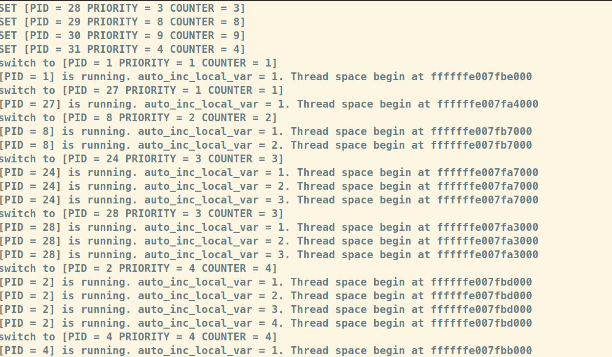

# 实验 3：RV64 虚拟内存管理

## 1. 实验目的

- 学习虚拟内存的相关知识，实现物理地址到虚拟地址的切换。
- 了解 RISC-V 架构中 SV39 分页模式，实现虚拟地址到物理地址的映射，并对不同的段进行相应的权限设置。

## 2. 实验环境

- Ubuntu 20.04
- VMware

## 3. 背景知识

- [浙江大学23年春夏系统三实验指导](https://parfaity.gitee.io/sys3lab-2023-stu/lab3/#43)

## 4. 实验步骤

### 4.1 准备工程

- 本次实验基于系统二实验六的代码；
- 首先在`defs.h`添加内容：

```c
#define OPENSBI_SIZE (0x200000)

#define VM_START (0xffffffe000000000)
#define VM_END   (0xffffffff00000000)
#define VM_SIZE  (VM_END - VM_START)

#define PA2VA_OFFSET (VM_START - PHY_START)
```

- 修改`vmlinux.lds`，从[仓库](https://gitee.com/Parfaity/sys3lab-2023-stu)中同步该文件。

### 4.2 开启虚拟内存映射

#### 4.2.1 `setup_vm` 的实现

将 0x80000000 开始的 1GB 区域进行映射，我们需要填写`early_pgtbl`中对应的表项，这里面有两次映射，第一次是等值映射，也就是虚拟地址和物理地址数值相同，如果不进行等值映射，读取指令还有之后的创建多级页表映射可能会出错。第二次映射则是将物理地址映射到高地址 ( PA + PV2VA_OFFSET == VA )。

```c
/* early_pgtbl: 用于 setup_vm 进行 1GB 的 映射。 */
unsigned long early_pgtbl[512] __attribute__((__aligned__(0x1000)));

void setup_vm(void)
{
    /*
    1. 由于是进行 1GB 的映射 这里不需要使用多级页表
    2. 将 va 的 64bit 作为如下划分： | high bit | 9 bit | 30 bit |
        high bit 可以忽略
        中间9 bit 作为 early_pgtbl 的 index
        低 30 bit 作为 页内偏移 这里注意到 30 = 9 + 9 + 12， 即我们只使用根页表， 根页表的每个 entry 都对应 1GB 的区域。
    3. Page Table Entry 的权限 V | R | W | X 位设置为 1
    4. early_pgtbl 对应的是虚拟地址，而在本函数中你需要将其转换为对应的物理地址使用
    */
  
		//等值映射
    unsigned long phy = PHY_START;
    unsigned long vir = PHY_START;
    early_pgtbl[(vir >> 30) & 0x1ff] = ((phy >> 30) << 28) | 15;
    //高地址映射
    vir = VM_START;
    early_pgtbl[(vir >> 30) & 0x1ff] = ((phy >> 30) << 28) | 15;
   
    printk("...setup_vm done!\n");
}
```

#### 4.2.2 修改 `head.s`

因为已经在`vmlinux.lds`中分配了栈空间，所以我们自己不再需要额外分配栈空间

```assembly
la sp, _stack
# li x1, 4096  将后面两行注释掉
# add sp, sp, x1
```

在`head.s`完成`relocate`函数，设置`satp`以启用虚拟地址，其中`satp`的布局如下：
```
Supervisor Address Translation and Protection Register:
 63      60 59                  44 43                                0
 ---------------------------------------------------------------------
|   MODE   |         ASID         |                PPN                |
 ---------------------------------------------------------------------
```

对于MODE字段，因为我们所使用的模式是Sv39，所以应该设置为8；对于ASID字段，直接设置为0即可；对于PPN，由于我们的物理页大小为4KB，所以去掉PA的12位偏移就是物理页号，即 PA >> 12 == PPN。

```assembly
relocate:
    # set ra = ra + PA2VA_OFFSET
    # set sp = sp + PA2VA_OFFSET (If you have set the sp before)
    li t0, 0xffffffdf80000000
    add ra, ra, t0
    add sp, sp, t0
   
    # set satp with early_pgtbl‘s physical address
    li t0, 8
    slli t0, t0, 60
    # li t0, 0x8000000000000000
    
    la t1, early_pgtbl
    srli t1, t1, 12
    
    or t1, t1, t0
    csrw satp, t1

    # flush tlb
    sfence.vma zero, zero

    ret
```

然后在适当位置调用虚拟内存初始化函数：

```assembly
_start:
		...    
    call setup_vm
    call relocate
    call mm_init
    call setup_vm_final
    call task_init
    ...
```

#### 4.2.3 `setup_vm_final` 的实现

由于 `setup_vm_final` 中需要申请页面的接口，应该在其之前完成内存管理初始化，需要修改 mm.c 中的代码，mm.c 中初始化的函数接收的起始结束地址需要调整为虚拟地址。

```c
void mm_init(void) {
    kfreerange(_stack, (char *)(PHY_END + PA2VA_OFFSET));
    printk("...mm_init done!\n");
}
```

之后就是对物理内存（128M）进行映射，并设置正确的权限，

```
Physical Address
     PHY_START                           PHY_END
         ↓                                  ↓
--------------------------------------------------------
         | OpenSBI | Kernel |               |
--------------------------------------------------------
         ^                                  ^
    0x80000000                              ，───────────────────────────────────────────────────┐
         └───────────────────────────────────────────────────┐                                  |
                                                             |                                  |
                                                          VM_START                              |
Virtual Address                                              ↓                                  ↓
----------------------------------------------------------------------------------------------------
                                                             | OpenSBI | Kernel |               |
-----------------------------------------------------------------------------------------------------
                                                             ^
                                                     0xffffffe000000000
```

首先我们将要映射的内容分成三个段，分别是text、rodata和other，分别求出他们物理地址的开始地址，虚拟地址的开始地址和段的长度，通过调用create_mapping进行三级页表创建映射。映射结束后，我们将`satp`寄存器的PPN值设为 swapper_pg_dir 的物理地址，并调用`sfence.vma zero, zero`进行TLB的刷新，完成虚拟内存的开启。

```c
unsigned long  swapper_pg_dir[512] __attribute__((__aligned__(0x1000)));
void create_mapping(uint64 *pgtbl, uint64 va, uint64 pa, uint64 sz, int perm);

void setup_vm_final(void) {
    memset(swapper_pg_dir, 0x0, PGSIZE);

    // No OpenSBI mapping required
    unsigned long text_v = VM_START + OPENSBI_SIZE;
    unsigned long text_p = PHY_START + OPENSBI_SIZE;
    unsigned long text_len = (unsigned long)_srodata - (unsigned long)_stext;
    unsigned long rodata_v = text_v + text_len;
    unsigned long rodata_p = text_p + text_len;
    unsigned long rodata_len = (unsigned long)_sdata - (unsigned long)_srodata;
    unsigned long other_v = (unsigned long)_sdata;//rodata_v + text_len;
    unsigned long other_p = (unsigned long)_sdata - PA2VA_OFFSET;//rodata_p + text_len;
    unsigned long other_len = PHY_SIZE - text_len - rodata_len - OPENSBI_SIZE;

    printk("text: %lx -> %lx\n", text_v, text_v + text_len);
    printk("mapping kernel text X|-|R|V\n");
    create_mapping(swapper_pg_dir, text_v, text_p, text_len, 5);

    printk("rodata: %lx -> %lx\n", rodata_v, rodata_v + rodata_len);
    printk("mapping kernel rodata -|-|R|V\n");
    create_mapping(swapper_pg_dir, rodata_v, rodata_p, rodata_len, 1);
  
    printk("other memory: %lx -> %lx\n", other_v, other_v + other_len);
    printk("mapping other memory -|W|R|V\n");
    create_mapping(swapper_pg_dir, other_v, other_p, other_len, 3);
  
    // set satp with swapper_pg_dir
    unsigned long swapper_pg_dir_pa = (unsigned long)swapper_pg_dir - PA2VA_OFFSET;
    unsigned long val = (swapper_pg_dir_pa >> 12) & 0xfffffffffff;
    unsigned long mode = 0x8000000000000000;
    val = val | mode;
    asm volatile("csrw satp, %0" :: "r"(val));
    
    // flush TLB
    asm volatile("sfence.vma zero, zero");
    printk("...setup_vm_final done!\n");   
    
    return;
}
```

#### 4.2.4 `create_mapping` 的实现

一次for循环进行一页的映射，首先根据虚拟地址取出三个页表项的位置，然后先访问最外层页表，如果无效则新建一个页表项，然后访问次级页表，同样如果无效就新建一个页表项，最后访问最内层页表，将物理地址和一些权限位写入。

```c
/* 创建多级页表映射关系 */
void create_mapping(uint64 *pgtbl, uint64 va, uint64 pa, uint64 sz, int perm) {
    printk("    create_mapping start\n");
    /*
    pgtbl 为根页表的基地址
    va, pa 为需要映射的虚拟地址、物理地址
    sz 为映射的大小
    perm 为映射的读写权限

    将给定的一段虚拟内存映射到物理内存上
    物理内存需要分页
    创建多级页表的时候可以使用 kalloc() 来获取一页作为页表目录
    可以使用 V bit 来判断页表项是否存在
    */
    
   unsigned long cur_va, cur_pa, cur_pte;
   cur_pa = pa;
   for(cur_va = va; cur_va < va + sz; cur_va += PGSIZE){
    uint64 vpn[3];
    vpn[2] = (cur_va >> 30) & 0x1ff;
    vpn[1] = (cur_va >> 21) & 0x1ff;
    vpn[0] = (cur_va >> 12) & 0x1ff;

    if((pgtbl[vpn[2]] & 1) == 0){
        unsigned long* newpage = (unsigned long*)kalloc();
        cur_pte = (((unsigned long)newpage - PA2VA_OFFSET) >> 12 ) << 10;
        pgtbl[vpn[2]] = cur_pte | 1;
    }

    unsigned long* pgtbl1 = (unsigned long*)((pgtbl[vpn[2]] >> 10) << 12);
    if((pgtbl1[vpn[1]] & 1) == 0){
        unsigned long* newpage = (unsigned long*)kalloc();
        cur_pte = (((unsigned long)newpage - PA2VA_OFFSET) >> 12) << 10;
        pgtbl1[vpn[1]] = cur_pte | 1;
    }

    unsigned long* pgtbl0 = (unsigned long*)((pgtbl1[vpn[1]] >> 10) << 12);
    pgtbl0[vpn[0]] = (cur_pa >> 12) << 10;
    pgtbl0[vpn[0]] |= (perm << 1);
    pgtbl0[vpn[0]] |= 1;

    cur_pa += PGSIZE;
    
    if(cur_va - va <= 3 * PGSIZE){
       printk("    %lx -> %lx\n", cur_va, pgtbl0[vpn[0]]);
    }
   }
   printk("    create_mapping finish\n");
   return;
}

```

### 4.3 编译与测试

修改`proc.c`中的输出消息，验证结果：

```c
printk("Thread space begin at %lx\n", current);
```

测试截图如下：



## 5. 思考题

1. 验证 `.text`, `.rodata` 段的属性是否成功设置，给出截图。

- 输出各个段写入的页表项，可以看到页表项最后的4bit已经被置位。


2. 思考线性映射时能否不对opensbi所在的区域进行映射，给出你的理由。

- 在线性映射的时候，直接跳过opensbi区域的映射，经过验证代码还能正常运行，所以应该是可以不对opensbi所在的区域进行映射的，因为opensbi运行的时间在启用虚拟页表之前。

3. 为什么需要在修改页表后执行sfence.vma指令？

- TLB缓存的就是页表的表项，而修改页表之后，TLB中的表项可能已经过时了，所以要执行sfence.vma来清除缓存。

## 6. 实验心得

操作系统的实验隔了五个多月了，花了好一会儿把之前自己的代码逻辑又复习了一遍，这次的实验对着实验书写倒是也能写下来，但是感觉调试确实如助教所说，非常有难度，有时候真的不知道错在哪里，反正我也是调试了很久。最后确实是完成了实验，但是感觉自己还是没有特别搞懂一些实验设置的原理（只知道叫我这么做，不知道为什么这么做），比如为什么要等值映射，比如为什么要映射两次，之后自己查阅资料加上问助教，算是稍微理解了一点。不过总体来说，本次实验还是很能加深对于虚拟内存的理解的，特别是`create_mapping`的三级页表让我印象深刻！
