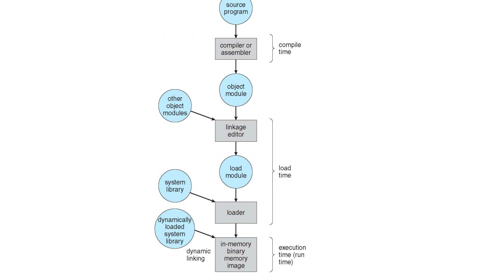
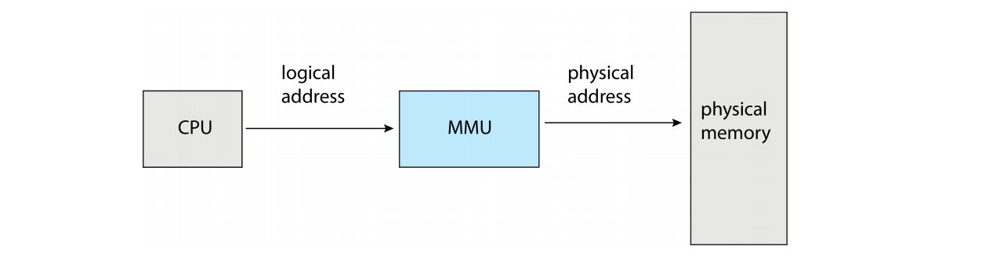

## Main Memory

### Background

- 程序必须（从disk）进入memoey；
- 主存储器和寄存器是CPU可以直接访问的唯一存储器；
- Memnory单元只看到一个流：
  - 地址+读取请求
  - 地址+数据写入请求
- 寄存器访问在一个CPU时钟（或更少）内完成；
- main memory的访问可能需要许多周期，导致stall（解决方案：cache）；
- 缓存位于主存和CPU寄存器之间；
- 要确保正确操作所需的内存保护
  - 硬件与软件层面

**Protection：**

- 一个进程只能访问一定区域的memory内容（这是受限的）
- CPU要去check要访问的memory地址，通过base寄存器和limit寄存器来进行判断；
- **but**
  - 所有进程使用的memory区域是连续的，这样的话如果memory碎片化就会导致memory不够；
  - 没有区分虚拟内存和物理内存的概念（当然不区分其实本身没有错）-> 通过分页机制来解决碎片；
  - 要多少给多少，不管进程实际上会不会访问这块内存；

### Address Binding

- 地址在不同的阶段以不同的方式表示：
  - 源代码的地址通常是符号的（例如，temp）
  - 编译器将符号绑定到可重定位地址
    例如，“从该模块开始的14个字节”
  - linker（或loader）将可重定位地址绑定到绝对地址，例如0x0e74014
  - 每个绑定将一个地址空间映射到另一个

### Logical vs. Physical Address Space

逻辑地址：被CPU生成，也称为虚拟地址，在load和store中被使用的；
物理地址：内存单元看到的地址；

逻辑地址和物理地址在compile时和load时是相同的地址绑定方案；
逻辑（虚拟）地址和物理地址在执行时是不同的地址绑定方案；

逻辑地址空间是程序生成的所有逻辑地址的集合；
物理地址空间是程序生成的所有物理地址的集合；

**MMU(Memory-Management Unit)**

- 判断给出的逻辑地址是否合法；
- 将给出的逻辑地址转化成物理地址；

**Dynamic Loading**

没有必要把整个程序一次全部加载到memory中，可以一页一页的加载，或者用到再加载；

好处：内存空间的利用率比较好，用不到的就不加载到内存；

**Dynamic Linking**

在执行的时候再去(link)寻找要调用的函数的地址，而static link就是在编译时候就把依赖的库函数的代码全部都copy到文件中。

### 分配内存

**Contiguous Allocation（连续分配）**

把main memory分成两部分，一部分给os用，另一部分给用户态的进程用；

Protection：因为是连续的，所以通过base和limit两个register就可以进行检测；

First-fit：首次匹配（first fit）策略就是找到第一个足够大的块，将请求的空间返回给用户。同样，剩余的空闲空间留给后续请求。
Best-fit：首先遍历整个空闲列表，找到和请求大小一样或更大的空闲块，然后返回这组候选者中最小的一块。
Worst-fit：最差匹配（worst fit）方法与最优匹配相反，它尝试找最大的空闲块，分割并满足用户需求后，将剩余的块（很大）加入空闲列表。

**弊端：内存逐渐碎片化**（外部碎片）

### Paging

一个进程的物理地址空间可以不连续，可以分成很多虚拟页映射到很多物理页，从而实现不连续的地址空间。

**问题**：page也有一个最小的粒度(比如4KB)，仍然存在内部碎片的问题

- 内部碎片：如果分配程序给出的内存块超出请求的大小，在这种块中超出请求的空间（因此而未使用）就被认为是内部碎片（因为浪费发生在已分配单元的内部）。

**方法：**

- 把物理内存切分成固定大小的block，称为frame，但是size必须是$2^n$，一般在512B到16MB之间；
- 把逻辑内存也分成同样大小的block，成为pages；
- 当需要N个page，就需要有N个frame与之对应（当然同时可能不需要N个frame）；
- 需要初始化一张页表（CPU内部没有这么大的空间去存页表，所以要把页表存储在内存中，而CPU有一个专门的寄存器去存储这个页表的物理地址）去把page对应到frame；

**地址转换：**

一个虚拟地址被分为虚拟页面号（virtual page number，VPN）和页内偏移量（offset）

