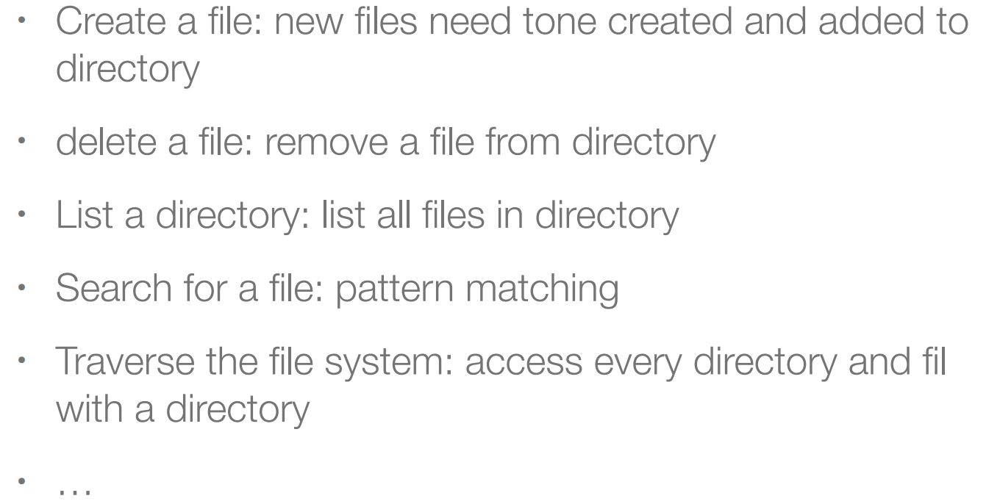
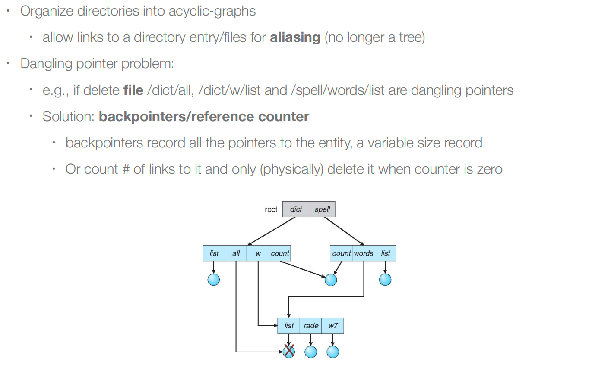

## File System Interface

### 文件概念

文件是用于存储信息的连续逻辑地址空间。

文件有很多种类形式：
- 数据：数字、字符、二进制等
- 程序
- proc文件系统：使用文件系统接口来检索系统信息

### 文件属性

### 文件操作

- create：
- open：在linux中，我们通过路径打开文件，把文件抽象成文件描述符fd，之后对于文件的操作都可以通过fd来进行，也就是告诉操作系统要操作哪个文件。（我们通过fd来建立当前操作的文件的一些信息，比如你的光标编辑位置）
- read/write：需要有一个指针
- reposition within file - seek：在文件查找中重新定位
- delete：释放磁盘空间；如果同一个文件被多个指针所指，那么在最后一个指针被删除时释放空间
- truncate：删除文件内容，但是保留文件属性信息
- copy：创建和读写

---

**Open Files**

OS接受文件的**路径**和一些**flag**。OS搜索目录以找到给出路径下的文件。

- 为了避免之后的重复搜索，操作系统维护一个表来存储打开的文件，其中包含关于所有已经打开的文件信息

- 然后通过对表的索引指定操作——不需要进行搜索

在OS打开文件的时候会维持两类表：

- Per-process table：当前location pointer，访问权限
- System-wide table：存储跟文件相关的信息，比如磁盘上的位置

**Information with Open Files**

- 编辑的位置
- 这是system-wide的信息，记录了一个文件目前被打开的个数
- disk location: cache of data access information
- access rights: per-process access mode information

---

**文件锁**

一些文件系统提供文件锁定来控制对文件的访问，比如两个进程同时写一个文件

两种文件锁的类型

- Shared lock：多个进程可以同时获取该锁
- Exclusive lock：只有一个进程可以获得这样的锁

两种文件锁的机制

- mandatory lock（强制锁定）: access is denied depending on locks held and requested
- advisory lock：processes can find status of locks and decide what to do（由进程自己决定）

flock

当我们fock一个子进程的时候，因为**lock是和文件描述符fd绑定的**，而父进程和子进程拥有了相同的fd，那么还是能同时访问该文件，这时就起不到互斥锁的效果。（这里老师有代码演示）

### 文件类型

- 文件扩展名：作为文件名的一部分，很容易被欺骗
- magic number of the file：elf

### 文件结构

文件结构具体如何由OS或者打开文件的应用程序来定义

- 没有结构：字节流或者字符流，比如linux文件
- simple record structure：lines of records, fixed length or variable length，such as database
- complex structures：word文档，可重定位的程序文件

### 访问方式

Sequential access：一组元素是按预定的顺序进行访问的，对于某些媒体类型，这是唯一的访问模式（例如磁带）。

Direct access：在（大致）相等的时间内访问序列中任意位置的元素，与序列大小无关，有时称为随机访问。

### 目录结构

目录是一个包含关于所有文件的信息（不包括内容）的节点的集合。

### Disk结构

总的来说，一个disk可以有多个partition，一个partition也可以有多个disk。

### 目录操作

### 目录组织

**Goal**

**方式**

- 一级目录；
- 二级目录：第一层是用户文件夹UFD
- Tree-Structured Directories
  - 删除目录的方式：Option I: directory cannot be deleted, unless it’s empty。Option II: delete all the files, directories and sub-directories。
  - 路径穿越漏洞。
- Acyclic-Graph Directories，允许别名，当前目录的文件也可以指向别的目录的文件，构成了环。需要有一个引用计数的方式，当一个文件指针被删除时，引用计数减一很重要，在inode里面有一个reference count。hardlink是两个链接都指向同一个inode，而softlink有自己的inode，从而也有自己的data block，但他会在自己的data block中会写明自己是链接文件，真正指向的是文件。soft link可以跨文件系统，hard link不能跨文件系统，inode是文件系统的概念。soft link的缺点是访问时候会需要两次的重定向才能找到目标的位置，性能会有损失。
