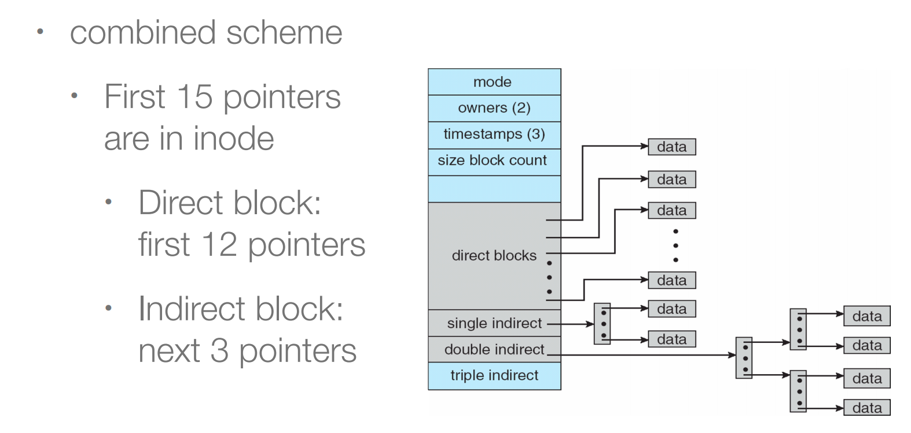
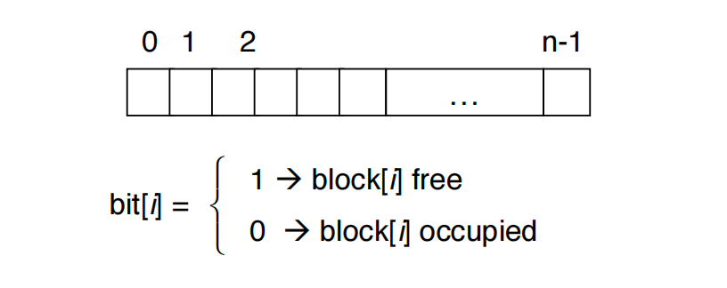
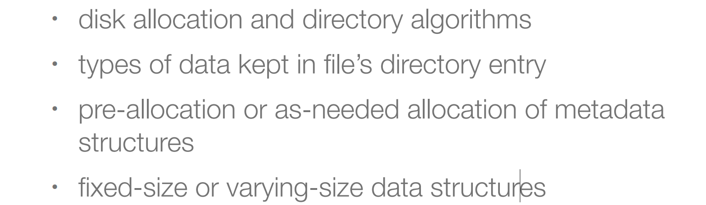
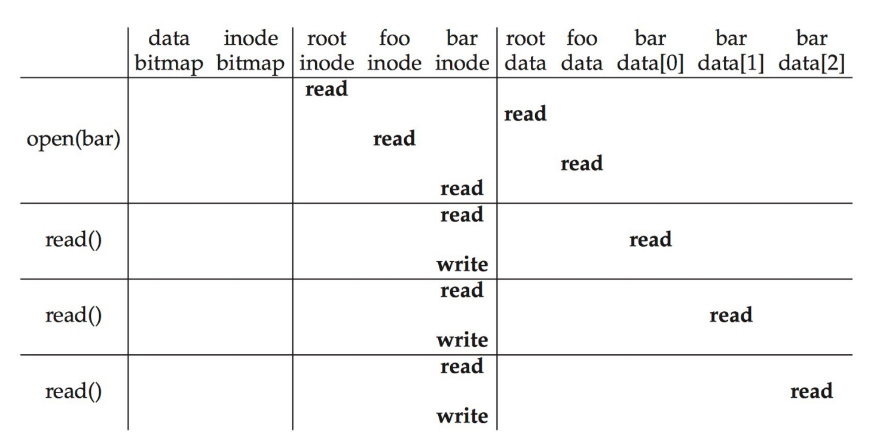

## File System Implementation

### 1. Mounting File Systems

把当前文件系统挂载到某个路径下，

boot block：能让前一步的加载起找到操作系统镜像的位置，把操作系统镜像从dick读入内存，之后再开始执行。也就是如果一个操作系统可被加载，那就一定要有一个boot block来记录操作系统镜像放在文件系统的位置。

In-memory mount table：存放着指向挂载文件系统superblock的指针。

superblock：文件系统级别的元数据。

### 2. Virtual File Systems

VFS提供了一种面向对象的实现文件系统的方法，VFS负责定义一个同样的接口。它使得相同的系统调用API可以被不同类型的文件系统所使用。

也就是用户程序调用VFS定义的接口，每个文件系统只需要实现VFS定义的这些接口就好了。这样就可以在一个操作系统里面，存在多个不同的文件系统。

### 3. Directory Implementation

- 具有指向文件元数据的指针的链表。
- 哈希表：减少搜索时间，不过可能会产生冲突。

### 4. Disk Block Allocation

#### Contiguous Allocation

连续分配：每个文件的data block都是连续的。

优点：在大多数情况下性能最佳，而且容易实现（只需要记录起始地址和长度）。

缺点：连续分配不灵活，比如当我们需要增加文件大小的时候，万一这一块已经没有空间了，那就出问题了。连续存储也会导致外部碎片。

extent-based contiguous allocation：做些让步，比如分成两个大块，大块内连续，大块之间可以不连续。

#### Linked Allocation

链表分配：每个文件存储着一串disk块的链表，每个块都包含指向下一个块的指针，以零指针结束。只需要存储开始和结尾的block即可。

优点：比较灵活，块可能分散在磁盘上的任何位置，没有外部碎片，没有压缩。

缺点：定位一个data block需要很多次I/O和磁盘搜索，另外指针也需要空间，而且如果一个data block损坏，会导致之后的都读不到了。

改进：聚类，比如将4个块连在一起。但是这样就会产生内部碎片。

FAT使用的就是linked allocation。

#### Indexed Allocation

索引分配：每个文件指定一个block来存储index，每个index存着对应的block指针。

优点：访问速度快。

缺点：我们要管理index block的分配，不能过大也不能过小。每个文件最大就是index的数量乘以block的大小（一个index指向一个block）。采用多级索引块来管理大文件。小文件就direct blcok，大文件就多级索引。

#### 总结

连续分配对顺序访问和随机访问的性能都比较好；
链表分配对于顺序访问性能较好；
索引分配需要多次访问。cluster(集群)可以改善性能，集群就是连续的block。

Disk IO是非常慢的，我们需要尽可能减少disk IO的次数。

### 5. Free-Space Management

空闲空间管理，我们需要disk上哪些data block是空闲的。

#### Bitmap Free-Space Management

一个bit代表一个block，非常简单。缺点是如果disk非常大，那么也需要占据一定的空间。

#### Linked Free Space

不浪费空间，只需使用空闲块中的内存作为指针，对用户的可用空间没有影响。缺点是无法轻易获得连续的空间。

提高管理free space的性能

### 6. File System Performance

文件系统的效率的决定因素：

**提高文件系统性能**

- 希望metadata和data能够距离较近
- 使用cache，在内存中保存着经常读写的磁盘内容
- 使用异步write。从操作系统来看，读比写慢。因为写可以异步写（写到memory就返回，剩下的memory自己进行IO），读不能异步读。
- free-behind and read-ahead: 可以提高顺序读写的性能，从buffer中删除之前的page，提前多读取几页数据。
- 当然我们可以使用异步IO，在读的时候，我们可以去做其他事情，等到IO结束，通知系统，系统再去读取数据。不过这是应用程序的角度。

### 7. Page Cache

统一缓存，文件系统需要和内存系统要有沟通，不需要在两个层面都有cache。

### 8. Recovery

文件系统需要进行一致性检查，以确保一致性，检测到不一致，那么就会进行recovery

- 比较目录中的数据与磁盘上的一些元数据，以保持一致性
- 如果恢复速度缓慢，有时会失败

文件系统恢复方法

- 日志结构文件系统
- backup

## File System Implementation Example

### 文件系统结构

假设我们有一系列的block，每个block有4K，物理磁盘一共有64block。

**Inodes**

分配五个block用来存储inode（确定文件系统支持文件或目录的数量大小）。比如这个文件系统只能放置80个文件或者目录。

**Bitmap**

管理多少空闲的inode和空闲的data block，比如数据只有56块，我们只需要56个bit来管理即可。

**Superblock**

存储有关此文件系统的信息：有多少个inode/数据块、inode表的开始位置、数据区域的开始位置，以及magic number。

**Data Region**

最后的56个blcok用存储数据。

### 文件组织

**read inode**

Inode中可能会存储的一些数据：

**Directory Organization**

### 文件操作

**Read /foo/bar**

首先open这个文件，root inode的位置存储在superblock里面。$$root\ inode \to root\ data \to foo\ inode \to foo\ data \to bar\ inode$$

第二次在进行read的时候就不需要再open，直接能够在全局文件表中找到文件名对应的inode。然后我们进行read。因为要把访问时间等记录到inode中，所以读取之后还要写回inode。$$read\ bar\ inode \to bar\ data[0] \to write\ bar\ inode$$

**Write to Disk: /foo/bar**

假设文件不存在，我们还需要create这个文件。读完foo data之后，找不到文件，那么我们要创建文件。所以我们需要寻找空闲inode，因为foo下多了一个文件，所以要修改foo data，现在bar inode已经存在了，就可以写入文件的创建时间、修改时间、uid等信息，最后写foo inode，比如foo inode的修改时间。

wirte需要多一步对于bitmap的修改，因为需要分配空闲区域才能进行写。

### Crash Consistency

操作系统把写请求发送给disk，之后的事情由disk来完成。至于disk完成的顺序，都不是操作系统能够决定的。

假设我们要完成如下工作，Write inode(I), bitmap(B) and data block(Db)。

**Case I:** Only Db is written to the disk

inode和bmap没有被更新，从操作系统的角度来看，满足一致性。从用户的角度来看，就是没有完成写入。

**Case II**: Only I is written to the disk

bmap空闲区域还是空闲的，这里造成了不一致。而且inode指向的data还是旧的data。

**Case III:** Only B is written to the disk

bitmap告诉block已经被分配，但是没有指向它的inode，这导致了空间泄漏（这块空间不再能够被使用）

**Case IV:** I and B are written to the disk, not not Db

块的数据还是没有被更新。

**Case V:** i and Db are written, but not the B

inode points to data, but the bitmap says the block is free -- 导致不一致性。

**Case VI:** B and Db are written, but not the inode

we do not know which file the data belongs to since no inode points to it

---

**Solution I**：一旦发现不一致，进行修复。

**Solution II**：采用日志的方式来修复。我们在磁盘的某个区域分配一个日志区域，在进行disk操作的时候，先写日志，再进行操作，这样就算中途崩溃，也能通过日志记录的重复操作一遍。

为了避免在写入日志的时候系统崩溃

（之后的不知道老师会不会细讲，要是没讲那么还是看书吧……）
