## 1. Mass-Storage Structure

大容量存储设备结构。

重点内容：机械硬盘结构各种概念和各种时间、SSD特性 FTL、RAID

### 1.1 Overview

Moving-head Magnetic Disk（移动头磁盘）

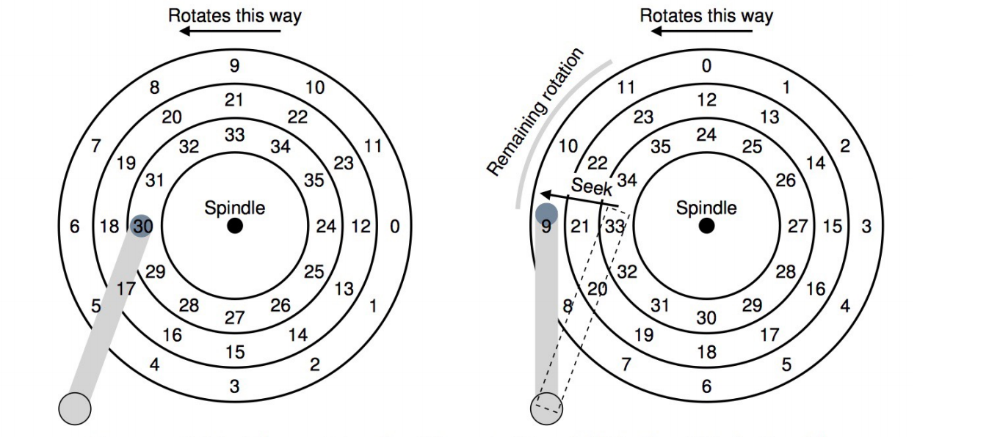

**Positioning time**: to move disk arm to desired sector. 包括seek time和rotational latency，也就是寻道时间和旋转延迟. positioning time is also called random-access time

**Performance**: 
**transfer rate**: 传输速率，就是data在驱动设备和计算机之间的速率。例如theoretical 6 Gb/sec; effective (real) about 1Gb/sec。
**seek time**:  from 3ms to 12ms (9ms common for desktop drives)
**latency**: 旋转延迟由转速决定

**Average access time**

**Average I/O time**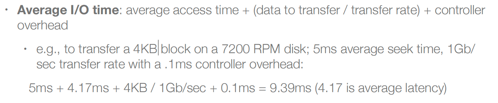我们希望我们内存页越大越好，因为我们希望能够一次性读取尽可能多的内容，来降低头尾固定开销的比重。

---

**Nonvolatile Memory Devices**

非易失性存储器设备，如果类似disk，那么就叫做SSD，SSD比HDD更加可靠，因为没有那么多机械部件，访问速度非常快，但是价格比较贵。每一个SSD本身有调度算法，因为SSD本身的最小存储单元想要修改内容就必须擦出再写入，而每个最小存储单元都有寿命，所以调度算法需要进行一些动态映射（也就是访问地址和真正操作的物理地址之间的映射）操作，避免某个存储单元频繁被擦除和写入，而且还可以把坏的block隐藏起来。

---

**Magnetic Tape**

磁带，用来存储，缺点是速度慢，优点是容量大。

### 1.2 Disk Structure

platter：盘片，一个磁盘由多个盘片叠加而成。盘片的表面涂有磁性物质，这些磁性物质用来记录二进制数据。因为正反两面都可涂上磁性物质，故一个盘片可能会有两个盘面。

track、sector：每个盘片被划分为一个个磁道，每个磁道又划分为一个个扇区。

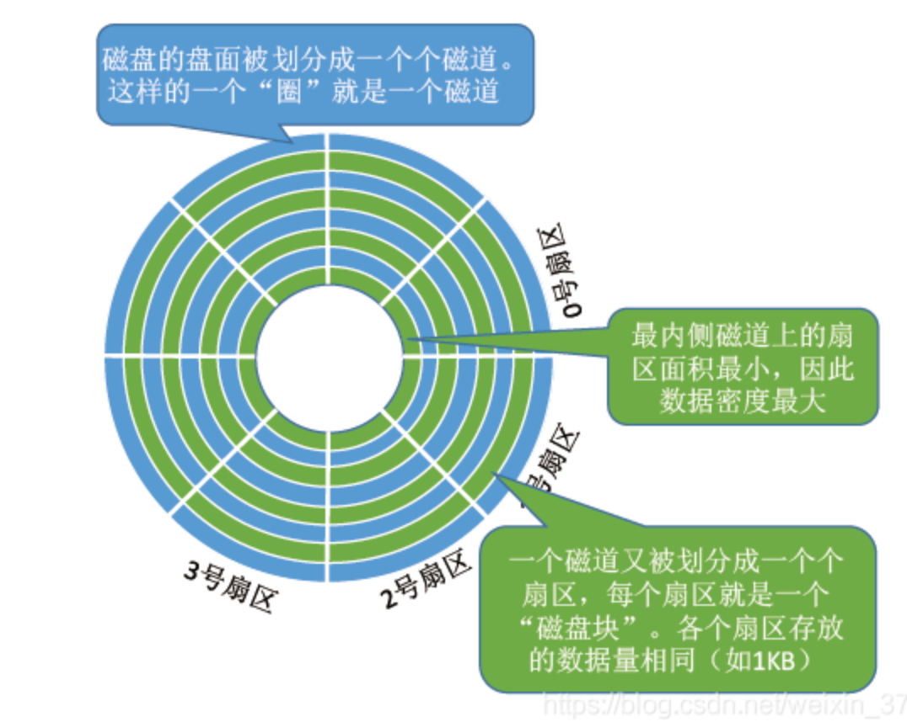

cylinder：每个盘面对应一个磁头。所有的磁头都是连在同一个磁臂上的，因此所有磁头只能共同进退。所有盘面中相对位置相同的磁道组成柱面。

### 1.3 Disk Attachment

**host-attached** storage：可以直接连接到设备

**network-attached** storage：网络连接

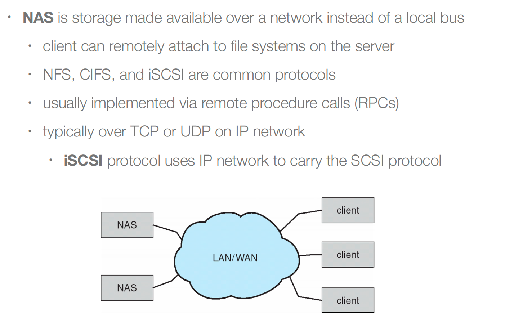

**storage area network**

### 1.4 Disk Scheduling

磁盘调度，这一块比较核心。一个disk希望有更快的访问速度和更高的bandwidth，访问速度由seek time和旋转延迟共同决定，而bandwidth就是数据传输的最高速度。

我们能决定的是seek time，我们通过磁头移动距离的累加值来判断算法的好坏。

#### FCFS

先来先服务

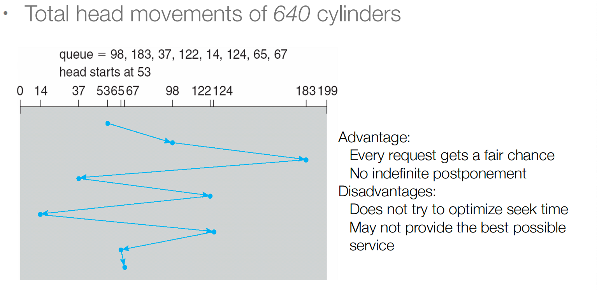

#### SSTF

最短寻道时间优先。从当前的位置出发，最短的距离优先。局部最优，而不是全局最优。优点是吞吐率更高（吞吐率就是数据传输速度），缺点是会导致饥饿问题。

#### SCAN

电梯算法，只往一个方向运动，不到最低或者最高点不改变方向，不会中途改变方向。

#### C-SCAN

可以有更加均匀的等待时间

#### LOOK/C-LOOK

SCAN和C-SCAN是移动到存储的尽头，而LOOK/C-LOOK移动到服务的尽头就会回头。

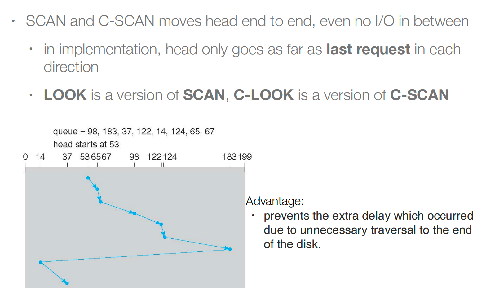

#### 算法选择

### 1.5 Disk Management

**Physical formatting**：物理格式化，将磁盘划分为扇区sector供控制器读写（每个扇区都可以保存报头信息，加上数据，以及纠错代码）。其实就是建立分区，每个分区可以有独立的文件系统，也就是在大多数情况下物理磁盘和文件分区是一对一或者一对多的关系。

**Root partition**：根分区存储着操作系统的源文件，他会在boot time的时候进行挂载，否则找不到操作系统里面的文件。

在挂载的时候，文件系统会进行一致性检查。

**Boot block**：可以指向引导卷或引导加载程序的一组块，这些块包含足够的代码来知道如何从文件系统加载内核。

### 1.6 Swap-Space Management

交换分区的管理。也就是内存不够用的时候，把内存的数据交换到disk中。

交换分区既可以是单独的分区文件系统（效率较高，因为交换分区不需要有文件的概念），也可以是已经格式化好的文件系统里的某个文件（效率低，因为要通过目录寻找这个文件）。

### 1.7 RAID Structure

**RAID**：redundant array of inexpensive disks，廉价冗余磁盘阵列。目的是用冗余性换取可靠性。

**RAID 0（条带化）**：将数据均匀地分割到两个或多个无奇偶校验位的磁盘上，没有冗余。他可以增加读写速度，但是对于可靠性并没有什么帮助。

**RAID 1（镜像）**：两个磁盘上的一组数据的精确拷贝（或镜像）。可靠性增加，就算一个磁盘坏掉了数据仍然是完整的。

**RAID2**：使用Hamming code来进行错误纠正。hamming code是4bitdata和3bit奇偶校验码

**RAID4**：一个磁盘损坏可以恢复，两个就不行

**RAID5**：旋转奇偶校验 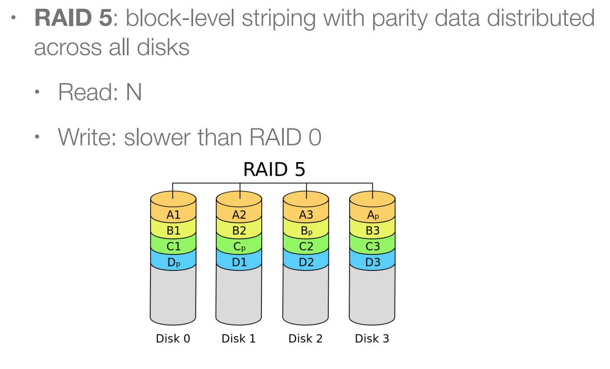

**RAID6**：

**总结**：RAID只能在disk层面检测或者发现错误，它不防止或检测数据损坏或其他错误，这两者的区别是比如从内存写入disk时掉电导致某些data或者matadata没有写入，这样就跟上节课最后提到的那些错误一样，可能会导致数据损坏，这种损坏是无法检测的。ZFS尝试去解决这样的问题，ZFS将checksum添加到所有数据和元数据中，checksum是数据的一些摘要。

## 2. I/O System

### I/O Hardware

使用polling(*IO负载比较高的情况下选择轮询机制，因为中断的处理有上下文的开销*)或者interrupt(*大多数情况下还是采用中断的方式*)方式来进行IO的访问。

**Direct I/O instructions**：专用输入输出指令，为设备的数据和控制I/O提供寄存器，寄存器用于设备放置命令和数据。

**Memory-mapped I/O**：将外设映射到内存的某个位置，也就是把一段物理地址分配给某个设备，用于存储设备的一些信息，访问设备。

**Interrupts**：硬中断就是IO设备发起的中断，软中断就是系统调用发起的中断。中断也有CPU亲和性(CPU affinity)，比如在多核结构中，一些特定的中断由特定的CPU去完成。

**Direct Memory Access**：数据传输的时候不需要CPU介入

**Application I/O Interface**：应用程序跟IO设备交互一般会使用API（封装着system call）。在linux中，我们可以通过文件的方式来访问设备。另外一种方式是通过iocontrol，这是一种较为万能的系统调用。

### IO设备的特点

**分类**

IO设备可分为

Block IO：以块的形式去访问设备，比如disk IO。

Character IO：字符流IO，比如键盘，只需要接受字符流即可，也不需要随机访问等其他操作。

Network Devices：运用例如socket接口去访问，socket也是一种特殊的文件，访问socket也是使用read和write对网络数据包进行读写。

Clocks and Timers：时钟和计时器可以被看作是字符流设备。

---

**同步/异步IO**

**同步阻塞IO**：当我们发起例如read，当read的数据没有接收到，操作便会阻塞，阻塞结束说明数据已经ready。

**同步非阻塞IO**：当我们去调用read，就算数据没有读取结束，我们会return目前读到的数据，比如要读400KB，只有4KB读取成功，那么先把4KB返回。但是，如果之后的数据读好了，我们需要通过polling去查看是否完成读取，然后再次调用read去读取剩余的内容。

**异步IO**：调用read不会阻塞，会继续执行。当数据ready后，操作系统会通过信号量的方式告诉CPU数据已经被放入buffer，CPU对于信号处理会有callback函数进行相应的处理，比如CPU直接去buffer里面读取数据，与同步非阻塞IO的区别是不需要再主动使用read。异步的意思是数据以非预期的方式通知CPU。

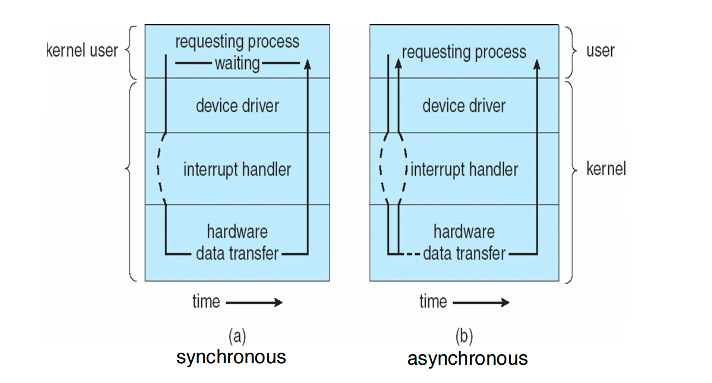

### Kernel I/O Subsystem

**I/O scheduling**：很多IO请求，需要进行IO的调度，也就是IO处理的先后。

**Buffering**：

---

**Device-status Table**

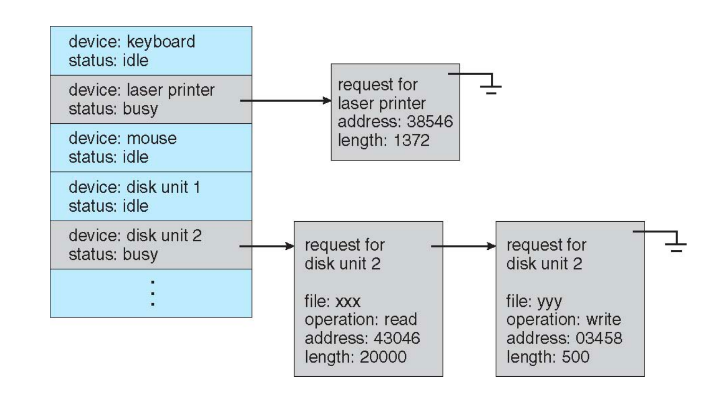

---

**Error Handling**

OS需要处理IO设备的一些错误，比如IO繁忙无法处理OS的请求。大部分情况是什么也不做，直接把消息告诉用户态程序，由用户态程序来决定如何应对。

---

**I/O Protection**

IO需要被保护，例如在键盘输入的时候，由内核先接受输入，再把这些数据重定向到安全的需要消耗这些输入的进程中去（并不是所有的进程都可以读取IO）。因此用户态指令不能随意发IO指令，用户态进程不能随意读取IO信息。如果是MMIO，我们可以直接通过设置页表项的一些bit来控制权限。

---

**I/O Requests to Hardware**

OS会有一张表来把对于目标IO文件的操作和对真正的IO设备操作进行映射。

IO请求的处理流程：

### Performance

影响IO开销的因素

改进措施：减少上下文调用的次数、减少拷贝data的次数、减少中断的次数(polling)、使用DMA来拷贝数据、使用智能硬件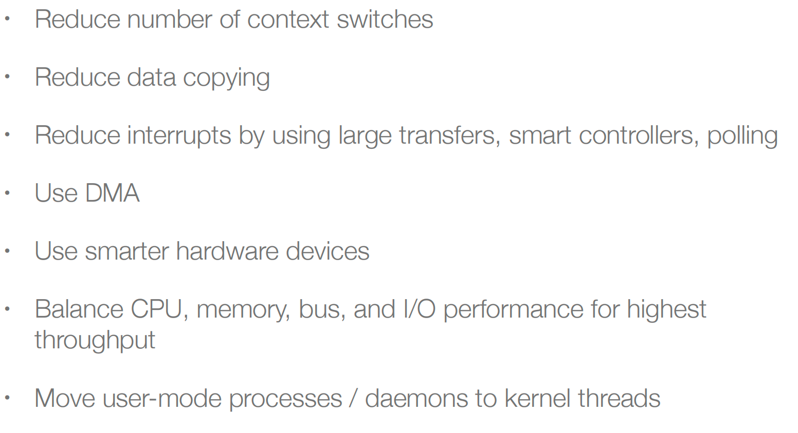

---

用一个例子来说明如何减少上下文调用的次数和避免数据的拷贝：

read给出的参数有fd和buffer一个用户态缓冲区，操作系统需要从磁盘中读到内存中，再从内存中读到用户缓冲区中，作了两次拷贝。

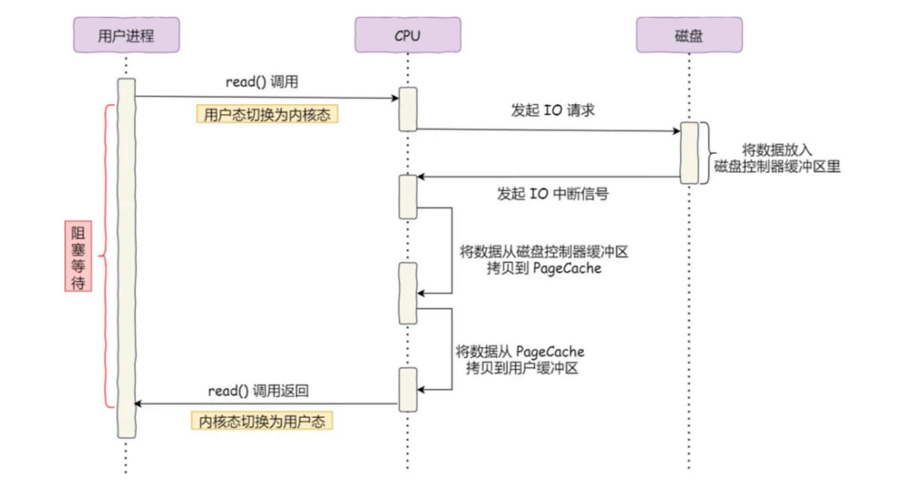

使用DMA控制器，由DMA来将数据从disk拷贝到内存，然后再由操作系统将内存数据拷贝到用户态缓冲区，还是两次拷贝。

下面再看一个例子，从文件中读数据写到网络的socket，有4次上下文切换(黄色)和4次copy(蓝色)。

做一下改进，不使用read，使用mmap，让用户态缓冲区和内核态缓冲区都映射到同一个物理地址，共享缓冲区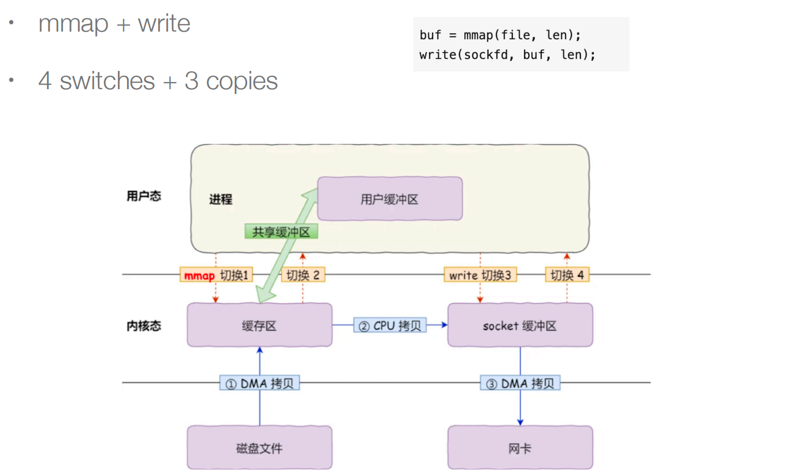

不用read和write，我们直接用一个名叫sendfile的系统调用

通过一些更高级的技术，直接打通磁盘文件和网卡两个子系统，让网卡子系统的DMA直接去磁盘文件的缓冲区拷贝数据，这就叫做zero-copy。

综上，**打通不同子系统共享缓冲区可以减少拷贝次数，用粗粒度的指令代替细粒度的指令可以减少上下文切换次数**。

---

**Pagecache**提升性能

我们不希望频繁地去IO读取数据，所以使用cache，但是不一定所有情况都提速，比如去读取大文件，反而会降低速度。

---

