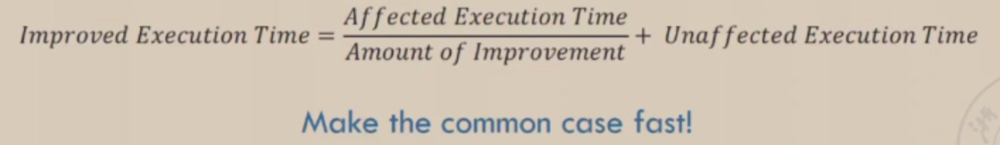
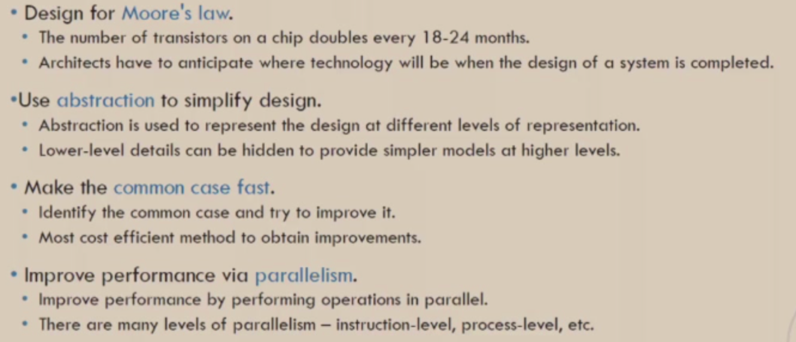

## 1. CPU performance 量化研究方法

### 单核
- CPU Time

    - 提高速度
- CPI（CPU总时钟周期数/指令总数） 平均时钟周期数
    - 不同种类指令的计算：
    - 指令总数影响因素：程序以及程序语言、ISA、编译器

- CPU与CPI

- 总结

### 多核

### Amdahl’s Law

- 加速比（Sp）

### Great Architecture Ideas

