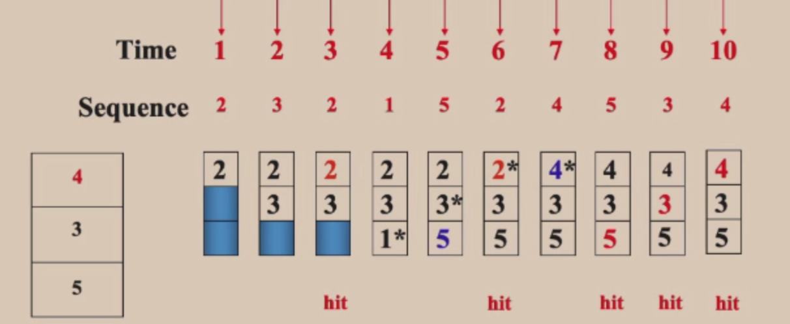
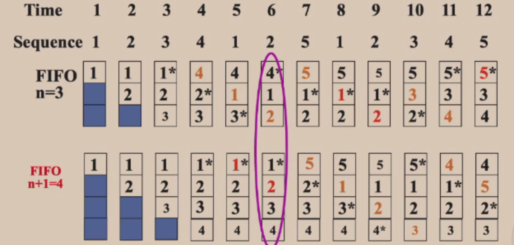
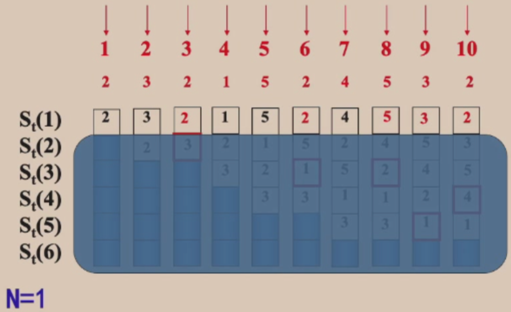
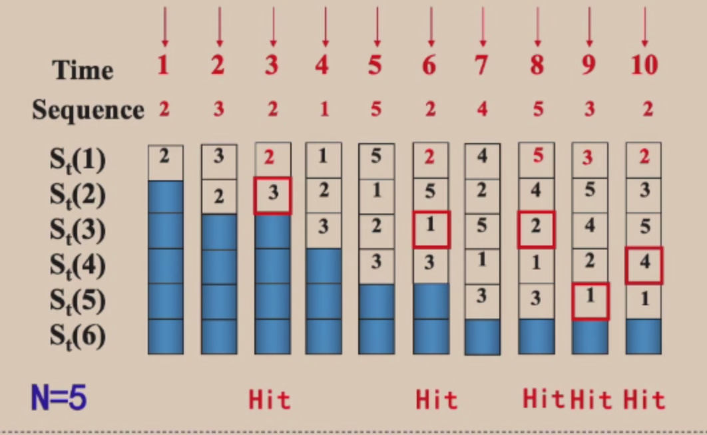
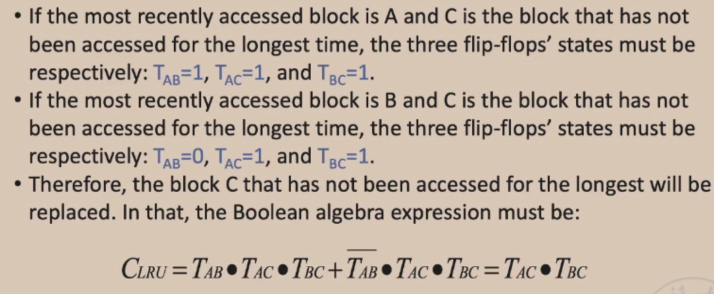
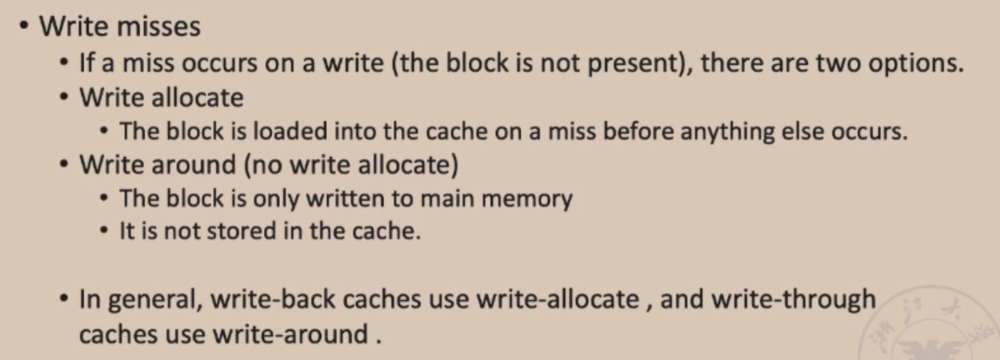
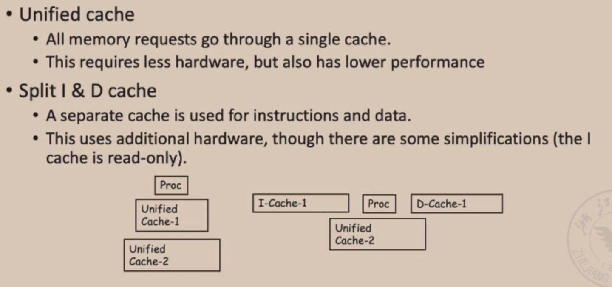

## Memory Hierarchy
### Cache
#### Q3: Block replacemet

当要访问的数据不在Cache当中，对于直接映射不需要考虑替换，因为只有一块对应的，没有选择问题。

- Random replacement；
- Least-Recently Used(LRU)：从局部性来考虑，最近最少使用的块；
- First in， First Out(FIFO)；

Example1：

- FIFO
- LRU(3位，因为size只有3)
- OPT(最优算法，考虑的是未来的事情，必须程序全部跑一遍才知道，所以实际中很难做到，可以用来衡量其他算法的优劣)

**操作步骤**

- 
- 

Example2：

- 除了替换方案之外，对于一个访问序列，序列本身也会对命中率也会有影响；

Example3：

- 当cache块大小改变，对命中率还是有影响的；

**Stack replacement algorithm**

- 保证算法随着cache块的增大，命中率只增不减

- LRU算法是Stack replacement algorithm
- FIFO就不是Stack replacement algorithm
- 使得栈顶的元素永远都是刚刚被访问的元素当n=1，没有两个连续块是一样的，所以命中率为0当n=2，红色的块是命中的，所以命中了一次n=3，命中了三次n=4，命中了四次n=5以及更大，命中了五次统计图：
- 怎么比较各个cache的块的次序（访问远近的时间次序）

#### Q4: Write strategy
- 如果hit命中
  - **Write-through**: write is done synchronously both to the cache and to the backing store。Write-through（直写模式）在数据更新时，把数据同时写入Cache和后端存储。此模式的优点是操作简单；缺点是因为数据修改需要同时写入存储，数据写入速度较慢。
  - _**Write-back**_: initially, writing is done only to the cache. The write to the backing store is postponed until the cache blocks containing the data are about to be modified/replaced by new content。Write-back（回写模式）在数据更新时只写入缓存Cache。只在数据被替换出缓存时，被修改的缓存数据才会被写到后端存储（即先把数据写到Cache中，再通过flush方式写入到内存中）。此模式的优点是数据写入速度快，因为不需要写存储；缺点是一旦更新后的数据未被写入存储时出现系统掉电的情况，数据将无法找回。write back是只写cache，并使用dirty标志位记录cache的修改，直到被修改的cache 块被替换时，才把修改的内容写回main memory。

Write stall

- 

- 如果write miss:
  - **_Write allocate_** (also called _fetch on write_): data at the missed-write location is loaded to cache, followed by a write-hit operation. In this approach, write misses are similar to read misses.。Write allocate：先把要写的数据载入到Cache中，写Cache，然后再通过flush方式写入到内存中；  写缺失操作与读缺失操作类似。       
  - **_No-write allocate_** (also called _write-no-allocate_ or _write around_): data at the missed-write location is not loaded to cache, and is written directly to the backing store. In this approach, only the reads are being cached。No write allocate：并不将写入位置读入缓存，直接把要写的数据写入到内存中。这种方式下，只有读操作会被缓存。

- 

Example：

- 

**Split vs. unified caches**

- 

### 总结

内存的管理也有相应的几个问题

